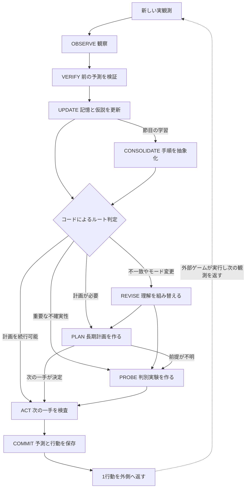

# ARC-AGI-3: 適応的な認知ステートマシンの設計

設計日: 2026-09-24。対象: Google ADK Python 2.0系を使う次期エージェント。**目標仕様を含む設計書。実装状況は下記ガイドを参照。**

基本実装を追加済み。実装範囲・実行方法・検証結果は[実装ガイド](adk-cognitive-implementation-ja.md)を参照。以下は引き続き目標仕様を含む設計書。
## 1. 設計判断と根拠

**固定するのは「観察→予測との比較→探索／計画→行動→検証」という制御構造。更新するのは目標・操作対象・因果モデル・計画である。** ゲーム別の状態を増やすのではなく、同じ状態機械が保持する知識を更新する。単純な有限状態機械では記憶と長期計画を表現しきれないため、階層化した拡張状態機械（状態＋作業記憶＋ガード条件）を採用する。

根拠は[全25環境の分析](human-vcgt-analysis-ja.md)と[記録別の証拠](human-vcgt-environment-evidence-ja.md)。340記録の構造を確認し、各環境2記録、計50記録の抜粋・関連区間を定性分析した。説明は動画とルールから生成されたLLM注釈であり、本人の思考発話ではない。本設計は人間らしい問題解決を操作可能な機能へ翻訳する仮説で、認知過程の再現や性能改善を実証したものではない。

「激しく変化する環境」は、配置変更、仕掛けの追加、操作モード変更、部分観測、時間変化、モデルの誤りに分けて扱う。観測の不一致をすべて「ルールが変わった」と断定しない。

|分析から得た要求|設計上の対応|代表的な根拠|
|---|---|---|
|ゴールの解釈が間違う|達成条件も仮説として保持し、未達成時に再検討|r11l、ls20|
|操作対象・関係の見方が変わる|REVISEで対象、制御対応、表現を変更|tr87、cn04、re86|
|探索には情報を得る役割がある|PROBEは競合仮説と結果の判別条件を先に作る|tn36、bp35、ar25|
|後の手順を成立させる準備が必要|前提条件、順序、退避場所、維持条件を計画に含める|sk48、ka59、lf52、dc22、cd82|
|複数対象が連動する|共同効果、同時達成、順序依存をモデル化|m0r0、lp85、vc33|
|見えない情報を覚える|観測と推定を区別した信念状態を保持|s5i5、ls20|
|時間・外部主体の影響がある|遅延予測、位相、実行前の再確認を持つ|g50t、tu93、wa30、sp80|
|作用の価値が目標で変わる|作用モデルと目標に対する効用を別管理|su15|
|関係・手順を再利用する|適用条件付きの手続きと検証点を記憶|ft09、sb26、tn36|

## 2. 二層の状態機械

外側はゲームとの接続と寿命を管理し、内側は思考方法を切り替える。各状態を別プロセスや別モデルにする必要はない。同じVLMを、入力と出力契約の異なるADKノードから呼ぶ。

### 外側: 実行ライフサイクル

|状態|役割|遷移条件|
|---|---|---|
|BOOT|ゲーム実行単位のセッション作成、予算・入力の確認|プレイ中ならACTIVE。NOT_PLAYEDなら合法性を確認した開始操作を発行|
|ACTIVE|内側の認知グラフを1回実行|1行動を発行したらAWAIT_FRAME。終了条件ならDONE/STOPPED|
|AWAIT_FRAME|前の行動と予測を保持し、外側のドライバへ制御を返す|次の実観測でACTIVE。グラフ内で疑似フレームを生成しない|
|RECOVER|GAME_OVER、入力不良、出力不良、実行結果不明を扱う|合法で予算内の再試行ならAWAIT_FRAME、再解釈可能ならACTIVE、それ以外はSTOPPED|
|DONE|環境がWINを報告した成功終了|終端。最終記録を保存|
|STOPPED|予算切れ、接続エラー、実行可能な選択肢なしによる終了|終端。成功とは別に理由を保存|

レベル変更はACTIVE内の境界イベントとする。現在位置・進行中計画を無効化し、前レベルの規則は適用範囲付きの候補として再評価する。RESETではattemptを進め、ゲーム変更ではセッション自体を切り替える。

### 内側: 認知状態

図は通常経路。全ノードから外側のRECOVER/STOPPEDへ出られ、環境WINはDONEへ優先遷移する。ACTの拒否時は理由に応じてREVISE/PLAN/RECOVERへ戻るが、呼出回数・内部遷移数の上限を設ける。モデルによる反省を無期限に繰り返さない。

|状態|入力|必須の出力|次へ進む条件|必要なスキル|
|---|---|---|---|---|
|OBSERVE|現在・過去の実フレーム、操作ログ、メタデータ|物体候補、関係、差分、可視領域、観測信頼度|入力IDと座標系が確定。不明点はunknownで残る|視覚差分、対象追跡、関係抽出|
|VERIFY|前手の予測、今回の観測|予測項目ごとのsupported/contradicted/unknown、判定根拠|遅延・不可視・未実行を区別済み。初回はno_pending|結果照合、遅延認識、成功条件確認|
|UPDATE|検証結果、既存の記憶|新しい信念状態、仮説の状態、計画の有効性|観測事実と推定を分離し、版を付与|部分観測の記憶、仮説管理|
|REVISE|矛盾、無効になった前提、現モデル|変更の診断、置換／追加仮説、無効化対象|変える範囲と次に確かめる内容が明確|変化検出、目標再解釈、表現・操作対象の変更|
|PROBE|重要な未知、競合仮説、合法操作、予算|実験の次の一手、各仮説の予測、判別基準、費用|何を知る操作かを説明でき、実行制約を満たす|因果探索、情報価値比較、可逆性評価|
|PLAN|目標仮説、因果モデル、記憶、予算|部分目標グラフ、維持条件、時間制約、条件分岐、次の一手|少なくとも次の一手の前提と予測が具体的|逆向き計画、依存関係、共同効果、同期、局所修復|
|ACT|実験または計画の一手、最新状態|合法操作1件と予測、または拒否理由|参照版が一致し、座標・操作・前提・予算が妥当|操作の具体化、適用条件確認|
|COMMIT|検査済み操作、記憶の差分|decision_id、pending_action、次回VERIFY用予測|保存成功後だけ操作を返す|一貫した保存、行動履歴管理|
|CONSOLIDATE|節目の検証済み履歴|適用条件付き手順、失敗条件、反例、証拠参照|成功の主張が観測に結び付く|手順の抽象化、再利用範囲の制限|

各スキルの入出力・手順・検証条件は[スキル設計](adk-cognitive-skills-ja.md)を参照。

## 3. 遷移のガードと優先順位

ルート選択はPythonの決定的な関数が行う。LLMは仮説や構造化した提案を返す。LLMの自由文だけで状態を書き換えたり、ゲームへ操作を送ったりしない。

上から優先し、同一入力から複数の外部操作を生成しない。

1. **終了:** 正常な環境メタデータのWINならDONE。残り行動数・時間が尽きたらSTOPPED。見た目の完成だけで成功としない。
2. **入力・実行の整合性:** フレーム不正、同じ入力の再配送、結果不明のpendingはRECOVER。画像が同一でも新しいstepなら新観測として扱う。
3. **境界:** 新ゲーム、新レベル、RESET完了を検知し、影響する記憶を無効化する。前レベルの盤面と新レベルの差分を規則の反証に使わない。
4. **結果の照合:** pendingまたは遅延予測があればVERIFYを行う。GAME_OVERも直前操作の結果を記録してからRECOVERへ送る。初回はno_pending。
5. **直近の失敗回避:** 次手が維持条件を破る、期限を逃すと判明したら計画を中断。検証済みの回避手段があるなら短いPLAN→ACTを使う。緊急時も合法性検査は省略しない。
6. **モデルの不整合:** 確認された反証、操作モードの変化、同じ失敗の再発ならREVISE。不可視や時間待ちだけでは反証確定にしない。
7. **学習の節目:** 部分目標達成／レベル境界／失敗の確定を未処理ならCONSOLIDATEを1回実行。同じ節目を再処理しない。
8. **探索・計画の選択:** 次手を左右する未知があり、識別可能で費用に見合う実験があればPROBE。無効・未作成の計画ならPLAN。有効な計画と前提を維持できればACT。

単なる「進捗なしがN回」でRESETしない。準備操作、情報獲得、遅延待ちも進捗に含める。反復検出には盤面だけでなく信念・モード・計画位置・位相を含める。閾値は開発環境で決め、評価環境ごとに手調整しない。

RECOVERは、出力形式の修正、同じ画像の再解釈、観測済みの低リスク操作、再開始、停止を区別する。形式修正で外部行動数を消費しない。RESETは開始・再試行として別途許可された場合だけ発行し、「詰まった感じ」やJSON解析失敗を理由に自動発行しない。UNDOやWAITが存在する前提も置かない。

## 4. 作業記憶の契約

全レコードはJSONに直列化でき、`schema_version`、`revision`、`game_run_id`を持つ。下表は実装時の型の設計でありADK標準型ではない。

|領域|必要なフィールド|寿命・更新規則|
|---|---|---|
|Observation|observation_id、driver_step、frame_ref/hash、dimensions、game_state、levels_completed、available_actions、visible_regions|生フレームは別ストア。全画像を毎回プロンプトに入れない|
|Facts|predicate、object_ids、value、observed_at、evidence_refs|その時点の観測。後の推測で上書きせず新しい観測を追加|
|Belief|objects、relations、hidden_locations、alternatives、last_seen、unknowns|不可視を消滅とみなさない。対象同一性の不確実性を保持|
|Hypothesis|id、kind(goal/control/dynamics/mode)、claim、scope、status(candidate/supported/refuted/suspended)、support_refs、counter_refs、discriminating_test|statusは確率ではない。支持があっても永久的な真理としない|
|CausalModel|preconditions、action_binding、effects、side_effects、delay_window、scope、hypothesis_ids|作用を記述する。目標に対する善悪は別の評価で計算|
|Goal|id、success_predicates、parent_id、priority、evidence_refs、hypothesis_id|環境の成功信号と、推定した達成条件を区別|
|Plan|goal_revision、model_revision、nodes、dependencies、invariants、temporal_constraints、branches、cursor、replan_triggers|次の数手を具体化し、先は部分目標。根拠の版が変われば再検証|
|Experiment|question、candidate_hypothesis_ids、next_action、predictions_by_hypothesis、discriminator、cost、stop_condition|既知の同じ実験を繰り返すなら新たな理由が必要|
|PendingAction|decision_id、based_on_observation_id、actionと全引数、expected_effects、expected_invariants、verification_window、plan_node_id、purpose|実行結果の受付待ちは最大1件。次の実観測で照合。未知の結果を成功として補完しない|
|DeferredPredictions|origin_decision_id、expected_effects、deadline_step/time、scope、intervening_action_ids|実行済みだが効果待ちの予測を別管理。各新観測で再評価し、期限・境界で解決／不明終了|
|Budget|remaining_actions、deadline、model_call_budget、internal_transition_budget、reset_count|外部ドライバのカウントと照合。推論も時間を消費する|
|Procedure|name、parameters、applicability、steps、checkpoints、failure_conditions、support_refs、counter_refs|同じゲーム内の候補と、別ゲームにも適用できる抽象手順を区別|

confidenceを数値化する場合も、校正前は順位付け用の値として扱う。最初は証拠付きのカテゴリでよい。長い自由記述の「思考」ではなく、**仮説・予測・観測・変更理由の短い記録**を残す。

行動の受付と効果の発生は別である。ドライバが行動を実行し次観測が届いたらPendingActionを消費し、まだ確認できない遅延効果だけDeferredPredictionsへ移す。これにより次の操作を打ちながら古い予測も検証できる。途中の操作が効果へ干渉した場合は、元の操作だけの因果証拠として数えない。遅延予測には件数・寿命上限を設ける。

隠れた状態について完全な確率分布を必須にしない。少数の代替候補＋unknownから始め、意思決定を変える候補を残す。フレームの同じ色、近い座標だけで異なるレベルの物体IDを結合しない。

### 境界で何を残すか

|境界|破棄・無効化|残すもの|
|---|---|---|
|次の通常観測|古い現在位置を履歴へ移す|隠れた情報、仮説、計画、予測照合結果|
|レベル変更|盤面固有ID、達成済みゴール、前レベルの計画|同じゲームの規則候補・手順。新レベルで適用条件を確認|
|RESET完了|位置、消費資源の推定、実行中計画、古いpending|試行中に得た因果知識・失敗証拠。再開始状態に依存するものは再検証|
|モード／規則の再解釈|変更したモデルに依存する計画ノード|無関係な観測と規則。知識全消去を避ける|
|別ゲーム開始|実行セッション全体|汎用スキルの定義。ゲーム固有規則を事実として転用しない|

## 5. 長期計画を成立させる条件

PLANの出力は単なる行動リストではなく、**前提条件と観測による分岐を持つ部分目標グラフ**にする。

例: 「対象を一時退避→経路を開ける→必要な対象を運ぶ→最後の対象を配置する」。各ノードに成立条件、完了条件、保つべき関係、費用見積り、未知の前提を付ける。退避場所が後で必要になるなら依存関係に含める。上書き操作は順序を明示し、連動物体は一体として効果を予測する。

- **実行範囲:** 一度に外へ出すのは1操作。予測どおりなら続行し、外れたら影響する部分だけ修復する。
- **時間:** g50t型の同期は先行関係・同時条件・相対位相を追加する。環境が操作ごとに進むか実時間で進むかも仮説とする。実時間型なら推論中の進行を考慮し、再観測手段がなければ鮮度の限界を記録する。
- **遅れ:** vc33型の遅延は複数観測にまたがる予測窓として扱う。実測した待機手段がなければ「何もしない操作」を捏造せず、利用可能な操作の副作用込みで計画する。
- **情報と到達性:** 最短に見える手順でも未検証前提が多ければ、小さい実験を先に行う。実験にも不可逆な費用がある。
- **利用価値:** su15型の変換は「この作用は悪い」と固定せず、現在の目標への寄与を都度計算する。
- **探索器:** 離散状態モデルが検証できた範囲ではBFS等の探索を関数ノードに任せられる。未公開ゲームコードや未知の真の遷移モデルが使える前提を置かない。

PROBEとPLANの比較には「期待する目標進捗＋意思決定に効く情報価値−操作費用−失敗リスク−推論時間」を定性的に用いる。確率や報酬を校正できる前から数式上の最適性を主張しない。識別不能な実験は選ばず、予算不足なら既存の証拠で最も妥当な計画か停止を選ぶ。

## 6. Google ADK 2.0への配置

ADKのグラフは関数とエージェントを組み合わせる`Workflow`で記述できる。本設計では決定的な処理とVLM判断を分けた明示的グラフを採用する。[公式: Graph workflows](https://adk.dev/graphs/)

分岐は関数が返す`Event(route=...)`と対応するエッジで表す。状態機械の状態名とADKのノード名を対応付けるが、認知状態の永続化はアプリ側の記憶に明示的に保存する。[公式: Graph routes](https://adk.dev/graphs/routes/)

|アプリ側の役割|ADKへの配置|
|---|---|
|認知状態機械|`Workflow`。通常経路・エラー経路・上限を明示|
|OBSERVEの意味理解、REVISE、PROBE、PLAN|状態別の指示と型契約を持つ`LlmAgent`。モデル実体は共用可能|
|差分、照合可能な述語の検査、ルータ、ACT|Python関数ノード。曖昧な視覚判断だけVLMへ委譲|
|COMMIT|単一の書込み担当。検証済み記憶をセッションへ保存|
|ゲーム実行|既存`MyAgent.choose_action`を呼ぶ外側のドライバ。LLMツールに直接公開しない|
|履歴と再開|1ゲーム実行につき同一`SessionService`とsession_id。RESETは同じ実行内のattemptとして記録|
|実験と評価|状態遷移、入力ID、予測、観測、費用を構造化ログに記録|

セッション更新はADKのイベント経由で行い、`EventActions.state_delta`などの管理された更新経路を使う。取得した`session.state`の直接変更には依存しない。1セッションの更新を直列化する。[公式: Session state](https://adk.dev/sessions/state/)

**1回のADK呼出しは「新観測から次の1行動または停止判断まで」。** `AWAIT_FRAME`は外部ドライバとの境界であり、ADKグラフ内で環境を進めるループではない。次回は保存したpendingをVERIFYする。ADKのワークフロー再開機能だけでゲームの観測待ちや重複行動防止が自動的に実現するとは考えない。

処理順は `入力受付→観察・検証→仮の記憶更新→提案→検査→COMMIT→操作返却`。decision_idと元observation_idで同じ判断の再計算・二重保存を避ける。外部ドライバに配送ID／ACKがなければ、クラッシュをまたぐ厳密なexactly-once実行は保証できない。結果不明の操作を自動再送せず、実観測で整合性を取り直す。

DONE/STOPPEDにも行動を伴わない保存経路を設け、最終観測、判定理由、可能な範囲の予測照合を残す。外側の`is_done`が`choose_action`より先にWINを処理する場合は、終了フックから記録する。残時間がない終了時には追加のモデル呼出しを行わない。

モデルの応答は提案であり、型検証してから採用する。`output_schema`指定だけで現在のローカルサーバが制約付きJSONを生成できるとは仮定しない。切断・不正JSON・不明なID・古いrevisionは拒否してRECOVERへ渡す。

### スキルのロード方法

ここでのスキルは「特定の判断を行う指示・入力・出力・検証器」の単位。まず関数ノードのレジストリから、現在状態に必要な指示とリソースを読み込む。モデルによるツール呼出しは必須にしない。

ADKには`SkillToolset`と`SKILL.md`を使うスキル機能があるが、公式ではexperimentalとされ、ロード等にツールを使う。現在の`LocalVisionLlm`はツールを拒否するため、そのまま接続できない。将来ツール往復に対応した段階で、同じスキル契約をADKのネイティブスキルへ包装する。[公式: Skills](https://adk.dev/skills/)

### 推論コスト

状態数とモデル呼出数は同じにしない。通常は差分と前提条件の関数検査で計画を続け、重要な曖昧さがあるときにVLMを呼ぶ。OBSERVEとUPDATEの提案を1回の型付き応答にまとめる最適化も可能だが、保存上の責務は分ける。

当初は通常手で0〜2回、再解釈を伴う手で最大3回のモデル呼出しを**仮の運用上限**として測定する。画像理解が毎手必要なら0回にはできない。数値は性能実証ではなく、GPU・残時間に合わせて事前評価で調整する。各呼出しには独立タイムアウトと残時間チェックを付け、長文履歴を毎回投入しない。

## 7. 現在の実装との差分と実装順序

確認時点ではホストにgoogle-adkがなく、リポジトリの`requirements.local.txt`にもADKの固定バージョンがない。上記APIは公式文書で確認したが、実際の実行イメージとの互換性は未検証。実装開始時に使用する2.0系バージョンを固定し、ローカルVLMとWorkflowの最小往復を確認する。

|現状|必要な変更|対応箇所|
|---|---|---|
|毎手`InMemorySessionService`と`single_step`を作る|ゲーム実行単位でRuntime/Runner/SessionServiceを維持|`agent/adk_policy.py`|
|1画像から短いaction/reasonを生成|状態別の構造化提案と検証を追加|`agent/adk_policy.py`|
|直近6行動、クリック座標・結果が履歴にない|行動全引数、観測ID、予測、実結果を保存|`agent/my_agent.py`|
|`asyncio.run`を毎手呼ぶ|同期APIを保ちつつ長寿命のイベントループとruntimeの寿命を揃える|`agent/adk_policy.py`|
|出力上限96トークン、ツール非対応|状態別の出力枠を測定し設定、ホストがスキルを選択|`agent/local_vlm.py`|
|2次元配列をそのままグレースケール化|入力が色IDならパレット表示とIDの両方を保持。画像とクリック座標の対応を検証|`agent/my_agent.py`|
|不明な合法手にフォールバックしRESETも無条件に候補へ追加|実際の合法手と開始／再開始ポリシーを分離|`agent/adk_policy.py`|
|終了判定はWINのみ|STOPPEDを外部ループへ伝える制御経路を追加。STOPを架空のGameActionとして返さない|`agent/my_agent.py`と実行ドライバ境界|

実装は次の順に進める。

1. **観測・記憶・検証:** 入力忠実性、永続セッション、PendingAction、OBSERVE/VERIFY/UPDATE/ACT/COMMIT、予算と停止。予測と結果が対応して記録されることを先に成立させる。
2. **探索と再解釈:** 仮説台帳、PROBE、REVISE。未知の操作対象や不一致から復帰できることを確認。
3. **長期計画:** 部分目標、維持条件、共同効果、条件分岐、局所修復。1手実行の外側契約を保つ。
4. **時間と再利用:** 遅延窓、同期、CONSOLIDATE、適用条件付き手順。コスト測定後にロード方式を最適化。

仮の配置: `agent/cognition/{state,workflow,guards,memory,validation}.py`と`agent/cognition/skills/`。既存の`my_agent.py`は環境アダプタ、`local_vlm.py`はモデルアダプタとして保つ。この設計段階ではファイルを実装していない。

## 8. 受入条件と評価計画

まず制御契約を人工的な観測系列で検証し、その後ゲームで有効性を測る。注釈に合う説明が出ることと、ゲームが解けることを分ける。

|シナリオ|期待する状態遷移／契約|
|---|---|
|見た目は完成、環境は未クリア|VERIFY→UPDATE→REVISEで目標仮説を再検討。DONEにしない|
|物体が不可視になる|Beliefにlast_seenを残す。存在しないと断定しない|
|同じ入力で別対象が変化|REVISEでmode/control仮説と依存計画を更新|
|効果が遅れて現れる|予測窓の内側ではunknown/pendingを維持し、拙速な反証・RESETを避ける|
|副作用で完成部分が崩れる|維持条件の破れを検出し、関連する計画部分を修復|
|以前不利だった変換が必要になる|作用モデルを保持したまま、新目標に対する効用を変更|
|レベル移行、RESET、新ゲーム|寿命表どおりに無効化。異なる局面の観測を誤って比較しない|
|同じ入力の再配送、無効JSON、残時間切れ|二重操作を避け、有限回の回復またはSTOPPED。架空の操作を出さない|
|静止画像が連続する|stepと遅延仮説で判定し、ハッシュ一致だけで入力重複扱いしない|

評価はゲーム環境単位で開発／保留に分け、同一環境の別プレイ記録だけを未知環境評価にしない。25環境は既に分析に使っているため、その保留分は「実装調整からの保留」と表示し、真の未見汎化には追加環境を使う。ルールブックや注釈の未来の説明を実行時の入力に入れない。

比較する構成: 現行の単発判断、記憶＋VERIFY、探索＋REVISE追加、長期計画追加、時間・手順再利用追加。同じモデル・行動上限・実時間上限・試行条件で比較し、環境別と環境等重みの集計を併記する。

測定項目はクリア／到達レベル、行動数、RESET数、推論時間、無効行動率、予測の矛盾率、変化後の回復に必要な操作数、同じ失敗の反復率。予測の精度には「何割の効果を予測できたか」も併記し、unknownばかりで高精度に見せない。部分目標の自己申告だけで成功率を計算しない。

今回の成果はこの設計とスキル仕様まで。ゲームでの性能検証は実装後の工程とする。
