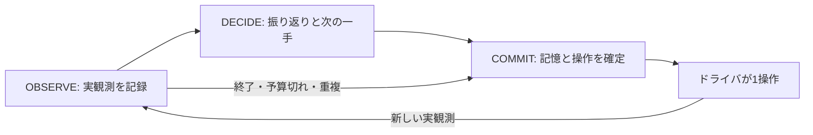

# ARC-AGI-3: 一手ずつ学ぶ認知ループ

更新日: 2026-09-25（日本時間）。現行の実行グラフは **OBSERVE → DECIDE → COMMIT**。Google ADK 2.0.0のWorkflow・LlmAgent・Sessionを維持し、モデル判断をDECIDEへ統合した。`make visualize`で現在のコードから図を再生成できる。

## 簡素化の理由

旧構成はVERIFY・PLAN・PROBE・REVISEを別モデル状態にし、計画の依存グラフや識別実験を行動前の必須契約にしていた。[以前の測定](local-evaluation-completion-tools-ja.md)では、PLAN約40秒＋PROBE約46秒で1操作、その後は時間不足で停止した。複数の原因があるため、状態数だけが原因とは断定しない。

[Human VCGT分析](human-vcgt-analysis-ja.md)から取り入れるのは、思考段階の数ではなく次の反復である。

1. 前の予測と実際の画面を比較する。
2. 目標・操作の作用・見えない状態の仮説を必要な範囲で修正する。
3. 分からなければ一つ試す。分かっていれば部分目標へ一歩進む。
4. 結果を見て、作業メモと次の操作を更新する。

この分析の元資料は動画とルールに基づくLLM注釈で、人間の内的思考の実測ではない。本変更も設計仮説であり、攻略能力の実証とは分ける。

## 実行構造



- **OBSERVE:** 入力・順序・境界を検証し、証拠を保存。差分を計算し、環境の終了・予算を確認する。モデルは呼ばない。
- **DECIDE:** 前後の画面、直前の操作と予測、作業メモ、最近の試行から、振り返りと次の1操作を一緒に提案する。開始とGAME_OVERのRESETはホストだけで処理する。
- **COMMIT:** 検査済みの操作・予測・メモをセッションへ保存し、decision_id付きの1操作または停止を返す。外部ゲームを進めるのはドライバだけ。

通常は1モデル判断。旧VERIFY/UPDATE/RECOVER/CONSOLIDATEなどのエンジン内部処理は決定論的な記録・境界処理であり、別モデル呼び出しではない。旧型の述語・計画検証ユーティリティは回帰テストとともに残すが、現行Workflowは旧ルート選択・提案・計画実行を呼ばず、モデルにも公開しない。

## 提出と記憶

完了ツールは `submit_decision` 一つ。必須は `action` と `prediction` だけ。

```json
{
  "action": {"action": "UP"},
  "prediction": "対象が上へ動くかを確認する。動かなければ入力の対応か障害物を見直す。",
  "reflection": "前の操作では対象の位置は変わらなかった。",
  "notebook": "目標は未確定。対象は中央付近。RIGHTは変化なし。次にUPの作用を確認。"
}
```

`reflection`は今回の結果の解釈、`notebook`は2400文字以内の作業メモ。メモには目標仮説、操作の作用、最後に見た位置、残る部分目標、失敗した試行を簡潔に残す。省略/nullは保持、空文字は消去する。これらは**モデルの仮説**であり、検証済みFactや環境の勝利とは扱わない。予測をホストが意味的に真偽判定したとは主張しない。

観測IDと記憶revisionはホストが提出先の現在ターンに結びつける。モデルによる転記は不要。受理前に隔離したターンで操作を検査し、不正な操作に付随するメモも反映しない。受理した提出はADKのツールループを終了し、追加の最終JSONを生成しない。テキストだけの回答、完了と別ツールの同時呼び出しは受け付けない。

## 観測とツール

現在画像に加えて、同じレベル・試行内では直前の操作前画像も最初から渡す。現在画面とBEFOREを明示し、既知の差分・直前の予測も入力する。レベル/RESET境界では前の盤面を通常のBEFORE画像として添付せず、`boundary=true`でメモの再検証を促す。

最新128観測を不変なEvidenceStoreへ保持する。必要に応じて `list_observations`、`get_observation`、`compare_observations`、`observe_animation` を使える。再読・動画の再生はゲーム時間を進めない。`observe_current`、`move_cursor`、仮定上の操作順を調べる `check_plan_order` も利用可能。

`causal_memory` は実観測に対応する記号解釈と因果規則をSQLiteへ保存・訂正・削除し、正例・負例から条件を学習する。`plan_backward` は目標から現在状態まで逆算し、モデル上の行動列または不足条件を返す。いずれもDECIDEの任意ツールで、状態数は増やさない。計画が得られても1操作後に再観測する。[詳しい設計と制約](causal-learning-and-backward-planning-ja.md)。

CLICKは従来どおりホストカーソルを使う。必要なら `move_cursor(x,y)` の後、座標を含めない `{"action":"CLICK"}` を提出する。利用可能ボタン・座標・残り予算はホストが検査する。

## 予算と停止

- DECIDE内のHTTP往復は最大3回。最後の枠は `submit_decision` だけを公開する。
- `COGNITION_MAX_CALLS=3` は1観測でのモデル判断の上限。正常時は1回、残りは形式・通信エラーの再試行用。検証→計画→実験の呼び分けには使わない。
- `COGNITION_SECONDS=600` は1ゲーム全体の推論時間上限。時間切れは `budget_exhausted`。
- GAME_OVER後のRESETは `COGNITION_MAX_RESETS=2` まで。初期開始は別扱い。
- WIN、評価のレベル上限、操作/時間予算、無効な観測、順序不整合、操作候補なし、再試行しても提出不能なら停止する。
- 「目標が不明」「形式的な計画がない」は停止条件ではない。不正応答をランダム操作に置き換えて成功扱いにはしない。

重複入力には同じdecision_idを返すが、残り予算の再検査は省かない。ノートだけでDONEにならず、勝利は環境WINで決まる。

## スキルと評価

DECIDEには視覚観測・予測照合・目標推定・原因診断・識別実験・逆向き計画の6スキルを任意公開する。毎手のロードは不要。その他の専門スキルは資料として保持するが通常ループには接続しない。[接続仕様](adk-native-skills-ja.md)。

テストでは、1判断での一手提出、前後画像とメモの持越し、境界、クリック、拒否時の原子性、重複、終了、予算、提出の訂正を検証する。実ゲームでは、操作数だけでなく到達レベル、停止理由、最初の一手までの時間、HTTP回数、同一盤面での反復を確認する。[今回の評価記録](local-evaluation-simple-loop-ja.md)。

ADK利用方法は[公式Dynamic workflows](https://adk.dev/graphs/dynamic/)の `Workflow` と `ctx.run_node` を用いる。プロセス内の直列実行を対象とし、診断スナップショットから外部ゲームまで自動復旧する仕組みではない。
