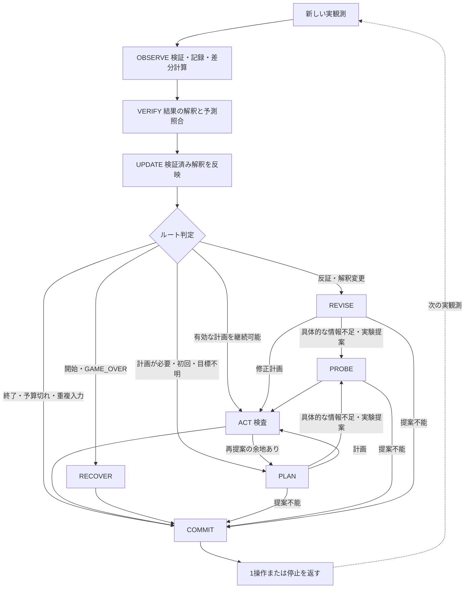

# ARC-AGI-3: 証拠を共有する認知ステートマシン

更新日: 2026-09-24。観測取得と意味解釈を分離した現行実装の設計。実行と検証は[実装ガイド](adk-cognitive-implementation-ja.md)、接続一覧は[ネイティブスキル仕様](adk-native-skills-ja.md)。`make visualize`で現在のコードから図を再生成できる。

## 1. 設計判断と根拠

**OBSERVEは証拠を取得・保存する。証拠の意味は、VERIFY・PLAN・PROBE・REVISEが、その時点の問い・予測・目的に応じて解釈する。** 最初の静止画から物体の役割や目標を認識できることを、思考の開始条件にしない。

根拠は[Human VCGTの分析](human-vcgt-analysis-ja.md)。r11l・ls20は達成条件の見直し、vc33は操作と遅延する変化、s5i5は過去の観測の保持、su15は目的による作用の価値の変化を示唆する。これらは動画とルールから生成されたLLM注釈の定性分析であり、人間の内部処理順序を実証したものではない。本設計は検証可能な工学的仮説である。

区別する情報:

- **証拠:** 実際に受け取ったフレーム、色ID、観測時点、操作、環境の状態。解釈で書き換えない。
- **機械的な差分:** どの座標の色IDが変わったか。受付時に計算できるが、効果・原因・進捗を意味しない。
- **解釈:** 物体の同一性、操作の作用、隠れた状態、目標条件。根拠と担当ステートを付けて更新する。
- **目標:** 達成すべき状態・関係・同時条件などの仮説。特定の画面上の物体に限定しない。環境のWINとは別物。

「factsやgoalが空」だけで画像認識不能とは判定しない。必要な判断に対して適切な証拠を使い、解釈が次の行動へ反映されたかを評価する。

## 2. 制御構造

外側のライフサイクルはBOOT／ACTIVE／AWAIT_FRAME／RECOVER／DONE／STOPPED。1ゲームに1Runtime・ADKセッション・観測ストアを持つ。1回の判断は新観測から次の1操作または停止まで。外部ゲームを進める権限はドライバに限定する。

CONSOLIDATEは独立したWorkflowノードではなく、レベル境界・WIN・部分目標達成で呼ぶ内部処理。全体の上限とエラー処理はコードで強制する。

|状態|責務と出力|モデル呼出し|
|---|---|---|
|OBSERVE|入力・順序・境界を検証。観測IDを確定し、不変の画像・操作対応を保存。差分は数値として計算|なし|
|VERIFY|前の予測・実験・計画に照らして証拠を読む。現在の事実と仮説更新をInterpretationとして提案。Pythonが三値で述語照合|初回はなし。結果待ち／計画があり予算に余地がある通常手で最大1判断|
|UPDATE|VERIFYの検証済み解釈を仮の記憶へ反映。終了・計画完了・期限・不変条件を確認|なし|
|PLAN|目標条件も検討対象にし、既存証拠で計画できるか判断。計画、具体的な探索依頼、または完成した実験を提案|あり|
|PROBE|依頼された未知を区別する実験を作る。完成した実験を受け取った場合は再推論せずACTへ|必要時|
|REVISE|反証された目標・制御対応・作用・モードを見直す。関係のない知識を残し、計画または実験を提案|あり。独立したモデル状態|
|ACT|操作、現在の前提、依存関係、予測、座標、予算を検査|なし|
|COMMIT|記憶と判断ID・pendingを保存し、1操作か停止を返す|なし|
|RECOVER|開始／GAME_OVERに対する上限付きRESET、または停止|なし|
|CONSOLIDATE|確認された節目の履歴を、再検証が必要な手順候補として保持|なし|

VERIFYの意味解釈と述語照合は分ける。解釈が形式不良でも、セル・環境状態など照合可能な証拠は検査する。事実が分からなければunknownとし、架空の認識結果を補わない。

## 3. 共通の観測スキルと証拠ストア

S01はOBSERVE専用の推論ではなく、VERIFY・PLAN・PROBE・REVISEから使う証拠参照のスキル。全状態のモデルへ同じ取得ツールを公開する。

|ツール|返すもの|
|---|---|
|`observe_current()`|現在受け取っている最終フレームとホストカーソル|
|`list_observations()`|保持中の観測ID・step・境界segment・元の操作と判断ID|
|`get_observation(observation_id)`|その時点の不変な画像・メタデータ。再取得は新観測ではない|
|`compare_observations(before_id, after_id, offset=0)`|ラベル付き前後画像、画素差分、間に入った操作。差分は96件ずつ取得|
|`observe_animation(event_id, start_frame=0)`|保持中の過去イベントの途中フレーム。4枚ずつ取得|
|`move_cursor(x,y)`|現在画面でクリック位置をプレビュー。操作は実行しない|

`EvidenceStore`は実行単位の一時ディレクトリへ最新128観測を保存する。診断ログ設定に依存せず、終了時に削除する。各記録には最終画像・色IDグリッド・元の途中フレーム・操作対応を保存する。古い観測は明示的に失効し、ツールは取得不能を返す。全ゲーム履歴やクラッシュ後の復旧を保証するストアではない。

過去の画像に表示するカーソルは保存時のホスト表示であり、ゲーム内物体ではない。カーソルを動かしても、保存済みの画像や観測IDは変わらない。現在画像だけを通常入力へ添付し、過去画像は必要なときに取得する。

比較は同じsegment内の古い観測→新しい観測に限る。レベル変更・RESET完了でsegmentを切り替え、境界をまたぐ機械的な差分比較を拒否する。過去画像そのものは保持期間内なら参照可能。複数操作が介在した差分を単一操作の因果証拠とはみなさない。

## 4. 記憶と応答の契約

記憶スキーマはversion 2。過去のPerception契約を廃止し、OBSERVEからLLM呼出しを除いた。旧スナップショットの移行・復旧は実装しない。

|情報|保持内容|
|---|---|
|観測ストア|観測ID、step、segment、画像・色ID・途中フレーム、元の操作。解釈から独立|
|Fact|現在見える測定値、根拠観測ID。前回の事実は不可視として保持し、現在事実と混ぜない|
|Hypothesis|goal/control/dynamics/mode、主張、level/gameの範囲、状態、証拠ID|
|Goal|現在の達成条件の仮説を文字列で保持。空文字は未確定。関係・同時条件などを表現可能|
|Interpretation|観測ID・記憶版、facts、hypotheses、必要ならgoal/unknowns、changeと根拠、summaryとevidence_refs|
|Plan|部分目標、依存関係、前提、完了条件、維持条件、効果、stepの時間窓|
|Experiment|問い、2個以上の異なる予測、識別基準、リスク|
|Pending／Deferred|操作前観測ID、操作、予測、期限、介在操作|
|解釈履歴|直近32件。担当ステートと証拠を保持。生の証拠を上書きしない|
|行動履歴／Procedure|直近64判断／最大8手順候補。再利用時に前提を再検証|

VERIFYはInterpretationを返す。PLAN・PROBE・REVISEはProposalを返し、必要な知識更新を`interpretation`に含める。内側のinterpretationも観測IDとmemory_revisionを照合する。

- factsは現在の観測を根拠にする。過去の事実や不可視対象は現在見えたことにしない。
- goal/unknownsの省略またはnullは保持、`goal=""`は撤回、`unknowns=[]`は解消を表す。
- 目標変更・解釈のsummaryにはevidence_refs、mode/dynamics/goal変更にはchange_evidenceが必要。
- 新しい仮説とそれを使う計画を同じ提案に含められる。提案全体の検証に失敗したら、その解釈も取り消す。
- 成功の判定は環境WINだけ。目標文字列やモデルの主張でDONEへ遷移しない。
- 実験の`matched_alternatives`は予測照合結果と分けて記録する。一致した候補があることは、一般的な因果法則の確定ではない。

VERIFYではInterpretationを検証・保留し、その現在factsを仮の証拠として述語評価する。UPDATEで解釈を反映する。提案の解釈は提案の検査時に仮の記憶へ適用し、成功時だけ採用する。外部セッションへの保存はCOMMITが担当する。

## 5. ルート判定と予算

優先順は、終了／重複入力→開始・GAME_OVER→反証によるREVISE→既存計画を実行できるACT→PLAN。**goalが空、unknownsが残るという理由だけではPROBEへ送らない。** 未知が次の判断に影響するかをPLAN／REVISEで検討する。

PLAN／REVISEは次のいずれかを返す。

1. `status=ok, purpose=plan`と部分目標グラフ → ACT。
2. `status=need_evidence, inquiry=具体的な問い`、操作・計画・実験なし → PROBEが実験を設計。
3. `status=ok, purpose=probe`と完成した実験 → PROBEを通ってACT。追加のモデル呼出しは不要。

PROBEは合法操作と識別可能な実験を返す。操作なしの無限な情報要求ループは作らない。取得ツールの呼出しは各状態の内部で完結し、外部操作を増やさない。

既定は1観測につき最大3モデル判断、各判断最大8 HTTP往復。初回はPLANのみ、またはPLAN＋PROBE。通常はVERIFY＋PLAN、必要ならPROBEを加える。有効な計画を継続できればVERIFY＋ACT。VERIFYは少なくとも1判断分を次の提案へ残す。残り時間がなければ追加推論をしない。未使用枠は形式修正に使えるが、上限到達時は停止する。

端末状態・手数上限・レベル上限で追加の視覚推論を行わず、可能な決定的照合と最終記録を残す。RESETを形式不良や単なる無進捗から自動発行しない。

## 6. 境界・遅延・部分観測

- 通常観測では過去事実を不可視へ移し、仮説・計画・未知を保持する。
- 新レベル／RESETでは盤面の事実、目標、計画を無効化。level仮説はsuspended、game仮説はcandidateへ戻す。
- 行動結果の受付と効果の発生を区別する。遅延窓が残ればDeferredへ移し、不可視や未到来を反証にしない。
- 途中に別の操作があれば因果帰属を保留する。差分はその間の全遷移を含む。
- 別ゲームはRuntime・セッション・証拠ストアごと分離する。
- 画像ハッシュが同じでもstepが新しければ新観測。同じ入力の再配送では二重操作を生成しない。

## 7. 検証と残る課題

テストでは、初回のPLAN到達、具体的な探索依頼、操作前後画像のツール往復、VERIFYによる事実解釈と述語照合、UPDATE後のPLANへの反映を実際のADK経路で確認する。さらに境界比較の拒否、古い証拠の失効、同一画像の再読、無効提案の原子性、終了・予算・重複入力を検証する。

性能は同じモデル・公開ゲーム・操作数・時間で比較する。クリア／SDKスコアだけでなく、判断のステート別回数、証拠参照ツールの回数、解釈の根拠、同じ実験の反復、目標変更後の行動、予測カバレッジを調べる。「空のOBSERVE応答率」は現行構造の指標ではない。

現在の限界は、モデルが証拠取得ツールを適切に選ぶ保証がないこと、目標がまだ形式的な述語集合ではなく仮説文字列であること、因果帰属や認識の正しさをID検査だけでは保証できないこと。専用探索器、モデル判断を省く適応的なVERIFY条件、ゲームをまたぐ手順学習は別の課題とする。
