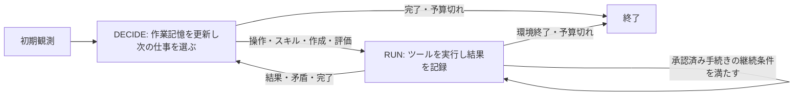
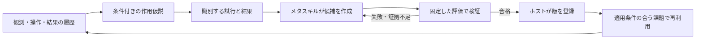

# 自律的なスキル獲得を中心にしたエージェント再設計

2026-09-25の設計案。後続の[現行実装](skill-learning-runtime-ja.md)では、有限の条件付き手順から自律獲得する最小構成を実装した。本書には将来の拡張案も含むため、実装済み範囲と検証結果は現行仕様を参照。

## 目的と今回の設計判断

目的を「認識・計画・実行を分ける」から、**未知の環境で作用を調べ、使える手続きを作り、評価を通ったものを再利用して次の課題を少ない判断で解く**へ置き直す。

推奨は、**一つの判断役とツール実行からなる循環＋評価を通して更新するスキルライブラリ**。認識・計画・因果推論・反省は判断役が必要に応じて行う機能であり、毎回通過する独立状態にはしない。実行制御の通常状態を `DECIDE` と `RUN` にする。終了・予算切れ等のライフサイクル管理は別に持つ。

これは「人間には二状態しかない」という主張ではない。思考機能の数、LLMの数、実行制御の状態数、スキルの採用状態を区別し、ソフトウェアとして最小の境界を選ぶ提案である。

前の[構造レビュー](history/agent-architecture-gap-review-ja.md)の認識・検証に関する診断は維持するが、「三状態を維持する」は設計の前提から外す。認識改善は自律学習の入口であり、それだけで完成とはしない。

## 添付PDFの読み取り

資料: Singhalほか『Agent Skills』、May 2026。[ローカルPDF](<../reference/Agent Skills_Day_3.pdf>)。目次のページ番号にずれがあるため、以下はPDFの実ページ番号を使う。

- §6はpp.35–38。作成、成功履歴からの抽出、既存スキルの改善、ライブラリ拡張を分けている。
- Figure 9はp.36。成功した履歴から再利用可能な手続きを作る。
- Figure 10はp.37。修正案を評価し、維持／差し戻しを決める。図中には人による抜き取り確認も描かれている。
- 同じp.37の「Library evolution」でVoyagerを引用する。**Figure 10そのものはVoyagerの原論文の状態図ではない。**
- §4（pp.18–27）では、呼び出しの適切さ、実行結果、コンテキスト費用、他スキルへの回帰を評価対象にしている。

本設計は、PDFの「候補をそのまま正式採用しない」という評価境界と、Voyagerの実行可能な手続きの蓄積を組み合わせる。Voyagerの公開実装での採用条件はcriticの成功判定であり、一般的なユニットテスト群を通すFigure 10と同一ではない。[Voyager実装](https://github.com/MineDojo/Voyager/blob/main/voyager/voyager.py)、[critic](https://github.com/MineDojo/Voyager/blob/main/voyager/agents/critic.py)

PDFの人による確認は運用上の推奨として扱う。今回のローカル研究用エージェントでは、初期の評価基準・採点器を人が確認し、その固定基準内で候補の作成・試験・採用を自動化する案とする。候補ごとのユーザー承認を必須にはしない。これは自律化という本プロジェクトの目的に合わせた設計上の選択で、PDFの図の完全な再現ではない。

## 文献から借りるもの

|資料|原資料での考え方|今回の設計への対応|
|---|---|---|
|Voyager, Wang et al., 2023|課題生成、実行コードのスキルライブラリ、環境結果・実行エラー・批評に基づくコード修正|課題を保持し、操作結果から手続きを修正。成功が確認できた手続きだけを再利用する|
|Anderson, 1982|宣言的な知識を使う段階から、練習による知識のコンパイルを経て、手続きとして適用する段階へ。適用範囲も調整される|仮説・経験を作業記憶へ残し、安定した手続きをパラメータ付きスキルへ変換する|
|Gopnik et al., 2004|因果関係の理解では、観察された共変動と介入の情報を区別する。子どもの実験結果を因果モデルで説明する|「押した後に変わった」を即座に法則とせず、別仮説と区別する操作・予測・結果を記録する|
|Sutton, Precup & Singh, 1999|複数時点にまたがる行動を、開始可能な条件、内部方策、終了条件を持つoptionとして表現する|スキルを固定操作列だけにせず、適用条件・観測に応じた手続き・終了条件で表す|

一次資料: [Voyager](https://voyager.minedojo.org/)、[Anderson論文 pp.369–370](https://gwern.net/doc/iq/1982-anderson-2.pdf)、[Gopnikほか論文](https://www.sfu.ca/~jeffpell/Cogs300/GopnikCausalMaps.pdf)、[Options論文 §2](https://people.cs.umass.edu/~barto/courses/cs687/Sutton-Precup-Singh-AIJ99.pdf)。Andersonのリンクは原論文の再配布PDF。

Andersonの習得段階は、一手ごとに順番に通る状態図ではない。Gopnikほかの結果も、子どもが本システムと同じアルゴリズムを実行するという証明ではない。Optionsは計算上の行動抽象化であり、人間の思考段階の実証ではない。これらから設計原理を借り、状態数や具体的な採用閾値は本プロジェクトで検証する。

既存の[Human VCGT分析](human-vcgt-analysis-ja.md)は、目標の再解釈、作用の識別、手順の再利用を設計仮説として支持する。ただし動画・ルールから作られたLLM注釈であり、本人の思考発話でも、今回全件を元動画と照合した結果でもない。

## 候補を比較した結論

|案|利点|今回の判断|
|---|---|---|
|認識→計画→実行→反省→スキル化の固定工程|役割を説明しやすい|各手で不要な呼び出しと受け渡しが増える。通常の実行と学習を同じ頻度で回す必要はない|
|現行三状態に学習状態を追加|移行差分が小さい|現在の分割を前提に複雑さを増やす。自律スキル獲得から設計し直す目的には合わない|
|一つの判断役＋実行、スキル更新は必要時の仕事|同じ作業記憶を使い、通常操作とスキル作成の頻度を変えられる|推奨。ただし小さい状態図でも、観測・検証・記憶の契約は必要|

Voyagerの三つの主要構成要素も、必ず毎手一回ずつ通る三つの思考状態と同義ではない。カリキュラムの機能は最初は判断役の部分目標・実験選択に含め、別LLMにしない。

## 実行制御：DECIDEとRUN

### DECIDE：認識と方針を同じ判断で更新する

最新観測、直前の実結果、現在の課題、関係する仮説、候補スキルの短い説明を入力にする。結果を見て目標や仮説を修正し、次の仕事を一つ選ぶ。

- 未知の作用を区別する操作を試す。
- 目標へ進む単発操作を実行する。
- 適用可能な採用済みスキルを呼ぶ。
- 経験からスキル候補を作る／修正する。
- 候補を評価する、または終了する。

認識だけの回答を必ず先に出させてから別の計画役へ渡す必要はない。出力は「作業記憶の小さな更新＋次の仕事」。全対象・全仮説・長い説明を毎回書き直させない。初期目標の推定も修正可能な仮説として保持する。

複数ツールの利用でHTTP要求が増える場合はあるため、「判断役が一つ」と「一手につき必ずLLM一回」は区別する。メタスキル作成を通常判断の出力に毎回含めず、選ばれたときだけ専用の短い作業入力にする。

### RUN：操作・検査・結果収集を担当する

ホストが入力を検査し、選ばれたツールを実行する。ゲームを進めるのは既存ドライバだけとする。スキルも一手ずつ操作を返し、毎回実観測と受付結果を記録する。

スキルの実行中に、機械的に判定できる適用条件・継続条件・予算を満たせば、毎手LLMを呼ばず継続できる。予測外の変化、対象消失、レベル境界、判定不能、上限到達で停止してDECIDEへ戻す。意味的な判断をモデルに頼る手続きはその時点で戻す。長い操作列を観測せず一括送信する設計にはしない。

RUNはゲーム操作だけでなく、証拠の読出し、候補保存、評価の実行にも使う。ツールの結果が返れば同じ作業記憶へ戻り、独立した「スキル作成エージェント」の永続記憶は作らない。最初の実装は直列処理でよく、バックグラウンド学習や複数エージェントは不要。

## スキル獲得：通常の行動とは別の更新周期

これは必須の逐次状態列ではなく、成果物の依存関係。経験が足りなければ候補作成を保留し、操作へ戻る。予算を使い切ったら未評価の候補をそのまま残す。スキルのライフサイクルは最小限 `candidate → active → suspended` とし、評価失敗・未評価はcandidateのまま。修正は新しい版として作る。

最初から完全な因果モデルを解明する必要はない。条件を限定した経験的手続きでも、適用範囲内で結果を確認できれば候補になる。ただし「実用上この条件で動いた」と「一般的な因果法則が証明された」は区別する。

### 最初に用意するメタスキル

1. **識別実験を設計する方法:** 競合する仮説、区別できる操作、仮説ごとの予測、判定条件を短く作る。
2. **skill-creatorに相当する方法:** 成功例・失敗例・適用範囲から、候補の説明・パラメータ・手続き・試験案を作る。修正も同じ方法で行う。

観測保存、合法操作の実行、評価実行、ライブラリ登録はホスト機能。これらまで全て自然言語スキルに置き換えない。初期の方法スキルと採点器は固定し、最初の自律更新対象はゲーム内で獲得する手続きに限定する。メタスキル自身の改善は、この仕組みの効果が測れた後の別実験とする。

作成形式は今回参照した[skill-creator](/home/prog/.codex/skills/.system/skill-creator/SKILL.md)の、短い説明、必要時だけ読む本文、実行可能な補助資源という構成を参考にする。Codex用の管理ファイルを本エージェントへそのまま導入する意味ではない。

## 仮説・手続き・評価結果を混同しない記憶

|保存物|最小の内容|役割|
|---|---|---|
|Experience|前後の観測ID、実行した操作、受付、測定差分、使用スキルの版|後から読み直せる実経験。モデルの文章で上書きしない|
|WorkingMemory|現在の課題、対象の観測参照、作用仮説と反例、未解決点、現在の手続き|次の判断に必要な少量の情報。課題変更は理由となる観測と結ぶ|
|SkillCandidate / SkillVersion|適用条件、パラメータ、手続き、予測効果、停止条件、根拠、親版|再利用単位。候補と正式版を分ける|
|EvaluationReport|候補ハッシュ、評価セット・採点器の版、各結果、費用、適用を認めた範囲|採用・保留・差し戻しの根拠|

例えば作用仮説は `条件Cで操作Aをすると、観測可能な効果Eが時間幅W内に起きる` とする。支持する経験IDと反例IDを持つ。単一の確信度で採否を決めない。操作後の変化でも、同時に別要因が変わった、対象同定が曖昧、時間遅れが不明などの場合は未確定とする。

スキルの最小契約は、`適用範囲 / 開始条件 / 引数 / 観測に応じた手続き / 期待効果 / 完了・中断条件 / 操作上限 / 根拠・依存先・版`。最初は長いコードを自由生成するより、既存の観測・ボタン操作・条件分岐・回数制限を組み合わせる小さい実行形式を推奨する。実行形式の不足が実例で分かった場合に、同じ契約の下でスクリプトへ広げる。

`SKILL.md`は発見・選択・説明に使い、手続きを毎回文章から再解釈しなくてよい実行形式も持つ。最初の配布単位は `SKILL.md`、実行仕様、証拠参照、評価報告で十分。多数のテンプレートや汎用スキルを先に生成しない。

## 評価を通して登録する仕組み

Figure 10を本プロジェクトに移す際、**ユニットテストの成功だけでは未知のゲームの法則や攻略能力を証明できない**。評価を次のように分ける。

|評価|確認する内容|合格しても言えないこと|
|---|---|---|
|契約・単体試験|引数、許可された操作、観測参照、終了・中断、上限、エラー処理|ゲーム内で期待効果が生じること|
|保存履歴による試験|適用すべき／避けるべき例、対象位置、予測と記録結果の対応|未実行の別操作の結果や未知状態での成功|
|環境内の挙動試験|候補を実際に動かし、別の対象や配置でも申告した効果と停止条件が成立するか|未確認の別ゲームへの一般化|
|ライブラリ全体の比較|候補を加えて選択が乱れないか、既存能力を壊さないか、費用に見合うか|あらゆる条件での性能改善|

メタスキルは試験案も提案できるが、自作の実装と自作の期待値が一致するだけでは採用しない。既存の固定ケース、生成に使わなかった経験や新しい試行、外部の観測に結び付いた判定を使う。登録判定はホストが行い、作成側には合格記録や採点器を書き換える経路を与えない。

評価開始時に候補・依存先・評価セットを固定する。合格したハッシュと一致する版だけを登録し、旧版は残す。効果判定は `pass / fail / unknown` とし、unknownや未実施をpassへ変換しない。十分な証拠がなければ候補を残し、追加の有限な試行として実験できる。通常の自動再利用対象にはしない。

初期の小さいスキルについては、少なくとも採用範囲内の複数の異なる条件、適用除外例、中断例を含む評価を事前に定義する。必要件数・許容失敗率・費用上限はスキルの範囲と測定ばらつきから決める。PDF中の例示値を、このゲーム向けの普遍的な合格基準として流用しない。

### 評価環境の制約

現行の保存画像・観測ログは任意の操作を試せるシミュレータではない。現在の評価スクリプトは新しいゲームセッションを作れるが、任意の途中状態への復元をエージェントに提供しているわけではない。

保存履歴の試験は認識・選択・既観測結果の照合に限定する。挙動試験は隔離した新規セッションや、実際に再現できた開始状態で行う。開始状態の再現性を確認できなければ同条件の比較とは扱わない。分岐復元できない環境では、オンライン試行にもゲームの操作・時間予算を課す。評価者だけが読めるゲーム内部のルールを、学習役へ渡す設計にはしない。

採用済みスキルが実行中に明確な反例を得た場合、その版の自動再利用を停止し、経験を残して判断役へ戻る。対象同定の失敗なのか、適用条件不足なのか、手続きの誤りなのかを区別して改版する。単なる新レベルへの移行で、全ゲーム共通の法則が成立・不成立と決めない。

## 仮の例：作用の発見から自動化まで

以下は仕組みの説明用で、ls20・vc33・ft09の実際の法則を主張するものではない。

1. あるセルをクリックした後、複数の色が変わったという実経験を保存する。
2. 「同じ行が変わる」「同じ列が変わる」「特定の色だけが変わる」を候補仮説として持つ。
3. 各仮説で結果が異なる対象を選び、操作前に予測を記録して試す。対象・盤面の読み取りが不確かなら、そこを先に確かめる。
4. 条件を限定して行への作用が支持されたら、メタスキルが `toggle_row(cell)` の候補を作る。座標固定ではなく対象を引数にし、実行後の差分で予測を検証する。
5. 別の行・配置、除外条件、変化しない場合の停止を評価する。合格した範囲で登録する。
6. 判断役は行を変える必要がある課題でそのスキルを選ぶ。手続きが検証済みの範囲では、毎回ルールを推測し直さない。

単発の作用スキルでも出発点になる。複数の採用済みスキルを組み合わせた手続きは新しい候補であり、構成要素の合格だけで合成結果まで合格とはしない。依存する版を固定して組合せを評価する。

## 中間記録と分析

状態を細分化しなくても、ホストが処理境界で次を保存すれば過程を追える。

`観測受領 → 判断の更新 → 操作／スキル選択 → 実行受付 → 結果 → 仮説更新 → 候補作成 → 評価 → 採用／保留／停止`

各イベントに観測ID・課題ID・判断ID・スキルIDと版・評価IDを必要な範囲で付ける。候補が生まれた成功例と失敗例、呼び出したメタスキル、実際のツール、登録判定まで辿れるようにする。未完了の評価や判断もログへ残す。

現行の要求・応答・操作・観測ログは再利用する。モデルが出力した仮説や短い判断要約は意思決定の成果物であり、内部の思考そのものを忠実に記録したという扱いにはしない。

## 現在の実装からの移行と検証

|段階|実装対象|到達条件|
|---|---|---|
|0: 学習の入口|保存入力で認識を診断。合成表示／ゲーム画像の比較、対象・差分と測定可能な効果の最小表現|モデルの古い説明と実観測を区別できる。何を測れずunknownなのかが明確|
|1: 最小ループ|ASSESSとDELIBERATEを一つの判断役へ統合。RUNは既存の操作検証・ドライバを利用|同じ予算で三状態版と比較し、観測更新・操作の整合・費用を測れる|
|2: スキルの実行と採用境界|ライブラリ、手続き実行、固定評価、版管理。動作確認用の小さい手書きスキルを使う|実行、適用拒否、中断、評価失敗時の非登録が実際に成立する|
|3: 自律獲得|実経験から候補を作るメタスキルを接続|未提供の手続きを候補化し、評価・登録・新しい状況での再利用まで一連で達成|
|4: 修正と転用|反例による停止・改版、検証範囲の拡張、合成スキル|既存能力を損なわずに適用範囲または費用が改善する|

段階2の手書き例は実行・評価基盤を検証するためであり、エージェントが獲得した成果には数えない。

現行[skills.py](../agent/cognition/skills.py)は説明文のロードだけを許し、スクリプトを拒否する。[workflow.py](../agent/cognition/workflow.py)は二つのLLM役割と状態別スキルを生成する。この接続だけを増やしても自律獲得にはならない。作成・評価・登録・実行を扱うライブラリ境界を追加する必要がある。

観測保存、操作の合法性検査、実行受付、モデル要求記録、既存ベンチマークは維持する。新しい形式を採用する際は[ノートブックの梱包](../scripts/build_notebook.py)も更新し、実行仕様・評価記録を再現可能に含める。現在はPythonとスキルMarkdownを中心に梱包しており、新設のJSON等が自動で全て入るわけではない。

比較はまず「現行三状態」「統合ループ・学習なし」「統合ループ・学習あり」を段階的に行う。認識表示など別の変更と同時に効果を帰属しない。学習ありでは同じ初期ライブラリから開始し、作成・失敗した試験も含む総費用を記録する。

学習の評価には、通常の一回の攻略とは別に、学習→ライブラリ固定→未使用の配置・課題で評価する条件を用意する。独立試行間のライブラリ共有は明示した転用実験に限る。90秒の評価を続ける場合も、学習・評価の費用を除外して有利に見せない。

主指標は、クリア、操作・時間・LLM費用に加え、実際に再利用されたスキルの効果、誤適用、予測違反後の停止、採用後の回帰。ファイル数や自己申告の成功数を学習の指標にしない。新しい課題でのスキル有無の比較により、獲得した能力が役立ったかを確認する。

この設計の最初の実証目標は、**未知の一つの作用について、経験から候補を作り、不合格なら残し、合格なら登録し、別の状況で再利用する**こと。その一連の循環を確認してから、スキル数やメタスキルの自己改善を広げる。
