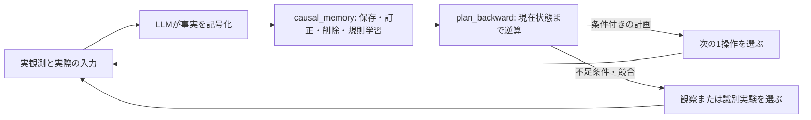

# 永続的な因果モデル学習と逆算計画

更新日: 2026-09-25。既存の **OBSERVE → DECIDE → COMMIT** を維持し、DECIDEから呼ぶスキルと型付きツールを追加した。

## 考え方

ユーザー提案を「観測を記号へ変換 → 正例・負例からルールを学習 → 目標から必要条件を逆算 → 次の一手、または不足知識を調べる実験」として実装した。

ILPは、背景知識と例から論理規則を学ぶ枠組みである。既知の規則をつないで行動列を求める部分は、別の計画探索として扱う。[ILP概説](https://arxiv.org/abs/2008.07912)。行動の前提・追加・削除効果を観測例から学ぶ研究とも関係する。[Learning Action Models from Plan Examples with Incomplete Knowledge](https://cdn.aaai.org/ICAPS/2005/ICAPS05-025.pdf)。

今回の実装は、その研究の再実装を名乗るものではない。**有限のground atomを使う命題化された条件学習と、STRIPS型の後向き探索**である。`at(player,door)`は一つの記号で、変数の単一化、再帰プログラム、述語発明、数値制約、一般的なPrologプログラム探索は実装しない。



逆算が到達すべき出発点は、基本的に**現在状態**。開始直後ならゲーム開始状態と一致する。すでに進んでいる場合、最初からの行動列を再実行する必要はない。

## 役割と接続

|担当|内容|
|---|---|
|LLM|画面の意味、同一物体、正・負の観測事実、抽象行動名、目標仮説、実験の選択|
|cause-diagnosisスキル|比較・記号化・反例による修正と記憶の使い方|
|`cause-diagnosis/scripts/induction.py`|観測例からground条件の候補を検索し、規則の支持・反例・不明を集計|
|backward-planningスキル|現在状態・目標の設定、探索結果と不足条件の使い方|
|`backward-planning/scripts/regression.py`|削除効果と部分目標の干渉を考慮した逆算、得られた列の前向き再検査|
|`agent/cognition/causal.py`|Pydantic契約、SQLite永続化、観測IDと実入力の照合、型付きツールへの橋渡し|
|通常のWorkflowとドライバ|操作の合法性・予算・重複配送・終了判定と、実ゲームへの1操作|

スクリプトは実際にスキル配下に置き、ホストが固定されたコードをimportして実行する。モデルには `causal_memory` と `plan_backward` を公開する。ADKの汎用 `run_skill_script` や任意Python実行は公開しない。登録された2スクリプトの名前と内容が同梱コードに一致する場合だけSkillToolsetが受け入れる。モデル生成コードを実行する経路ではない。

DECIDEの専門スキルはS06を加えた6個。スキル本文は任意ロードで、ツールはロードなしでも使える。通常の3 HTTP枠で「保存と学習をまとめる → 逆算 → 一手提出」が可能。毎手必ずこの3処理を行うわけではない。

## 観測・正例・負例

事実は `{"true":[...],"false":[...]}`。同一記号を両方に置けない。どちらにもない記号は**不明**であり、偽ではない。

モデルが `before_id`、`after_id`、抽象行動名と前後の記号を提出する。実際のボタン・クリック座標は、その間の観測に保存された入力履歴からホストが取り出す。存在しない観測、異なる実行の混在、欠落した中間入力、RESETをまたぐ例は拒否する。最大12入力の区間を抽象行動として記録できるが、支持されるのはその入力列全体であり、特定の1入力の因果効果へ分解しない。

- 正例: 前は明示的に偽だった効果が、操作後に明示的に真となった等、実際の成立変化がある。
- 負例: 成立を予測した効果と矛盾する結果を明示的に観測した。
- 不明: 対象が隠れた、必要な条件が未観測、効果が操作前から成立していた等。
- `confounded=true`: 時間経過・対象の同定・介在要因などが曖昧。保存するが、学習と支持件数から除外する。

`stage_clear`は予約記号。正のラベルはレベル増加かWINからホストが決める。モデルが「クリアに見える」と書いても正例にならない。レベル境界のAFTERは旧盤面の `stage_clear` だけとし、新盤面の物体位置を旧盤面の効果へ混ぜない。

ただし、その他の記号はLLMによる解釈であり、画像からの正確さをこのプログラムが保証するわけではない。反例を消して都合のよいルールを残さず、誤記号化なら例を訂正し、真の失敗なら条件やモデルを見直す。

## 規則学習と状態

同じ抽象行動名・同じ具体的な入力列・同じ適用範囲の例を集める。観測された成立／消失効果ごとに、正例で共通する前提の候補を作り、負例と区別できる条件を探索する。

例: 通電中に扉が開き、非通電時には開かなかったなら、`powered`を候補前提にできる。正例しかない場合は、無条件に一般化せず観測した文脈を保持する。条件が不明な負例を「条件を満たさない例」として除外しない。

負例の除外に使う連言は最大4条件、候補条件32個、候補探索2000件・0.5秒を上限とする。複数の説明がデータと整合する場合、返す規則はそのうちの候補であり、一意な真の原因ではない。例を分離できなければ、対象・モード・時間・未観測条件など、調べるべき差を `learning.unresolved` に返す。

|状態|意味|
|---|---|
|supported|適用条件を観測できた正例があり、対応する反例が記録されていない|
|contradicted|その条件下で予測に反する観測例がある|
|candidate|まだ対応する正例がない、または不明な例だけ|

`status`はモデルが指定せず、読み取り・計画時に記録例から再計算する。「supported」は因果関係の確定や高い統計的信頼度を意味しない。証拠件数と代表IDを併記する。

## 永続的な読み書きと削除

`CAUSAL_MEMORY_DIR`の既定値は `outputs/causal-memory`。full game IDをハッシュ化したSQLiteファイルで、別ゲーム／別バージョンを分離する。既定の規則範囲は同一レベル。`scope=game`は明示した場合のみ同じゲーム内でレベルをまたぐ。位置や制御対応は、再試行・新レベルの現状態で再検証する。

OBSERVEは最後のWINも含む直近128観測を保存する。モデルを呼ばずに終了した最終フレームも、次の実行から読める。保存済みの解釈例は元観測と中間入力を別途保持し、元の短期アーカイブが失効しても出典を調べられる。

`causal_memory`は次を同一更新へまとめられる。

- `transitions`: 追加、または同じIDの記号解釈の訂正。
- `rules`: 明示的な仮説の追加・置換。裏付けがなければcandidate。
- `delete_rule_ids`: 規則の削除。削除記録を残し、同じ規則が学習直後に復活することを防ぐ。明示的なupsertで復帰可能。
- `delete_transition_ids`: 誤った解釈例の削除。その例だけが支持していたルールは再評価される。
- `induce=true`: 保存後の例を使って学習。更新時の既定値。

`operation=read`（既定値）は更新しない。`action_name`で絞り込み、`offset`／`limit`で読み進める。`observation_index`からIDを選び、`observation_ids`で最大2枚の元観測を取得する。画像はラベル付き画像入力としてモデルへ返す。

上限は解釈例1024件・規則256件・削除記録1024件。上限で黙って学習例を落とさず、整理が必要なエラーにする。各更新はSQLiteトランザクションで検査して確定する。過去の観測からの知識更新は、新しい操作の提出とは独立して永続化する。

Dockerでは保存先がプロジェクトのbind mount内なので、コンテナを作り直してもファイルは残る。Kaggleでは同じ実行中の作業領域に保存できるが、別のNotebook実行への自動継承はしない。学習済みDBは提出ノートブックへ同梱しない。ベンチマークは各試行の出力先に独立した保存先を設定し、前の評価の知識を混入させない。

## 逆算の結果

逆算は、目標の連言を後ろから満たす行動を選び、必要な前提へ置き換える。残りの目標を壊す効果や矛盾する前提は拒否する。出発状態まで到達した行動列は、前から再実行して前提・効果・最終目標の整合性を検査する。[Regression Planning](https://artint.info/2e/html2e/ArtInt2e.Ch6.S3.html)。

|結果|扱い|
|---|---|
|plan|記録したモデルの下で成立する行動列。証拠と前向きの状態推移を返す|
|tentative_plan|`allow_candidates=true`で、未検証の規則も含む仮説的な列。実験候補として扱う|
|knowledge_gap|与えた有限モデル内に列がない。必要条件、不明な現状、既知の生成手段がない条件、競合する効果を返す|
|search_limit|深さ・ノード数・時間の上限。解や知識不足の有無は未確定|

既定上限は12規則・2000探索ノード・0.5秒。最短の具体的入力数や一般の問題に対する完全性は保証しない。同じ具体入力で、条件が重なり効果が異なるモデルは都合のよい方を選ばず、競合として除外する。

`knowledge_gap`は必要な知識を自動発見したという意味ではない。例えば `door_open` の生成手段がなければ「扉が開く条件を調べる」という具体的な問いになるが、どの未知操作がそれを実現するかは観測・実験が必要。また、クリア例も妥当なクリア仮説も一度もなければ、`stage_clear`への最後の規則自体が欠ける。まず目標仮説や観測可能な中間目標を設定し、探索と検証を行う必要がある。

得られた計画も、未知の副作用、部分観測、非決定性、記号化の誤りを解消しない。LLMが次の操作を現画面へ対応付け、1操作後に再観測する。自動で全列を再生しない。

## 検証

自動検証とモデル確認の結果は[検証記録](local-evaluation-causal-planning-ja.md)。

```bash
make test
docker compose run --rm --no-deps dev python scripts/demo_causal_planning.py
docker compose run --rm --no-deps dev python scripts/check_causal_tools.py
```

合成デモは「鍵を取る→扉を開ける→出口へ進む」を保存済み規則から解き、鍵取得の規則を削除すると `has_key` の生成手段不足を返す。これは記号処理と接続の検証であり、実ゲームのクリア実績ではない。
