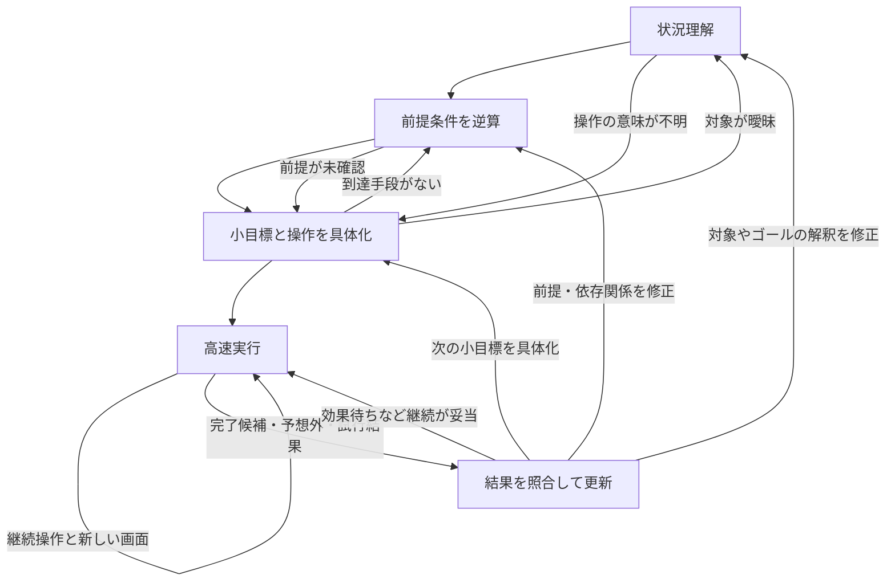

# 具体的な小目標を作る熟考ステートマシン

2026-09-26。fast/slow実装に対する設計記録。後続の[実装仕様](fast-slow-runtime-ja.md)に4工程と目標・試行の記憶を反映した。効果は実モデル評価と区別して扱う。

## 最新ログから分かる問題

対象は `outputs/evaluations/20260926T133025594495Z` の各ゲームの `cognition/*.model.jsonl`。

|ゲーム|最初の計画と完了条件|実際の高速判断|
|---|---|---|
|ls20|隣接マスへ移動して地図を探索する／移動して地図を発見したら完了|操作2回、手順完了7回|
|vc33|見えるゲーム要素を操作してゲームを始める／反応や変化があれば完了|操作6回、手順完了6回|
|ft09|中央の白い四角をクリックして効果を観察／操作して反応を観測したら完了|操作1回、手順完了6回|

この記録では8による明示的な再考要求は0回。7による手続き完了から、全候補終了を理由に
熟考へ戻り、同じような計画を作り直している。したがって、改善対象には計画の具体性とともに、
「試行終了」「小目標達成」「ゲーム進展」の区別が含まれる。

`backward_plan` という出力欄は存在するが、実際のls20の提出は探索行動を一文で言い換えただけ。
後続操作の前提条件を導いた証拠にはならない。各工程の出力が次の工程で使われる構造が必要。

## 参考にする観察と研究

[VCGT横断分析](human-vcgt-analysis-ja.md)は25環境・340記録の構造確認と50記録の定性分析。
説明文は動画とルールを与えられたLLMの注釈で、人間本人の思考発話ではない。
今回も元動画との逐次照合はしていない。以下はメモと保存済み注釈を再確認した設計上の手掛かり。

- tn36、record 17、要素1、00:19–00:58：未知の記号の作用を試し、必要な移動方向に対応する記号を探す。
  「操作の意味を知る」と「目的地へ到達する」を分ける。
- ls20、record 285、要素3、02:38以降：出口を試して未達成なら、残る仕掛けを調べる。
  目的地の仮説と、その目的地で成功するための前提条件を分ける。
- ft09、record 298、要素2、01:31以降：二つの近傍を比較し、完成例から不足する位置の修正を導く。
  「調べる」から「どの対象間のどの関係を変えるか」へ具体化する。
- vc33の分析メモ：遅れて現れる作用や複数区画への影響がある。効果を見る時間幅も手順に含める。

記録IDと注釈上の時刻は[環境別メモ](human-vcgt-environment-evidence-ja.md)に対応する。
これらの既知ゲームの正解ルールを、本番プロンプトへ埋め込む提案ではない。

|研究上の根拠|今回の設計への応用（設計仮説）|
|---|---|
|Simonが説明したmeans–ends analysis：現状と目標の差を求め、それを減らす操作を選ぶ。[一次資料](https://www.nationalacademies.org/read/5737/chapter/11)|目標を操作の言い換えにせず、状態の差と必要な前提条件として表す|
|TsividisらのEMPA：探索・モデル更新・計画・実行を循環させ、知識獲得も探索目標にする。[論文](https://arxiv.org/abs/2107.12544)|因果関係が未知なら、長い仮想計画の代わりに疑問を解消する試行を作る。EMPAの記号的なモデル・探索器とQwenは異なり、性能の直接保証ではない|
|Hoら：計画に使う問題表現自体を簡素化・制御する人間の行動をモデル化。[論文](https://arxiv.org/abs/2105.06948)|目標に関係する物体・関係だけを選び、必要になったときに理解を追加する|
|Correaら：小目標の選択を、達成価値と計画計算量の両方から捉える。[論文](https://journals.plos.org/ploscompbiol/article?id=10.1371/journal.pcbi.1011087)|状態を細分化する数ではなく、再利用できる実行区間と熟考時間の総量で評価する|
|Huangら：外部フィードバックなしの自己修正は評価対象の推論課題で必ずしも改善しない。[論文](https://arxiv.org/abs/2310.01798)|同じ入力で反省文を繰り返すより、特定の疑問・観測・反例を次の呼出しへ渡す。Qwenの視覚ゲームでの効果は別途評価する|

## 四つの熟考状態

一つのQwenを、状態ごとに違う短い問いと出力で呼ぶ。別々のモデルを常駐させる必要はない。
状態は思考の役割を表し、対象や前提条件は作業記憶で保持する。

|状態|今回解く問い|次へ渡す成果物|
|---|---|---|
|UNDERSTAND：状況理解|今の目標に関係するものは何か。観測したことと未確認のことは何か|注目対象の画像上の対応、現在の関係、ゴール候補、操作選択を左右する疑問|
|BACKCHAIN：前提条件の逆算|目標状態になる直前に何が必要か。それを可能にする条件は何か|親目標から現在取り組める小目標までの依存関係、既知の作用、未解決の前提|
|GROUND：実行手順への具体化|その小目標を今の画面でどう試し、何を見れば結果を区別できるか|対象、操作候補、継続条件、完了条件、期待外れの条件、観測の基準点|
|RECONCILE：結果との照合・更新|期待と実測のどこが一致／不一致／未確認か。何を更新するか|小目標の状態、支持・反証された仮説、次に戻る工程、変更が必要な前提|

通常の初回は理解→逆算→具体化。既知の手順なら途中を省略する。再考時は照合から入り、
変更が必要な工程だけを呼ぶ。各状態で全文の世界理解と計画を再生成しない。

操作の意味を調べる試行では、逆算を保留して具体化へ進める。
環境への試行が必要な疑問は、呼出し回数だけ増やしても解決しない。

## 「青い場所へ行く」を実行可能にする例

以下はユーザーの例に沿った仮定。ls20の実画面における位置・経路・ゴール条件の断定ではない。
座標や対象領域は実際の観測から取得する。

1. 理解：操作できそうな駒P、青い領域G、PからGへ向かう通路を特定する。
   「Gがゴール」は仮説。「UPでPが上へ動く」も未検証なら仮説とする。
2. 逆算：ゴール候補に入る ← 入口の前に立つ ← 同じ通路の曲がり角へ移動する。
   入口が閉じていれば、その手前に「開く条件を調べる」という小目標を置く。
3. 具体化：最初の小目標は「Pを、Gへ続く通路の曲がり角まで移す」。現在位置と目的領域を指定する。
   操作候補はUP。継続は「Pが通路内を上へ進み、まだ曲がり角に達していない」。
   完了は「Pが指定した曲がり角の領域に入った」。期待外れは「Pが動かない、別の対象が動く、経路が違う」。
4. 照合：曲がり角への到達だけなら、その小目標を更新して入口への移動へ進む。
   Gへ到達してもゲーム未達成なら、到達を取り消すのではなく、親目標の達成条件を見直す。

UPの作用が未確認なら、最初に「UPを一度入力し、Pの位置変化を調べる」という試行手順を作る。
受付済みの操作に対応する結果が得られれば試行区間は終了し、照合へ返す。
そこでPが動かなかった場合も観測結果を残すが、移動目標を達成したことにはしない。
これは試行の実行段階を管理するもので、同じ操作を再び試すことを拒否する仕組みではない。

タイムバーなどの変化は、Pの移動という条件を満たす根拠にはしない。
画面端を機械的に無視するのではなく、この手順が期待する対象・関係を比較の中心にする。
遅延効果があるという仮説なら、利用可能な観測や合法な操作でどう待ち・確認するかも具体化する。

## 同じ計画への巻き戻りを減らす記憶と受け渡し

- **目標の依存関係**：親目標、小目標、必要条件、未達成／完了候補／確認済みを保持する。
  高速側の7は完了候補であり、確認済みの因果知識や環境の勝利と同一視しない。
- **対象と基準点**：対象の見た目・領域、開始時の観測ID、その時点の状態を保持する。
  全物体の網羅的検出は要求しない。対象の対応が不明なら理解へ戻す。
- **試行の識別**：手続き名と段階だけでなく、今回の起動IDと受付済み操作・結果を関連付ける。
  同じ名前で作り直した手続きに、前の起動の結果を今回の成功として渡さない。
- **仮説の差分更新**：期待した関係、実測、支持／反証／未確認を短く残す。
  再計画はこの差分と未達成の小目標を入力にし、毎回「環境を探索する」へ戻さない。

7の扱いは二段階にする。具体化済みの手続き内の段階移行は高速側で行い、
小目標全体の完了候補や探索の試行結果では照合へ渡す。これにより毎操作の熟考は避ける。
達成を既に観測できる小目標を、形式上の操作回数を稼ぐために実行する必要はない。

機械側はID、参照関係、合法操作、結果の対応などを扱う。
「この結果で目標を満たしたか」「同じ操作を再試行する価値があるか」はモデルに残す。
文章の類似度・無変化回数による操作拒否やゲーム停止は導入しない。

## 時間と評価

高速化で熟考を増やす余地は生まれるが、現在の実行ログでは熟考が頻発しており、
その時間を償却できていない。段階追加だけで速くなるとは見込まない。

初回3呼出しと結果照合の合計をD秒、その計画を使う操作数をK、高速1回をF秒とすると、
計画が安定している区間の平均は概ね `D / K + F`。追加の高速スキル選択や再考は別途加算する。
各呼出しではその状態の短い成果物だけを生成し、現在の時間予算内で測る。

比較は同じモデル・ゲーム・時間上限で行う。

1. 現行の一括熟考。
2. 一括熟考のまま、対象・達成条件・試行ID・目標の持続記憶を具体化。
3. 同じ成果物を使い、熟考を理解・逆算・具体化・結果照合へ分割。

これで、改善が成果物の具体化によるものか、複数回の熟考によるものかを分けて調べる。
測るのはレベル達成、操作までの時間、熟考時間、計画あたりの操作数、誤った完了判断、
結果を受けても前提を変えない再計画。順序・ラベルの偏りも別途確認する。
具体的な手順を与えても高速側が完了を誤るなら、計画側だけの問題とは判断しない。
VCGTの既知ルールや未来の映像注釈を実行入力へ渡さず、未見環境でも比較する。
