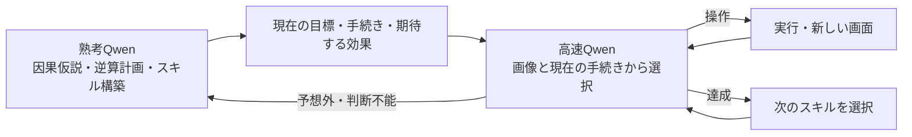

# Qwenの熟考と1トークン選択を分ける実行方式

調査・測定日: 2026-09-26。この資料は実装前の調査記録。後続の実装は[現在の構成](fast-slow-runtime-ja.md)を参照。

## 判断

現行のQwen3-VL-4Bでも、長い説明を生成する判断と、1トークンで候補を選ぶ判断を分けられる。
保存済み画像を使ったローカル測定で応答時間の短縮を確認した。
複数回呼出しを一律に避ける必要はなく、熟考の頻度、入力の長さ、画像の再利用を含む
実時間の予算で制御する構成が候補になる。ただし、今回確認したのは選択用APIの動作と速度であり、
因果推論、スキル獲得、閉ループでの攻略性能は未評価。

## JevとローカルQwenの違い

ユーザー提示の[Qiita記事](https://qiita.com/moritalous/items/41c9402a5dd9d80fc7a9)は、
Qwen3-VL-4Bに選択肢を単一トークンの記号で与え、次トークンの確率を取得する実装例。
複数の問いは複数回の呼出しで処理し、同じ画像・テキストのキャッシュを利用する。
今回検討する高速経路はこの方式に近い。学術論文による性能保証としては扱わない。

[TypeSafeの公式説明](https://typesafe.ai/blog/introducing-system-one-models-and-jev)では、
Jevは専用のモデル構造・学習方法・並列サンプリングによって複数の確率的判断を返す。
「Jev自体が通常のLLMで1トークンだけ生成する」という理解は正確ではない。
Qwenの記号選択だけで、Jevの並列出力や確率の較正まで再現されるわけでもない。

## 現行基盤での速度測定

サーバーはQwen3VL-4B-Instruct-Q4_K_M、視覚プロジェクターQ8_0、llama.cpp
`b11118-e6ab7c1a4`、コンテキスト16384、1スロット。既存のDocker Compose環境を使用。
ローカルHTTP要求の開始から応答JSON取得までを測定した。サーバーはすでに起動済み。

入力は `20260926T113716122325Z` のls20、step 0 / 10 / 20の保存済み要求。
step 0は現在画像1枚、step 10 / 20は直前・現在の2枚。ゲーム操作は一切実行していない。
各条件・観測につき1回の小規模測定であり、繰り返し測定の中央値やp95ではない。

|入力・出力|step 0|step 10|step 20|
|---|---:|---:|---:|
|保存済みの説明付きツール出力を再生|4.108秒|4.473秒|4.380秒|
|同じ入力を出力1トークンで打ち切る（操作として無効）|0.647秒|1.151秒|1.152秒|
|同じ画像＋短い質問でA〜Eの1トークン選択|0.250秒|0.450秒|0.447秒|

この表の全要求は `cache_prompt=false`、実際の `cached_tokens=0`。
通常出力は198〜215トークン、入力は1266〜2208トークン。
短い選択の入力は248〜438トークンで、選択肢は上下左右と再計画。
熟考から受け取った実際のスキルや長期計画は含めていないため、その入力を加えた際の性能は別途測る必要がある。

step 20の通常出力では、サーバーの入力処理は約1.13秒、出力処理は約3.19秒。
出力削減に加えて入力を短くする効果がある。`predicted_ms` が1トークン時にほぼ0でも、
最初の判断には画像と入力の処理が必要であり、全体の応答時間が0になるわけではない。

続いて同じstep 20の画像を再利用し、`cache_prompt=true` で質問だけ変えたところ、
約0.038秒と0.037秒、共通の405トークンがキャッシュされた。
直前と完全に同じ要求の再生は0.023秒、437トークンがキャッシュされた。
いずれも温まったキャッシュでの結果。新しい画面ごとにこの速度が出るとはいえない。
[llama.cppの公式仕様](https://github.com/ggml-org/llama.cpp/blob/master/tools/server/README.md)でも、
再利用の対象は共通プレフィックスである。今回の選択要求は画像を質問より前に置いた。
実際のキャッシュ層ごとの画像処理時間までは分離していない。

測定用[スクリプト](../outputs/probes/20260926-fast-choice/probe.py)と
[全12要求の応答・確率・時間](../outputs/probes/20260926-fast-choice/results.jsonl)を保存した。
再実行すると結果ファイルに追記する。上表は初回12要求から作成した。

## 二段階の構成案

同じモデルを異なる入出力で呼び分けられるため、まず2モデルをGPUに常駐させる必要はない。
現行1スロットでは逐次実行になるが、短い呼出しを複数回行う設計は可能。
高速経路を使っている間は現在のスキル・段階を保持し、毎手ライブラリ全体を読み直さない。

|経路|担当する判断|渡す情報・返すもの|
|---|---|---|
|熟考|未知の変化の解釈、因果仮説、ゴールからの逆算、手続きの構築・修正|必要な履歴を読み、次の目標・手順・期待効果を生成|
|高速なスキル選択|現在の目標にどの既存スキルが適合するか|関連する少数の候補から選択。候補が不適切なら熟考へ戻す|
|高速な実行|現在の手続きに沿った操作、次の段階への移行|現在画像と短い手続きから操作または熟考への復帰を選択|

「鍵があれば扉を開けられる」は因果知識だが、それだけでは実行手続きにならない。
スキルには現在画面に対応した対象、実行段階、期待する効果、完了の見分け方を含める。
これらを全て普遍的な禁止事項として書き出すのではなく、今実行するスキルに必要な内容だけ渡す。
初期探索では使えるスキルが少ないため熟考が多くなる。スキルが再利用できるほど費用を償却できる。

1トークン選択は、候補が事前に与えられる判断に向いている。上下左右は自然に表現できる。
自由座標のクリックでは、熟考側が選んだ対象の座標などを候補へ結び付ける必要がある。
候補外の場所を調べる自由は熟考経路に残す。毎手の全物体列挙を復活させる必要はない。

意味のある反復操作は高速経路で継続できる。予想と違うときは熟考へ戻り、
反復回数や画面ハッシュを理由とした操作拒否・ゲーム停止は復活させない。

## 成立条件と次に測ること

1. **呼出し回数より時間配分。** 1操作あたり高速判断をm回、熟考を平均K操作に1回行うなら、
   モデル時間の目安は `m × 高速判断時間 + 熟考時間 / K`。
   今回の2画像選択の約0.45秒なら2回で約0.9秒だが、追加するスキル文や熟考時間で変わる。
2. **高速経路に自由文とJSON全文を書かせない。** 現行のツール出力を1トークンで切ると
   `<tool_call>` だけで終わった。専用の選択応答処理で記号を操作に変換する必要がある。
3. **確率を正しさと同一視しない。** A〜Eへの正規化確率は攻略成功率ではない。
   `top_logprobs` に候補が全て載る保証もないため、候補トークンの網羅や制約付き出力を検討する。
   ラベルのトークン数を確認し、選択肢順序を入れ替えた評価も行う。
4. **再計画の判断も評価する。** 誤った操作を高速に繰り返しても改善ではない。
   タイムバーだけの変化、実際の進展、遅延して現れる効果について、継続・完了・再計画を区別できるか測る。
   自己申告の確信度だけを切替の根拠にしない。
5. **新画像とキャッシュ再利用を分けて測る。** 共通画像を前、個別の問いを後に置く。
   熟考と実行を交互に使った際のキャッシュ競合も含め、実運用のp50/p95とレベル達成を測る。

## 関連研究

[DP-VLA (2024)](https://arxiv.org/abs/2410.15549)は、低頻度の大きなモデルによる判断と、
高頻度の小さなモデルによる制御を分けるロボット向けの構成を研究している。
今回のように同じQwenを出力形式だけ変えて使う方式の直接の実証ではないが、役割分担の参考になる。

[System-1.x (ICLR 2025)](https://arxiv.org/abs/2407.14414)は、問題を部分目標へ分け、
難しさに応じて速い計画と探索を伴う遅い計画を組み合わせる。単一の基盤LLM上で各構成要素を
学習し、迷路とBlocksworldで評価している。今回の未学習Qwenで同じ性能になる保証はない。
