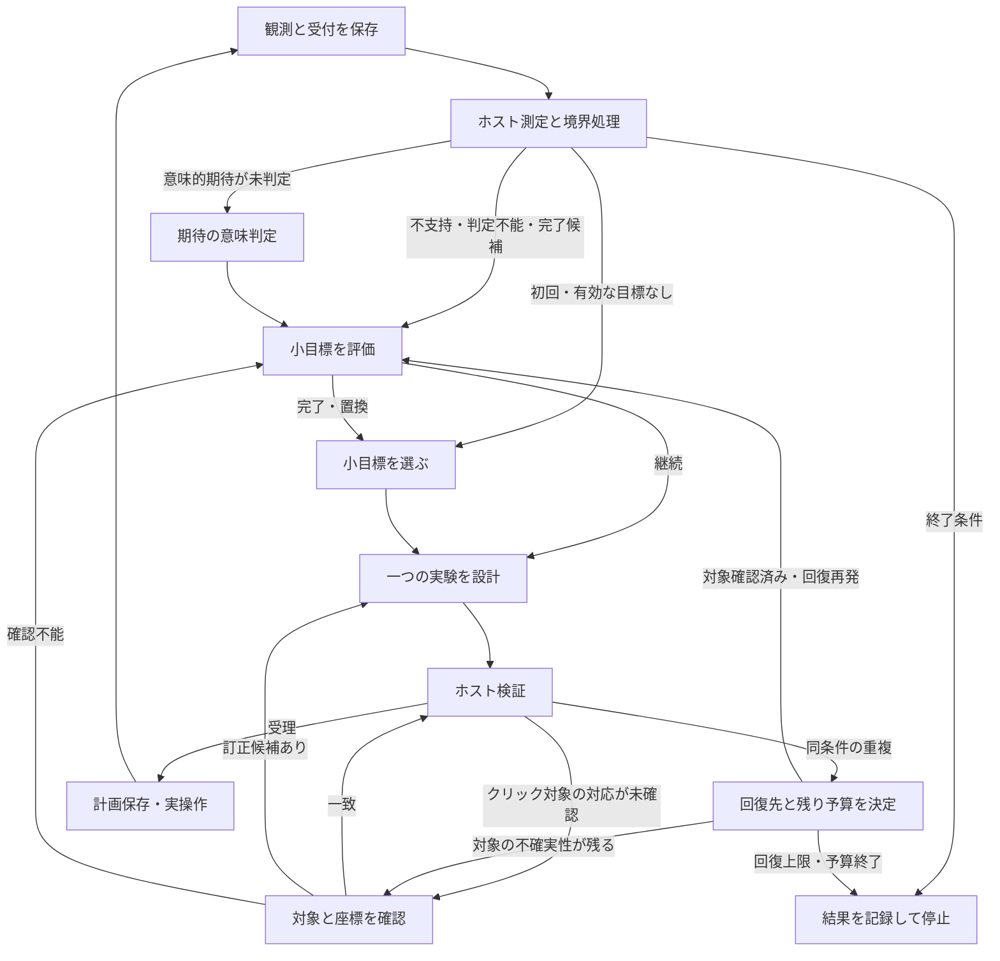

# 判断を限定したタスクへのリファクター設計

2026-09-25設計、2026-09-26実装。以下は採用した設計と評価方針。実装・検証状況は末尾に追記する。現行仕様は[実装と制限](skill-learning-runtime-ja.md)、直前の変更は[実験ループ設計](goal-experiment-loop-design-ja.md)を参照する。

## 目的と設計原則

一回のLLM呼び出しで決めることを限定する。プログラムは観測の保存、測定、入力の組立て、検証、分岐、予算、実行を担当する。LLMは対象の意味・位置、小目標の妥当性、次に検証する操作など、機械的には決められない判断を担当する。

タスクごとに「問い／必要な証拠／許可する出力／次段への受理条件」を定義する。全履歴や共通の大きなノートビューを各担当へ渡さない。元の証拠は保持し、必要な根拠を削って短くすることは避ける。情報不足を回答できる経路を用意する。

LLMタスクの境界は実際の呼び出し境界とする。巨大な一回の応答を複数欄に分割しただけで済ませない。一方、各手で全タスクを順番に呼ぶ固定工程にもせず、必要な判断だけを呼ぶ。

この変更の到達目標は、失敗後に対象確認・目標判断・実験設計のどこが停滞したかを識別でき、根拠を伴う別の検証へ進めること。1ステージクリアは実走で測る成果指標であり、構造変更だけで達成を保証しない。

## 現行から見直す点

基準記録は[`20260925T140400131714Z`](../outputs/evaluations/20260925T140400131714Z/report.md)。100手・推論600秒上限でも1操作後に再設計停滞で停止した。

|確認できた事実|設計上の対応|
|---|---|
|ノート・前後画像・不支持判定は入力に含まれていた|ノート参照回数を増やすことを解決策にしない|
|モデルの再レビューがホストの定型レビューと全項目一致した|ホストは測定事実を作る。完成済みの解釈文をLLMに再提出させない|
|`change: action`と申告しながら同じ座標だった|変更の種類・有無はホストが算出し、モデルの自己申告に依存しない|
|小目標・対象の認識・実験・スキル選択を同じ設計役が扱う|小目標の見直しと実験設計を別タスクにし、スキル管理のSchemaも分離する|
|同じ事実が`handoff`、`latest_review`、目標経路に重複する|保存形式とLLM用入力を分離し、タスク別の投影を一か所で作る|
|再レビュー後の重複でゲーム全体が停止する|有限な目標見直しへ進める。予算または回復上限に達した場合に停止する|

入力上限超過は確認していない。情報の重複が性能低下の主因か、モデルの視覚認識・判断能力の限界かは比較実験で切り分ける。

## ホストが保持する状態と、LLMに提示する状態

一冊の版管理ノートと原観測を正本として維持する。LLMごとに独立したコピーを更新させない。ホストは次の型を保存し、入力には必要な項目だけを選ぶ。

|記録|内容と責任|
|---|---|
|`Observation` / `ExecutionReceipt`|元フレーム、操作ID、受付、環境境界。ホスト記録、不変|
|`Measurement`|前後ID、指定領域の差分、レベル差分、比較可能性。測定結果とモデルの解釈を分離|
|`Goal`|親ID、知識を得る目標／ゲームを進める目標、完了条件、状態、理由、根拠、版|
|`GoalDecision`|継続／完了／置換要求／保留とその根拠。操作を含まない|
|`TargetAssessment`|対象記述、領域、座標との対応、確認不能な点、観測ID。LLMの判断として保存|
|`ExperimentPlan`|固定した小目標版、問い、仮説、条件、操作、観測範囲、試行上限、根拠参照|
|`SemanticVerdict`|機械測定できない期待の成立・不成立・判定不能と根拠。目標の変更や次の操作を含まない|
|`Rejection` / `PlanDelta`|差し戻しの種類、比較先、実際に同じ／変わった項目。ホストが生成|

呼び出しごとにホストが`task_id / task_kind / input_refs / observation_id / budget`を固定する。モデルの応答はそのタスクにのみ適用し、別観測・別目標版の応答を受理しない。元実験とその前後観測を参照し、古い実験の再検討に直近の別操作の画像を混ぜない。

進行中タスク・実験が参照する証拠は解決まで保持する。退避済みの証拠を読めなければ「不足」と返し、別の画像や推定で補完しない。

## LLMに割り当てるタスク

初期実装での主要タスクは次の五種類。各タスクに専用の入力構築関数と提出Schemaを設ける。

|タスク|一つの判断|渡す入力|許可する出力|呼び出す条件|
|---|---|---|---|---|
|`select_goal`|今、何を明らかにする／実現するか|親目標、現在画像、確認済み事実、直近の閉じた目標と理由|小目標1件、完了条件、選定理由／情報不足|初回、目標完了、置換決定、レベル境界|
|`assess_goal`|現在の小目標をどう扱うか|親目標の短い説明、小目標と完了条件、実測・必要なら意味判定、差し戻し理由、対象確認の結果|`continue / completed / replace / deferred`、理由、継続なら次に解消する疑問1件|不支持・判定不能、意味的な完了候補、重複の再発|
|`inspect_target`|意図した対象と指定座標・領域が対応するか|対象記述、指定座標、対応する原画像、必要な局所拡大、確認する疑問|`matched / mismatched / uncertain`、根拠となる領域、必要なら訂正候補／情報不足|新しいクリック対象、明示された対象不確実性、同条件の重複差し戻し|
|`design_experiment`|選ばれた疑問をどの一回の操作で検証するか|採用済み小目標と疑問、必要な画像・対象確認、合法操作、関連する失敗実験の短い事実、具体的な差し戻し|操作と事前期待を持つ実験1件／対象確認要求／情報不足|有効な小目標があり、未判定の実験がないとき|
|`judge_effect`|事前に定めた意味的期待は成立したか|変更不可の期待、実操作、受付、当該実験の前後画像・差分|`supported / unsupported / inconclusive`、限定した所見、根拠|期待が`semantic`で機械測定では確定できない場合だけ|

`assess_goal`に新しい実験や置換先の詳細は作らせない。`replace`を受けたホストが旧目標を理由付きで閉じ、別呼び出しの`select_goal`に新目標の選択を任せる。新目標が必要なだけなのに全体の攻略計画を作らせない。

`design_experiment`は小目標を書き換えない。継続が難しい場合は情報不足を返し、ホストが目標判断へ戻す。任意のステート名やゲーム操作を含む分岐命令はモデルに返させない。

### 小目標判断の入出力例

以下は契約の例であり、実モデルがこの回答を出した記録ではない。

```json
{
  "task": "assess_goal",
  "parent_goal": "観測からゲームの目的を発見し、解く",
  "subgoal": {
    "id": "subgoal-1",
    "revision": 1,
    "text": "中央の対象がクリックに反応するか調べる",
    "done_when": "対象を正しくクリックした結果から即時反応の有無を確認する"
  },
  "facts": {
    "action": {"action": "CLICK", "x": 32, "y": 32},
    "acknowledged": true,
    "changed_cells_in_tested_region": 0,
    "target_assessment": "uncertain"
  },
  "rejection": {
    "code": "same_test_unchanged_conditions",
    "unchanged": ["action", "observation_scope", "observed_context"]
  }
}
```

```json
{
  "decision": "continue",
  "reason": "反応の有無を判断する前提である、対象上へのクリックが未確認",
  "remaining_question": "指定座標は意図した対象上にあるか",
  "evidence_refs": ["experience-1"]
}
```

完了条件を満たさないまま`completed`にすることを推奨しない。「黒いバーを必ず反応させる」のような既存目標が不適切なら、元の条件を書き換えて達成済みにせず、`replace`で履歴を残す。

### 対象確認の範囲

新しいクリック計画の提出後、現在観測に結びつく対象確認がなければ、計画を仮置きして`inspect_target`を呼ぶ。`matched`なら検証へ進む。`mismatched`なら訂正候補を設計へ戻す。ホストが勝手に座標を差し替えない。`uncertain`なら保存済み画像の確認を一度追加するか、目標判断へ戻す。

同じ観測ID・同じ対象記述・同じ座標の確認結果は再利用できる。別の観測に移ったら、その意味的同一性まで画素一致だけで保証せず、初期実装は失効させる。既存の検証済みスキルが持つ機械的な開始条件は別経路で利用できる。

画像の拡大は原画素と元座標を保持する。小領域だけに切り詰めず、対象の周囲や遠隔効果を確認できる原画像も使えるようにする。バーの位置や色、ゲーム固有の対象をハードコードしない。

## プログラムで確定する処理

|処理|プログラムの責任|推測してはいけないこと|
|---|---|---|
|観測・受付|操作IDとの対応、重複配送、リセット／レベル境界を確認|受付不明を「効果なし」と扱わない|
|期待の測定|宣言領域の変化、到達レベルの増加、比較不能を計算|局所変化から因果関係や小目標達成を断定しない|
|対象の幾何検証|座標・矩形の範囲、モデルが示した対象領域への包含を確認|領域内だから対象の認識が正しいとは断定しない|
|計画の差分|正規化した操作・観測範囲・関連前提画素を比較し`PlanDelta`を生成|文章や期待種類の変更だけで有益な新実験と認定しない|
|分岐|受理済み出力のenumと状態から次のタスクを決定|自由文の原因説明を確定した故障原因と扱わない|
|記録と実行|関連版を保存し、一度だけドライバへ操作を渡す|仮置き計画や対象確認だけでゲームを進めない|

機械測定結果はモデルが再提出する対象から外す。`judge_effect`は意味判定だけを返す。小目標の達成判定は`assess_goal`へ分離し、`unsupported`を自動的に目標失敗、`supported`を自動的に目標達成とはしない。

固定形式の小目標完了条件を将来導入する場合はホストで完了できるが、第一段階では自由文の条件をプログラムが理解したことにしない。

## 分岐と回復の設計



図は主な探索経路。採用済みスキルの継続と再試行の経路は下記規則を適用する。`deferred`や証拠不足も無限に循環させない。

|契機|次の処理|
|---|---|
|受付不明|原記録を保存して停止。再クリックで受付を確かめない|
|勝利・評価の1ステージ上限・操作予算終了|最後の実験の機械判定を保存。意味判定ができなければ未判定として停止|
|初期観測・レベル境界|旧区間の実験を閉じ、現在区間で`select_goal`|
|事前宣言した有限回試験の途中|元計画・上限・継続条件を守って再試行可能。後付けで回数を増やさない|
|不支持・判定不能|`assess_goal`。繰り返し提出を待ってからレビューする方式をやめる|
|意味判定が必要|まず`judge_effect`、続いて目標の扱いが未決なら`assess_goal`|
|支持された自由文の小目標|`assess_goal`で達成か追加検証かを決める。固定スキルの途中手は既存ホスト処理を継続|
|形式・範囲エラー|同タスクで具体的なエラーと該当項目を示し、一度だけ訂正を許可|
|同条件の重複|対象確認が未解決なら`inspect_target`。確認済みなら`assess_goal`へ差し戻す|
|小目標を置換|旧目標の終了理由・失敗条件を保持して`select_goal`。実験履歴の重複検査はリセットしない|
|関連証拠不足|指定IDの保存済み証拠をホストが補給。取得不能なら保留または別目標。未知の結果は生成しない|

回復回数は目標IDや文章を変えてもリセットしない。新しい実観測を得るまでの回復エピソードとして数え、初期案では最大2回とする。1回の回復は必要な対象確認、目標判断、再設計の組を指す。既定のモデル・HTTP・時間予算にも従うため、2回の実行を保証する枠ではない。

上限で止まる場合は`recovery_budget_exhausted`、証拠不足なら`evidence_unavailable`など、予算と判断上の詰まりを分けて記録する。自動的なランダムクリックや制約の緩和で進行を偽装しない。

## 入力とツールの制限

各タスクの入力構築はホスト側の純粋関数にする。同じ証拠・状態から同じ入力を作れるようにし、構築時に別のLLM要約を挟まない。

- 共通指示は、原座標、観測と推測の区別、担当タスクの提出契約に限定する。スキル作成・ゲーム全体の運用説明を全担当へ渡さない。
- 各呼び出しは`include_contents='none'`を継続し、専用入力だけを与える。実際のHTTP要求も保存し、意図した入力と一致するかテストする。
- 原則は提出ツール1個。追加証拠が必要な担当だけ、参照IDを限定した読み取りツールを使える。全ノート検索・任意書込み・ブックマーク編集は通常タスクから外す。
- `assess_goal`は小目標と関連事実を読む。画像が必要なら対象確認へ要求する。`inspect_target`は画像と指定対象を読むが、全目標経路やスキル一覧を読まない。
- `design_experiment`に前レビューの完成文章を重複提示しない。採用された疑問、関連事実、ホスト生成の具体的な差し戻しを一度ずつ提示する。
- ホストはID・版・計画差分・保存処理を補う。モデルに既存文書全体や機械算出可能な項目を再出力させない。

入力の長さは実測し、重複削減の効果を確認する。文字数制限のために失敗条件や根拠を切り落とさず、追加取得を明示する。認識に必要な画像の削減は、文章の重複削減とは別の比較にする。

## スキル獲得・再利用との接続

`skill_creation`は既存の専用タスクとして維持する。固定評価、実試行、採用、失敗時の停止をLLMの自己評価へ戻さない。

実験設計に`learn / invoke / trial / evaluate`を混在させる現行の広い`Decision`は分割する。技能が関係する場合だけ`choose_method`を呼び、採用済み小目標、ホストが適用条件を確認したスキル候補、受付済み経験の短い索引から「探索／再利用／候補試行／構築」を選ぶ。対象やクリック座標の選択は同時に行わない。候補も構築可能な経験もなければ、ホストが実験設計へ直行する。

意味的に目標へ適合するかはホストが断定しない。`choose_method`は用途の適合を判断し、実際の引数解決は対象確認または専用の引数解決処理へ渡す。既存スキル内の機械的な継続はLLM不要。候補の採点・昇格はホストが必要条件を満たした時に行うため、`evaluate`をモデルに選ばせる必要はない。

移行中はこの分岐を独立したアダプターに隔離する。探索役の入力を小さくした効果を調べるために、学習機能の有無を比較条件間で変えない。新方式で既存の獲得・試行・採用・再利用の結合テストが通るまで、現行経路を削除しない。

## 予算と呼び出し回数

タスクの数を、そのまま毎手の呼び出し数にしない。ただし分割による費用増加はある。

|経路|LLM判断回数の目安（証拠ツール・訂正を除く）|
|---|---:|
|初回の新しいクリック|小目標選択＋実験設計＋対象確認で3回|
|機械測定後、目標継続と新しいクリック|目標評価＋設計＋対象確認で3回|
|意味判定後、目標継続と新しいクリック|意味判定＋目標評価＋設計＋対象確認で4回|
|目標置換、対象の不一致、回復|さらに必要なタスクが増える|
|検証済みスキルの継続|0回|

現行の`max_calls=4`は一観測の処理ごとの仕事呼び出し上限、`max_http_requests=8`は証拠参照などを含むHTTP上限で、ゲーム全体の時間予算とは別。分割後に内部上限を黙って拡大して比較しない。

まず同じ予算で比較し、次に双方へ同じ拡張予算を与えた比較を別に行う。必要な段階の途中で予算が尽きたら、未実行計画と停止段階を保存し、未検証の操作を出さない。呼び出し時間・入力／出力トークン・一実操作あたりの判断回数を報告する。

## ファイル単位の移行計画

|対象|変更案|
|---|---|
|`agent/cognition/state.py`|タスク別の入出力型、`Measurement / Rejection / PlanDelta`を定義。広い`Decision`と意味の重複する`ReviewUnderstanding`を段階的に置換|
|新規`agent/cognition/task_context.py`|タスク別入力、証拠参照の範囲、画像選択を構築。全役共通の`_context()`を置換|
|新規`agent/cognition/routing.py`|受理済み状態と理由コードから次タスクを決める純粋関数。回復回数と予算を管理|
|`workflow.py`|ホスト処理とLLMタスクを接続する。`DECIDE/RUN`は実行制御として維持可能だが、内部の仕事を明示する|
|`completion.py`|タスクごとの提出契約と読み取り可能な証拠を限定。機械判定やスキル採点をモデルへ再提出させない|
|`experiments.py`|予測の固定、測定、重複検査を維持。機械測定から自由文のレビューを生成する責務を除去|
|`notebook.py`|正本と版管理を維持。LLM用ビューは専用ビルダーへ移し、人間用の閲覧ビューと分離|
|`instructions.py`と`agent/skills/`|各タスクの問い・出力・禁止される担当外操作に絞る。全役への任意スキル一覧提示をやめる|
|`scripts/agent_monitor.py`、`notebook_view.py`、状態図|実際のタスク入力、対象確認、目標判断、計画差分、回復先を表示。旧ログも表示可能に保つ|
|`tests/`、評価スクリプト、提出用ノートブック|契約・分岐・実HTTP入力・再生・梱包の回帰検証と、比較評価用設定を追加|

実装は次の順に進める。

1. **現行方式の固定と比較入力の準備。** ソース・予算・モデル設定・失敗直後の証拠を保存する。
2. **入力と目標判断の分離。** 専用入力、`select_goal / assess_goal / design_experiment`を導入。測定結果と解釈を分け、目標版を設計に固定する。
3. **対象確認と回復の接続。** `inspect_target`、ホスト計画差分、理由コードによる回復、証拠不足、上限を実装する。
4. **スキル分岐・表示・梱包の統合。** 既存機能の回帰を確認し、狭い入力へ統一。過去ログは変換しない。
5. **同予算比較。** 比較結果と費用を確認して新方式を既定にする。実装後は旧ランタイム分岐を恒久的な二重実装として残さず、ソーススナップショットを基準に比較する。

## 受け入れ条件と評価

### プログラムで検証する契約

- `assess_goal`のHTTP入力に全スキル一覧・操作提出Schema・全履歴が混入しない。対象確認には、その実験の原画像と指定座標が届く。
- 小目標評価から直接クリックできず、実験設計から目標本文を変更できない。ホスト測定結果をモデルが上書きできない。
- 旧目標・古い観測・古い参照版を使う応答を拒否する。レベル境界で局所状態を失効させる。
- `change: action`相当の説明だけでは同じ実験を受理しない。差分はホスト計算であり、関連のない表示変化で重複検査を解除しない。
- 対象不一致では計画を差し戻し、勝手に座標を差し替えない。対象の再確認は実操作として数えない。
- 同じ座標でも関連条件が変わった場合、または事前宣言された有限試行であれば、適切な検証を経て実行できる。
- 新目標の作成で重複記録や回復予算を消せない。証拠不足・受付不明・回復上限で有限に停止する。
- 目標置換後に別の有効な計画が提出された場合は、実際の次の操作まで進む結合テストを持つ。拒否できるだけで合格にしない。
- ログ再生では将来の判断を混ぜず、元の入力・出力・ホスト分岐を追える。既存のスキル獲得・試行・採用・停止の保証を維持する。

### 実モデルで検証する判断

まず保存した失敗直後の証拠を入力にした一段ずつの比較を行う。生成された新操作の結果は記録画像から捏造せず、その操作を評価する段階では実環境へ戻る。

|比較|目的|
|---|---|
|A：現行／B：入力の重複だけを除去|入力の長さ・提示方法の効果|
|B／C：さらに目標判断・対象確認・実験設計を分離|タスク分割の追加効果|
|Cで現行予算／A・Cに同じ拡張予算|予算増加と方式変更の効果を分離|

一次評価は各条件5回を目安にし、設定・実入力・出力を保存する。temperature=0で同じ入力・応答が繰り返されても独立した能力証拠として過大評価しない。別の公開環境や異なる失敗状態でも確認する。

指標は、同条件の重複提案率、根拠付きで対象／条件／問いを修正できた割合、次の実操作へ復帰できた割合、失敗から復帰までのHTTP回数・時間、目標放棄の反復数、クリア数と実操作数。部分タスクのJSON受理率とゲーム進捗は分けて報告する。

再設計の妥当性は、変更が実在するという自動判定に加え、元フレームと理由の人手確認を含める。ゲームの内部ソースから得た正解や将来の結果をモデル入力へ追加しない。100手・1ステージ目標の実走を継続評価に使うが、今回の設計書作成では新しい実走や性能改善の主張は行わない。

## 参考資料との対応と制限

- [Voyager §2.1–2.3](https://arxiv.org/html/2305.16291v2#S2)：課題選択、プログラム生成・修正、達成の自己検証を分担し、一定回数の失敗後に別課題へ移る点を参考にする。Voyagerは高水準APIと構造化された環境状態を使うため、画素から対象を見つける今回の問題を解決済みとは扱わない。
- [ADK LLM agents](https://adk.dev/agents/llm-agents/)：担当ごとの指示・入出力・ツール・履歴の制御と、決定的なグラフ処理へのLLM組込みを利用する。資料がこの具体的なタスク数や予算を推奨しているという意味ではない。
- [人間の思考パターン分析](human-vcgt-analysis-ja.md)：不確実さの分離、対象・前提の見直し、問いを限定した探索を設計へ転用する。LLM注釈に基づく設計仮説で、人間の内的思考の実測ではない。
- [以前の分割設計の検討](history/adaptive-cognitive-loop-review-ja.md)：処理の分割とモデル呼び出しの増加を区別する。過去の重い固定工程へ戻らず、判断の必要性と費用を記録して評価する。

細分化しても、対象認識や「同じ小目標を続ける価値」の判断をモデルが誤る可能性は残る。次段は前段の判断を証拠付きの仮説として扱い、矛盾があれば差し戻す。短い入力だけで解決すると決めず、比較結果に基づいて境界と提示内容を調整する。


## 2026-09-26 実装・検証記録

8タスクの契約と限定入力、ホストによる小目標の版管理・分岐、実験差分・反復検査、回復上限、スキル実行・ホスト採用判定、ログ再生を実装した。本番の旧判断経路は除去し、過去の契約を使うテスト用コントローラは`tests/legacy_runtime_fixture.py`へ隔離した。提出用には含まれない。

実装時には対象確認をさらに分担した。LLMは`region`と所見だけを返し、クリックがその矩形内かどうかはホストで計算する。矩形を特定できなければ`null`を返す。矩形の範囲外・必須項目欠落等は訂正を最大2回許し、それでも不正なら`invalid_task_output`として実操作せず停止する。これはモデルの判断ではなく、ホストの停止として記録する。

機械判定は`EffectFact`として事実だけを保存し、小目標の意味づけを自動生成しない。スキル作成候補も「受付があり宣言した実験効果が支持された経験」に限定した。別の表示画素が変化しただけでは学習候補にしない。原画像は加工・分離せず、現在のフレームを使用する。

全106件のテストが成功。うち16件は新しい本番経路を検証し、小目標置換後の別操作、対象不一致の差し戻し、無関係な画素変化、有限再試行、古い応答・範囲外の証拠拒否、実験画像の保持、スキル作成→実試行→ホスト採用、時点を保った表示、不正出力の有限停止を含む。ADKには実際にディスパッチし、モデル応答はスクリプトで与えるため、モデル能力の証明とは区別する。提出用ノートブックを再生成し、全コードセルの構文・新モジュールの同梱・テスト専用コードの除外も確認した。

### ローカル実モデル確認

Qwen3-VL-4B、vc33、最大100操作・1ステージ・180秒（プロセス上限210秒）。既定予算は変更していない。

|設定|評価ID（UTC）|実操作|クリア|観測結果|
|---|---|---:|---:|---|
|4判断・8HTTP／観測|`20260925T151619574998Z`|0|0|対象矩形とクリック位置の不一致を検出し、設計が座標を変更。再確認の前に`model_budget`で停止|
|追加確認のみ8判断・16HTTP／観測|`20260925T151732518663Z`|1|0|変更後の操作へ進んだ。効果不支持後に小目標の置換へ進むが、モデルは同じ目標・操作を再提案。重複は2回とも実行せず差し戻し、最終的に`model_budget`で停止|

ログは`outputs/evaluations/<評価ID>/report.md`と同ディレクトリ内の`cognition/*.requests.jsonl / *.model.jsonl / *.artifacts.jsonl`にある。評価中のソースは各評価のスナップショットで固定される。後続の変更は人間用のノート表示、ホスト停止の出所表示、原画像が失効した場合の検証であり、上記実走の対象認識を改善したとは扱わない。

確認できたのは、限定した入出力と決定的な差し戻しが機能すること。**適切な別仮説の選択やステージ攻略が改善したとはまだ言えない。** 対象確認もモデルが推定した矩形に依存するため、矩形が実画素と一致する保証はない。今回も黒いバーの位置の認識には誤りが残る。また、既定4判断では初回の対象差し戻しだけで実行までの予算が足りない場合がある。

上記は実装中の動作確認であり、入力短縮だけの条件Bを含む5回ずつの比較・独立したゲームでの性能評価は未実施。短い入力と工程追加の効果を分離した結論や、拡張予算による改善率は主張しない。現在の課題は、対象の位置推定と、置換すると決めた小目標に具体的な別の問いを与えるモデル判断である。
