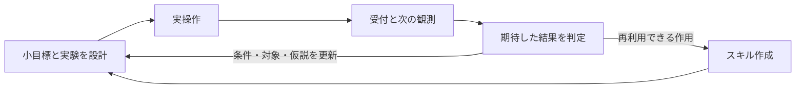

# 小目標と実験の結果判定を接続する設計・実装

2026-09-25。攻略ノートと状態遷移図を使ったユーザーの観察を受けた設計検討。対象は `20260925T102015850449Z / vc33-5430563c`。推奨案Bの承認を受け、同日に実装した。以下は診断と設計判断、および末尾の実装・検証記録。現行APIは[実装仕様](skill-learning-runtime-ja.md)を参照。既存の評価記録は変更していない。

## 記録から確認できた問題

[評価結果](../outputs/evaluations/20260925T102015850449Z/vc33-5430563c/result.json)と、同ディレクトリの `cognition/*.model.jsonl`、各手のJSONL、観測グリッド、ノート履歴を照合した。ゲームの実装・隠れた正解条件は診断に使っていない。

|項目|記録で確認した事実|
|---|---|
|選択した操作|4回とも CLICK (48, 48)|
|予測|4回とも「状態が変わる、または隠れた仕組みが分かるかもしれない」という同じ期待|
|目標|初期の「ゲームの目標を見つけて解く」のまま、goalの版は1|
|ノートの利用|write_note / read_notebook / set_bookmark / erase_noteはいずれも0回。ホストによる実行結果の記録のみ|
|推論スキル|design-experimentを含めロード0回|
|実際の差分|各操作で最上段 y=0 の1〜2セルだけ変化。y=1〜63は初期画面と同一|
|進捗|到達レベル0。4操作の上限で停止|
|現在の反復指標|unchanged_action_repeats=0。フレーム全体のハッシュが同一の場合しか数えないため|

漠然とした期待は出力されているので、モデル内部に仮説が全くなかったとは断定できない。しかし、何を観測すれば期待が支持・反証されるか、どの小目標のための操作か、得られた結果で何を更新したかは記録されていない。

最上段の変化は画像上では帯状の表示に見えるが、役割はこの記録だけでは確定しない。「タイマーだから無視」とハードコードしない。また、対象の見つけ方とクリック座標が適切だったかも別の検証課題である。

## 変更前の設計の不足

ノートには自由文の計画や仮説を書けるが、実行へ結び付ける契約がない。`goal`は一つの更新可能ページに限られ、親子関係を持つ小目標を管理する型もない。

`Decision`は操作と短い予測を受け付けるが、実験ID、判定条件、前回の実験に対する判定を要求しない。`prediction_unverified`は結果に添えられているだけで、未判定の予測を閉じる処理がない。`design-experiment`の説明は適切でも任意ロードなので、今回のように一度も使われずに全操作が完了する。

さらに開始用ビューは目標・最新結果・しおりの索引が中心で、進行中の仮説や小目標の本文は自動提示されない。保存先を一本化することだけでは、実験を設計し、その結果に従って方針を変更する動作は成立しなかった。

## 推奨：小目標と実験をノート上の明示的な記録にする

未知のゲームでは、最初に攻略手順を全部分解できないことが多い。「何を知る必要があるか」という小目標を許し、分かった範囲から次の小目標を作る。

例（観測から立てる仮の実験であり、ゲームの正解を主張するものではない）：

|階層|内容|完了を判断する材料|
|---|---|---|
|大目標|このステージを解く|環境からのレベル到達・勝利通知|
|現在の小目標|操作できる対象を見つける|特定の対象と操作に対する、観測できる反応|
|現在の問い|この対象候補は、今の状態で一度クリックすると反応するか|事前に指定した対象・関連領域の形・位置・色などの変化|
|実験|選んだ座標を一度クリックする|受付済み操作と、決めた観測期間内の前後比較|

ノートに追加するのは、まず小目標の親IDと状態、実験の状態だけでよい。巨大な計画DAGや多数の同時目標は初期案に含めず、大目標から現在の小目標へ至る短い経路と一件の進行中の実験を保持する。

小目標の達成と仮説の成立は別にする。「一度のクリックでは期待した反応がない」と確認できれば、期待は外れていても問いへの回答は得られている。ゲームの進捗とは別の、情報を得た結果として記録する。

## 実験の入出力

設計時に短い構造化記録として出す内容：

- 親となる小目標と、答えたい問い。
- 仮説と適用条件。予測を外した場合の別の説明は、必要な場合に少数だけ置く。
- 対象候補・座標、予定する操作。
- 観測したい結果と範囲、観測期間または試行回数の上限。
- どの結果なら仮説を支持、不支持、判定不能と扱うか。

設計結果と操作を一緒に提出し、ホストが実験ページと固定の`active_experiment`しおりを保存する。別途write_noteを何回も呼ぶ必要はない。親目標・実験・操作・実観測・判定をIDでつなぎ、前提と予測は実行前の版に固定する。実行後に判定条件を都合よく書き換えた場合は、新しい実験として扱う。

結果として受け取る内容：

- 実際に送った操作、受付、前後の観測IDと測定値。
- 実験で指定した期待についての判定と、根拠ID。
- 仮説・小目標の更新、および次は継続・別の実験・条件修正のどれか。

形式を埋めただけでは意味のある実験にならない。最初は領域の変化や色・位置など、原画像と照合できる条件を優先し、複雑な条件言語は追加しない。明確な測定条件はホストで判定し、意味的な判断が必要な場合は限定した入力でLLMに判定させる。LLMによる判定は誤り得るため根拠を残す。

## 状態・仕事の候補

|案|利点|懸念|
|---|---|---|
|A：通常判断の一回の応答に前回判定と次の実験を含める|呼び出し数を抑えられる|観測の解釈、仮説更新、実験設計が同じ応答に集まり、判定が形式的になる可能性|
|B：実験設計と結果判定を別の仕事にする|入力と担当を絞れる。未判定の実験を次の操作で放置できない|意味判定を毎回LLMで行うと呼び出し数が増える|
|C：独立した目標計画役と探索木を追加する|複数の長期手順を比較しやすい|未知の仕組みを誤推定したまま長い計画を作る可能性。現在のローカルモデル・予算には負担が大きい|

今回の観察を受けた推奨はB。以前の「通常判断＋スキル作成」に、結果判定を明示的な仕事として追加する。これは認識・計画・実行の三状態を人間の思考一般として復活させる提案ではなく、実験の前後に異なる入力・出力が必要なことを根拠にした境界である。

`DECIDE / RUN`はホストの制御骨格として残してもよい。モデルへ渡す仕事を`experiment_design / experiment_review / skill_creation`に分け、可視化ではこの仕事と実験の状態を表示する。機械判定できる場合はLLMのreview呼び出しを省くが、判定記録は必ず残す。採用済み手続きの各ステップは既存のホスト判定を利用する。既知の操作に毎回新しい仮説を作らせない。

初回には未判定の実験がないため設計から始める。受付済み操作の結果が届いたら、その実験の判定を処理してから次の操作へ進む。モデルが判定スキルを自主的に読むまで待たず、ホストが適切な仕事へ振り分ける。単に不足項目のエラーを返し続ける仕組みにはしない。

## スキルと共通文脈

- `notebook`：目標の親子関係、現在の小目標、実験へのしおり、変更履歴を扱う。推論上の判定とホストによる測定値を区別する。
- `design-experiment`：実験設計の仕事で必要な本文を自動提示する。目立つ場所を押すだけでなく、何を知りたいかと、何を比較するかを決める。
- `review-experiment`：新設候補。予定した予測と実結果を比較し、仮説と小目標を更新する。次の実験を長々と設計する仕事は兼ねない。
- `skill-creator`：根拠のある作用と適用条件を手続きにする。既存の固定評価・実試行・採用の境界を維持する。

各仕事には、大目標の短い説明、現在の小目標、進行中の実験、直近の判定をノートから自動提示する。全履歴や全仮説は渡さず、追加の証拠をしおりから参照する。

## 反復と「効果なし」の扱い

この走行で変更すべきなのは「どこかの画素が変わった」を有効な反応と混同しないこと。事前に指定した対象だけでなく、予測した遠隔領域への効果も調べられるようにする。指標としては、同じ操作の連続回数と、同じ問いに有効な証拠を追加できなかった回数を分ける。画面ハッシュだけを反復の判定に使わない。

「一度クリックしても反応しなかった」だけでは「この対象は永久に無意味」とは言えない。座標が外れた、前提操作が必要、反応が遅れる、見えない状態が変わった可能性がある。反証する範囲は「この条件・座標・観測期間で期待した可視変化はなかった」とする。受付不明・観測不足は不支持と同一視せず、判定不能にする。

同じ仮説・対象・操作・関係する前提を繰り返す際は、条件が変わった証拠、別の予測、または事前に計画した有限回の試験が必要。予測文の言い換えだけで新しい実験にしない。対象・条件の変化や遅延を試す理由があれば再試行できる。反復検出は再設計のきっかけとし、任意の座標を永久禁止したり、勝手な別操作へ差し替えたりしない。

今回なら、最初のクリック後に指定領域の即時反応が見つからなければ、その期待を不支持または保留として記録し、対象の座標確認、他の対象、前提条件の識別などへ進む設計になる。どれが正解かはこの4操作のログだけでは分からない。

## 文献との対応

- **Voyager**：小さな課題を選び、実行結果と課題をcriticへ渡す。達成できなければ批評をコード修正へ返し、上限まで進まなければ別の課題を選ぶ。借りるのは課題の粒度と判定・再試行の接続で、視覚パズルの因果推論を解決済みという解釈はしない。[原論文 §2.3](https://arxiv.org/html/2305.16291)
- **AdaPlanner**：生成した計画を環境のフィードバックで修正する。例ではステップの期待条件をassertで確かめ、外れた結果を修正へ渡す。実行前の期待と実行後の検査を接続する参考になる。既知APIや環境を使った結果を、今回の未知の画素環境の成功保証にはしない。[原論文](https://papers.nips.cc/paper_files/paper/2023/file/b5c8c1c117618267944b2617add0a766-Paper-Conference.pdf)
- **Reflexion**：試行の評価から振り返りを作り、次の試行に記憶を渡す。反省文の保存だけでなく、評価と方針更新を接続する参考になる。今回提案する一つの局所実験ごとの判定は適用上の設計判断であり、論文の全タスクが一操作ごとに同じ処理をするわけではない。[原論文 §3](https://arxiv.org/html/2303.11366)

この提案は人間の思考過程をログから復元したものではない。ユーザーの観察と上記研究を参考に、検証可能な仕事の境界を作る設計仮説である。

## 比較実験と可視化

まず同じモデル・ゲーム・初期状態で、現行構成とBを比較する。追加の判定呼び出しを含めてHTTP回数・時間・操作予算を揃える。Aは呼び出し費用が問題になった場合の比較候補とする。複数回実行し、一回の成功や反復減少だけで改善と結論付けない。

回帰用の例には「操作対象は不変だが別領域の表示が変わる」を含める。初期観測だけで仮説を作る、受付不明、遅延、対象位置の誤り、レベル境界、前提が変わった後の正当な再試行も確認する。記録済み画像から未実行操作の効果を生成しない。

測るものは、目標と実験が対応する割合、未判定の実験を放置した操作数、実際の判定の妥当性、根拠のない反復、得られた情報、ゲーム進捗、スキル再利用、呼び出し費用。単に仮説ノートや反省文が増えたことを成功としない。

再生では「大目標 → 現在の小目標 → 検証する問い」と、予測・実結果・判定・次の変更を並べる。状態図には結果判定を追加し、どの仮説をどの経験で更新したかをノートの版と結び付けて表示する。

## 実装した範囲

`experiments.py`が攻略ノート上の一件の実験の開始・観測・判定・中断を管理する。`state.py`に小目標、領域、実験、判定の契約を定義し、`workflow.py`が必ず結果判定を経由して次の設計へ戻す。複数エージェントや計画木は追加していない。

- 小目標は親IDと完了条件を持ち、大目標を含め4段まで。進行中の実験は一件。
- 期待は指定矩形の画素変化・レベル増加・意味判定。前提条件が離れた場所にある場合は`context_region`を指定できる。別領域だけの変化で同じ無効試験を繰り返さない。
- 判定スキルは必要な仕事へ自動提示。ホスト判定で足りる場合はLLM呼び出しなし。意味判定役から操作・スキル作成・ノート改変を提出できない。
- 実験の基準・操作前の版は固定。手動ノート編集では書き換えられない。有限回の再試行は最初の上限と理由を引き継ぐ。
- 既存の手続きの実試行・固定評価・採用・停止は維持。スキル作成に証拠が足りなければ`defer_skill`で実験設計に戻す。
- `*.experiments.jsonl`に開始・測定・判定・中断を記録。再生画面は目標経路と予測・結果を併記し、状態図に結果判定を追加。全画面のハッシュ一致だけを「反復」とする指標を、操作反復と完全同画面での反復に分離。
- 旧`Decision.prediction`、`prediction_unverified`、`action`仕事、任意ロードだけの実験設計経路、作成役の直接操作を削除。過去の仕様・検証文書は`docs/history/`へ移動し、現行文書と入口を分けた。過去ログの変換はしない。

この実装は仮説の質を保証しない。画素判定で支持されても因果法則が確立したわけではない。ホストは自由文の小目標達成を自動断定しない。意味判定・観測範囲・前提領域の選択はモデルが誤り得る。反復検査は宣言した領域と期待種類に基づくため、領域を少しずつ変える無益な探索までは防げない。固定された再試行は追加の実操作を伴い、時間だけを進める無操作待機ではない。

## 今回の検証

回帰テストは領域外だけの変化、意味判定と次の設計の分離、根拠ID、予測の固定、有限回試行、関連条件変化後の再試行、レベル／リセット境界、受付不明、最終操作、予算不足・終了時の中断、未来の判定を混ぜない再生を含む。既存のスキル獲得・評価・再利用、通信・梱包も継続して確認する。

実行結果：`python -m unittest discover -s tests -v` は80件成功。古い実験を再判定するとき、その実験の前後画像を使い、直近の別操作の結果へ誤って判定を付けないことも確認した。

実モデル（ローカルQwen3-VL-4B、vc33、4操作・推論120秒・プロセス150秒上限）の確認：

|記録|観察と対応|
|---|---|
|`20260925T120638517671Z`|1操作後、対象領域の変化なしを判定。同じ実験の提出を拒否するだけでは訂正ループになり停止。判定の開始用ビューを短縮し、再設計を新しい呼び出しへ戻す処理を追加|
|`20260925T121225820842Z`|新しい設計呼び出しでも同じ実験を再提案。ホストの測定を読み取るだけでは方針更新できないため、一度だけ判定役へ戻して小目標・次の介入を見直す処理を追加|
|[`20260925T121547800410Z`](../outputs/evaluations/20260925T121547800410Z/report.md)|設計→操作→ホスト判定→反復検出→モデル判定→設計を確認。モデル判定は不支持と別領域・操作への変更を記録したが、設計役は再び同じクリックを提案し、1操作・クリア0・model_budgetで停止|

最後の実走確認後、再判定後も同じ実験なら呼び出し上限まで待たず`experiment_redesign_stalled`で停止する理由を追加し、単体・結合テストで確認した。過去の記録は当時の終了理由のまま残す。

実走で確認できたのは予測・実測・不支持判定・更新の接続と、無益な同条件の再実行を止めることまでで、有益な別の実験を自律的に選ぶ性能の改善ではない。実験の問い・対象・条件の選び方はまだ弱く、形式が揃ったことや反復操作が減ったことだけを攻略性能の向上とみなさない。上記は実装途中の接続確認であり、統制したA/B比較ではない。

Jupyterカーネルで観測用ノートブックを実行し、最後の実走記録83イベントを読み込み、状態図の設計・判定・実行・待機・終了、判定パネルとノート詳細の表示を確認した。記録は`outputs/experiment-loop-validation/replay.json`と`executed.ipynb`。ブラウザでの目視確認は含まない。提出用ノートブックと静的状態図も現行ソースから再生成した。Markdownのローカルリンクと`git diff --check`は問題なし。

## レビューから再設計への受け渡し（2026-09-25）

`20260925T121547800410Z`では、モデルが「別の領域・操作を試す」とレビューした直後に同じクリックを再提出した。さらに元画像では、x=32の黒いバーはy=28〜31にあり、クリックした(32,32)はその下だった。対象の1画素の不変から「黒いバーが反応しない」と一般化できない。

[人間の思考パターン分析](human-vcgt-analysis-ja.md)の、不確実さの分離、問いを絞った探索、予測が外れた際の前提の再検討を、次の契約に反映した。これは注釈から得た設計仮説の利用であり、人間の内的思考や性能改善の実証ではない。ゲーム固有の解法は指示に入れていない。

- レビューの`finding`と`understanding`を分離。後者に`reconsider_assumption`（見直す前提）、`open_question`（残る疑問）、`subgoal_reason`（小目標の扱いの理由）を必須で記録する。機械測定だけでは対象の同定や自由文の小目標達成を断定せず、未確認として渡す。
- 開始用ビューの`notebook.handoff`を、版管理された直近レビューから生成する。独立した書き換え可能なメモを増やさず、測定事実、解釈、根拠、方針、再試行残数を先に読める形にする。従来の誤った参照パス`latest_review.update`を指示から除いた。
- 不支持・判定不能の後の新しい実験には`experiment.revision`を要求する。元の実験IDとレビュー版、変更の種類、見直した前提、疑問の解消に役立つ理由を、操作前の計画とともに保存する。
- 変更の種類は`action`（入力または座標）、`observation_scope`（観測する領域）、`context`（前提を観測する領域、または以前の対象・前提領域の実測変化）から選ぶ。宣言した種類の変更が実在しない、参照版が古い、仮説の文言や判定種類だけを変更した場合は拒否する。領域を変える理由の妥当性や、問いとの意味的一致までは機械検証できない。
- 既存の重複検査と、必要時に一度だけモデルレビューへ戻す経路を維持する。同じ対象の座標修正、観測範囲の修正、関連条件変化後の再試行は許可する。事前宣言された有限回の`retry_of`は、元計画の`revision`も固定して引き継ぐ。
- 再レビューでホスト測定済みの判定を変更できないよう、提出スキーマの`verdict`も測定値に限定する。原因が不確かなことと、指定された判定条件が成立したかは別に扱う。意味判定に機械測定値がなければ三種類の判定を選べる。
- 指示には、対象と座標の対応、期待効果に合った観測範囲、前提条件の確認を加えた。探索の小目標は否定的な結果でも答えられる問いにし、反応が出るまで同じ操作を続ける達成条件を避ける。新しいステートや計画木は追加していない。

Jupyterのノート表示と実験パネルには、前提・残る疑問・小目標の扱い・再設計元の版・実際の変更理由を表示する。旧ログでは存在しない項目を補完せず、従来どおり表示する。使用中の観測用カーネルには旧モジュールが残るため、表示コードの更新はカーネル再起動後の再実行で反映する。

回帰テストでは、参照版の不一致、変更説明だけの提出、同じ操作での観測範囲拡張、座標修正、条件の実測変化、再試行の計画固定、レベル境界での受け渡し解除、履歴と再生の時点整合性を確認する。形式の受理や反復の抑制だけでは、有益な問いへの変更や攻略性能の向上を保証しない。

検証結果：全90件の回帰テスト成功。提出用ノートブックも再生成した。実モデルは同じvc33、4操作・推論120秒・プロセス150秒上限で接続確認を行った。

|記録|結果|
|---|---|
|[`20260925T132711408990Z`](../outputs/evaluations/20260925T132711408990Z/report.md)|中間実装。1操作後、機械測定の不支持をモデルが判定不能に変更しようとして訂正を反復。これを受け、機械測定済みの判定は提出スキーマでも固定した|
|[`20260925T132919020732Z`](../outputs/evaluations/20260925T132919020732Z/report.md)|最終実装。意味判定の判定不能を受け、実験1の第3版を参照し、理由付きで(32,44)から(63,0)への変更を提出・実行。その後は「contextを変更した」と記述しながら同じ操作・観測範囲を再提出したため拒否。2操作、クリア0、`experiment_redesign_stalled`で停止。モデル呼び出し5回／HTTP8回、約40秒|

最後の実走ではホスト測定済み判定の再レビュー経路は通らず、そのスキーマ固定は回帰テストで確認した。実験1から実験2への受け渡しと、文章だけの変更の拒否を実走で確認したが、対象の位置確認、問いの具体性、次々に有益な実験を選ぶ能力には課題が残る。最初の操作も以前の走行と異なり、統制した性能比較ではない。
