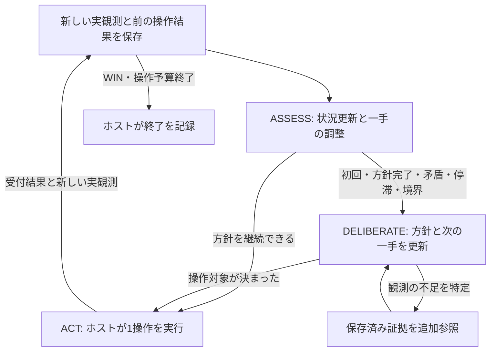

# 認識・計画・実行の分け方と中間記録の設計検討

> 過去の実装・調査の記録です。現在の仕様・実行コマンドは[現行実装](../skill-learning-runtime-ja.md)を参照してください。旧APIと旧比較コマンドは削除済みです。

検討日: 2026-09-25。設計検討時の判断と比較案を保存した文書。基礎となる成果物・条件付き方針更新を実装した[現行仕様](../skill-learning-runtime-ja.md)を別に記載する。候補間の比較評価と、人間の認知過程への適合性の実証は未完了。

## 推奨する方針

**認識と次の一手の調整は短い循環にまとめ、部分目標・実験・方針を組み直す処理を必要時だけ分離する。記録はモデル呼び出しの数ではなく、処理に使うデータの境界で残す。**

候補となる3つの機能状態は次のとおり。

|状態|責務|担当|実行頻度|
|---|---|---|---|
|ASSESS：状況更新と次の一手の調整|前後の観測を比較し、作業状態を更新。現在の方針を続けられるなら次の1操作を具体化する|モデル＋観測保存を担うホスト|各実観測。終了判定などはホストで早期終了|
|DELIBERATE：方針・部分目標の更新|目標・操作対象・作用仮説を見直し、次に試すことと判断基準を作る|モデル|初回、部分目標の完了、矛盾、停滞、モード・レベル境界など|
|ACT：操作の実行と観測の受領|現在観測に結びついた操作を検査・実行し、受付結果と次の実観測を保存する|ホスト／ドライバ|1操作ごと|

認識機能をなくす案ではない。「認識が全部終わるまで計画も操作もできない」という固定工程にせず、現在の目的に必要な認識と操作選択を同じ短い判断に置く。

## 根拠と、その限界

主な根拠は[全25環境の横断分析](../human-vcgt-analysis-ja.md)、[環境別の記録・時刻](../human-vcgt-environment-evidence-ja.md)、[初期分析](../human-vcgt-initial-analysis-ja.md)。全340記録の構造確認と、各環境2記録・計50記録の定性分析に基づく。元の説明はプレイヤー本人の発話ではなく、動画とゲームルールを与えたLLM注釈であり、元フレームとの逐次検証は未実施。

したがって、以下は「注釈に記述された行動パターンから導く実装仮説」である。人間が内部で認識と計画を直列・並列のどちらで行うか、この資料からは判定できない。注釈の「目標→理由→作業」という書式も、人間の認知順序の証拠にしない。

|記述されたパターンと例|状態分割への含意|
|---|---|
|tn36：記号を試して方向を学ぶ（代表例の要素1、0:19–0:58）。r11l：足を置いて未達成となり、胴体との関係を調べる（要素1、0:17–0:44）|認識と作用の理解は行動後にも変わる。完全な認識や確定した目標を初手の前提にしない|
|vc33：小さい調整と変化の途中経過を見る（要素4、9:23–9:45）。tu93：敵の動きと隙を扱う（要素8、11:45–12:26）|短い観測・操作ループを保つ。毎回の重い再計画は不要という仮説。ただし動画の待ち時間をゲームの待機入力に置き換えない|
|sk48：一括運搬から個別運搬へ変更（要素4、2:12–3:08）。tr87：回答欄から対応表へ編集対象を見直す（要素5、4:43以降）|細かな操作調整と、問題の捉え方を変える処理を分ける理由になる|
|s5i5：最初に見えた対象を記憶（要素1、0:00–0:48）。ls20：限定視野で地図を更新（要素7、15:06以降）|認識は画像からの単発抽出ではなく、記憶と現在観測の更新。見えない対象は消去せず、推定として残す|
|sp80：配置・流れの開始・失敗後の修正（要素6、8:30–11:34）。sb26：反復をサブルーチン化（要素5、13:12–14:10）|方針を複数操作にまたがって保持し、実行中は進捗と中断条件を確認する。毎手、同じ計画を作り直さない|
|su15：避けていた作用を別の目的に利用（要素6、9:57–10:34）|対象の作用と、現在の目的にとっての価値を分ける。目的が変われば計画を見直す|

これらをゲーム固有の正解知識として実行時のエージェントへ渡すのではなく、汎用的な更新・試行・中断の仕組みに反映する。

## 「分ける」を3種類に区別する

1. **機能を分ける:** 観測の解釈、方針の選択、外部操作の実行には別の責務がある。
2. **データを分ける:** 観測証拠、モデルの作業状態、意図した操作、実行結果を別の記録にする。
3. **モデル呼び出しを分ける:** 認識と計画に別々のHTTP要求を使うかどうか。

1と2は必要だが、常に3まで分ける必要性は資料から導けない。1回のモデル応答でも、操作対象を特定する作業状態と、その対象を参照する操作データを出せる。ただし、この場合は**同一応答内の成果物**であり、「認識結果を先に確定してから別の計画処理へ渡した」という独立したチェックポイントではない。

独立した認識チェックポイントが必要な場合だけ、状況更新を保存してからDELIBERATEを呼ぶ。問題が観測の読み違いなのか、目的・手段の組み立てなのかを調べる比較実験にも、この分割を使える。

## 比較した候補

|案|中間記録と使い方|利点|弱点・判断|
|---|---|---|---|
|毎手、認識→計画→ホスト実行|認識成果物を保存し、別のモデル呼び出しの計画入力にする|認識と計画の入出力を独立に点検できる|正常時も毎手2モデル判断。認識の誤りを次段へ固定してしまう可能性。比較対象として残す|
|毎手、認識・一手選択を1回にまとめる|作業状態と操作意図を一緒に提出し、ホストが保存・実行|最少の往復で行動できる|同じ応答内で辻褄を合わせる可能性。目標の見直しが省略される問題も残る|
|短い認識・操作ループ＋条件付き方針更新|通常は作業状態と一手を更新。必要時は状態を保存して別の方針更新へ渡す|操作の反復と方針の見直しを区別し、独立した中間記録も作れる|分岐・記憶の実装は増える。**推奨する評価候補**|

モデル判断数は、通常ループがN回、方針更新がR回なら概ねN+R回。毎手分離は概ね2N回。ツール参照・訂正・再試行によるHTTP要求は別に数える。方針更新が毎手必要なら節約にならず、時間が厳密に半分になるともいえない。

## 推奨する循環



追加の証拠参照は方針更新内の有限なツール往復であり、別の必須ステートに増やさない。初回は大きな目標が未確定でも「この対象がクリックで変わるかを一度調べる」という小さな実験を方針として作れる。

ここでいう「認識しながら実行」は、**一手を実行するたびに認識を更新し、次の一手を調整する**こと。モデルの認識が未完了のまま、同じ観測に基づく複数のゲーム操作を並行実行することではない。現行ドライバの一操作・次観測の対応を保つ。

この3状態は機能上の分担であり、そのまま3つのLlmAgentを作る案ではない。現行のCOMMITは操作を確定してドライバへ返すだけで、実ゲームを進めるのはドライバ。ACTの記録はこの両者を操作IDで結び、確定と実行受付を別イベントとして扱う。モデルや新しいWorkflowノードにもゲーム実行を追加して二重に操作することはしない。

将来の連続制御や複数手の一括実行は別の検討とする。まずは意図・部分目標だけを持ち越し、ゲーム操作は各1手。記録済みアニメーションの再読もゲーム時間を進める操作とは扱わない。

## 実際に使う成果物を記録する

長い理由文を別途書かせる代わりに、次の処理が必要とする小さいデータを持つ。

|成果物|内容|次の処理での用途|
|---|---|---|
|Observation：実観測|観測ID、画像・色ID、前の操作受付、前後差分、境界|作業状態の根拠。モデルの解釈とは別に不変で保存|
|WorkingState：作業状態|操作に関係する対象・位置、前の予測に対する確認結果、現在の仮説と不明点|対象の解決、方針の継続可否、再計画の入力|
|Intent：継続する方針|部分目標または試す問い、対象・前提、期待する変化、継続／中断条件|複数ターンの一手選択と予測照合。全手順のDAGは不要|
|ActionIntent：今回の操作|対象参照、ボタン、具体的座標、どのIntentを実現するか、次に確認する変化|ホストが実行する唯一の操作候補|
|Outcome：実行と結果|送信した操作、受付成否、次観測ID、実際の差分|次のASSESSへの入力。提出受理を実行成功と混同しない|

WorkingStateは毎回の全文描写ではなく、少数の対象と必要な更新に絞る。直接見えたこと、過去の観測に基づく推定、未知を区別する。「目標を達成した」「予測が一致した」というモデルの判断は、そのまま環境が証明した事実へ昇格させない。

例えば、クリックのActionIntentはWorkingState中の対象IDを参照し、ホストは対象の現在座標から実際のクリックを組み立てる。対象IDを文章に書くだけで座標は別の既定値から取る実装では、成果物を使ったことにならない。対象が本当に有効な操作対象かという意味的な正しさまでは、参照検証では保証できない。

認識と一手選択を同時に出した場合は、ホストが作業状態とActionIntentを同じトランザクションとして検査・保存してから実行する。認識・方針更新を分けた場合は、受理済みWorkingStateの版を固定して次段へ渡す。次段は必要時に元画像も参照でき、解釈の修正は新しい版として残す。

ログは概ね次の対応になる。

```text
observation O7
  → assessment B7（前の予測P6との比較、仮説Hの更新）
  → 継続する intent I2／新しく作る intent I3
  → action A7（B7の対象Tを参照）
  → gateway acknowledgement G7
  → observation O8
```

ホストがrun_id・step・観測ID・成果物ID・版を付与し、モデルに長いIDを転記させない。作成／受理／拒否／未実行／実行受付／次観測受領を区別し、途中停止でも作成済み成果物を失わない。更新は置換前後または変更差分を保存する。

これは**処理が依存した成果物の記録**であり、モデルが内部で本当にその順番で思考したことの証明ではない。データを受け渡す最低限の型・参照・鮮度の検査は残る。ステートを分けただけで、空の認識や誤った仮説が自然に解消するわけでもない。

## 方針更新へ移る条件

|状況|扱い|
|---|---|
|初回、現在使えるIntentがない|小さな実験または部分目標を作る。未知であること自体を停止条件にしない|
|レベル・RESET・明示的な操作モード境界|適用範囲を見直す。古い座標・対象参照を失効させる|
|部分目標の完了、前提・中断条件への抵触|次の方針を選ぶ。意味的判定にはモデルの判定と根拠を保存する|
|予測に反する変化、操作対象の同定不能|行動の細部で直せるか、目標・作用モデルの変更が必要かを再検討|
|同じ条件・対象で操作が無効なまま反復|再計画候補。初期案として連続2回を監視するが、閾値は未検証。具体的な遅延仮説・観測期限があれば無条件には遮断しない|
|画面変化はあるが目標に関係する変化が未確認|成功扱いせずunknownで保持。期限を決めて対象・仮説を見直す|

境界・回数・参照の鮮度はホストが検査できる。意味的な進捗や予測の一致はモデルの判断であり、単一の確信度や画面ハッシュだけで決めない。不確実さを理由に毎回DELIBERATEへ戻るループも避け、「何を試せば区別できるか」を実行可能なIntentにする。

予算は状態ごとに新しく満額を与えず、1観測とゲーム全体で共有する。必要な方針更新を完了できない場合、失効した操作を黙って実行しない。残り予算と停止理由を記録する。

## スキルと送信ログ

スキルは状態と一対一対応させず、必要な方法として呼ぶ。ASSESSでは視覚観測・予測照合、DELIBERATEでは目標推定・識別実験・逆向き計画が主な候補。同じスキルが両方に必要な場合もある。ホストのACTには推論スキルを置かない。これは接続案であり、未接続の専門スキルを利用済みとは扱わない。

スキル開始・終了イベントには、そのときの状態と対象となる成果物IDを結びつける。「呼べる」「ロードした」「本文を今回の要求に含めた」「判断成果物がその方法を参照した」は区別する。ロード成功を正しい適用の証明にしない。ロードが0回でも、内部でどの方法を考慮したかまでは推定しない。

再計画に渡したデータの記録だけでなく、実HTTP要求のテキスト・ツール宣言・画像参照／ハッシュと対応IDを残す。長い画像本体は既存ファイルへ参照させる。これにより「ログ上は記憶が更新されたが、送信内容も更新されていたか」を調べられる。ハッシュだけでは内容の再読はできないため、元テキストまたは参照先も保存する。

## 今回の評価に当てはめると

[20260925T014456008613Zの監査](../../outputs/evaluations/20260925T014456008613Z/log-analysis-ja.md)では、全36手で判断理由・振り返りが空、予測・メモは保存され、スキルロードは0回だった。ここから「ステート分離が必ず解決する」とは言えないが、必要なデータと分岐は具体化できる。

|今回の現象|提案で記録・判断したいもの|
|---|---|
|ft09：中央12クリック、全回で無変化|対象Tがどこにあると認識したか、その対象をクリックしたか、無変化後も同じ実験を続ける条件が成立したか|
|ls20：UPを12回、後半6回で無変化|作用仮説と部分目標を保持し、無変化を踏まえて方針を更新したか。長い一般的な理由文で反復を正当化していないか|
|vc33：中央クリック反復、変化は最上段1～2セルのみ|操作対象の変化と、それ以外の表示変化を区別できたか。画面変化を進捗へ読み替えていないか|
|予測・メモが反復|どのWorkingStateとIntentを再利用／更新したか。実際の送信内容も更新されたか|

例えばvc33の最上段を全ゲーム共通で除外するような固定ルールにはしない。対象に関係する変化を追えるかを検証する。

旧多段構成のls20測定では、PLAN約40秒・PROBE約46秒を使い1操作で時間をほぼ消費した。[旧測定](local-evaluation-completion-tools-ja.md)。[簡素化後](local-evaluation-simple-loop-ja.md)は各12操作まで進んだが、全ゲームでクリア0。プロンプト・ツール往復数・契約も同時に変えており、状態数だけの因果比較ではない。それでも、常時多段化のコストと、一括判断だけでは学習が機能しない問題の両方を評価する必要がある。

## 実装前後の比較方法

まず、同じ成果物・観測・スキル公開範囲を使い、呼び出しの分け方を比較する。

|比較|確かめること|
|---|---|
|現行版 vs 1回の判断から作業状態・操作意図を出す版|機能に使う成果物へ変えるだけで、記録と判断が改善するか|
|1回版 vs 毎手2段版|認識を別要求として確定する価値があるか。形式の差ではなく呼び出し分離を比べる|
|1回版・毎手2段版 vs 条件付き方針更新版|独立した方針更新を必要時に限定して、費用と適応を両立できるか|

同じ実時間・操作数上限での比較を主とし、同じ操作数まで進めたときの推論時間も別に見る。正常判断数だけでなく、HTTP要求数・トークン数・訂正往復・初手までの時間を記録する。各1試行・12操作だけで採用判断はしない。公開3環境で配線を確認後、可能な範囲で複数試行と異なる機構の環境へ広げる。

主な評価項目は、クリアレベル、対象選択の妥当性、予測不一致から操作／仮説を変えるまでの手数、無効反復、再計画の頻度と有用性。記録の品質として、成果物参照の整合、次観測との対応、未知の明示、根拠なしに仮説を事実化していないかも点検する。意味的評価は実観測で確認し、モデルの自己申告や注釈だけで採点しない。

実装を始めるなら、既存の観測保存・ツール監査・重複操作防止を活かし、まず成果物と参照の受け渡しを加える。その後、同じ成果物を使う方針更新ノードを条件付きで追加する。旧式の全計画DAGや多種類の必須提出を一度に戻さない。

**採用候補は「状況更新と短い行動調整／必要時の方針更新／ホスト実行」。人間の内部思考の模倣を達成したという主張ではなく、既存分析の行動パターンと今回の失敗を両方説明でき、比較可能な設計仮説として扱う。**
