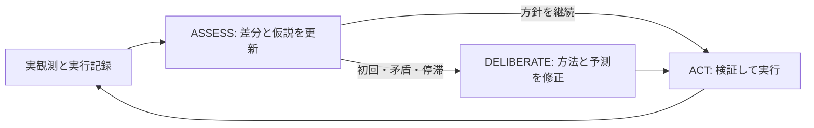

# 先行研究と現行エージェントの構造差・見直し方針

> 過去の実装・調査の記録です。現在の仕様・実行コマンドは[現行実装](../skill-learning-runtime-ja.md)を参照してください。旧APIと旧比較コマンドは削除済みです。

調査日: 2026-09-25。対象は現在の実装と、共通文脈の提示を比較した `20260925T064149191789Z` の12試行。実装・元ログ・一次文献を照合した設計レビューであり、本書の改善案は未実装・未検証。

追記: 自律的なスキル獲得を主目的とする再検討は[新しい設計案](../autonomous-skill-learning-design-ja.md)を参照。本書の失敗分析は引き継ぐが、後述の「三状態を維持」は最新の設計制約ではない。

## 結論

現時点で最も強く支持される診断は、**観測の誤解を、結果に照らして訂正できないまま次の判断に持ち越している**こと。ステート間の情報転送だけの問題ではない。現在のログは入力、受理した判断、実行、次の観測を追跡できるが、それらの参照が一致していても判断内容が正しいとは限らない。

これまでのリファクタで改善したのは、主に参照の整合、操作の検証、途中成果の記録である。観測の意味の理解、目的と手段の対応、失敗後の修正ができることまで検証できていなかった。この区別を今後の設計・評価で明示する。

共通文脈を追加した条件Bは、基準Aの33操作に対して41操作となったが、両条件ともクリア0。変化後に前のsummaryをそのまま提出した件数はAが22/24、Bが23/26で、具体例にも誤認識が残る。各ゲーム・各条件2回という小規模実験なので、共通文脈全般の無効性や個々の原因の寄与率は結論できない。[実験設計と結果](context-presentation-experiment-ja.md)

## ログとコードで確認できた問題

### 1. ゲームの対象とホストの操作表示を取り違える

ft09のB・1回目の初回ASSESSは、CLICK・RESET・方向キー等、8個のホスト操作ボタンを全て盤面座標 `(32,32)` の対象として提出した。DELIBERATEも「CLICKボタンをクリックしてゲームを開始する」という目的を採用し、同じ座標への操作を反復した。[元の判断ログ](../../outputs/context-comparisons/20260925T064149191789Z/r1-ft09-shared_brief/ft09-0d8bbf25/cognition/15179894bdf54cffa8b5c9fe7b25a586.model.jsonl)

[rendering.py](../../agent/rendering.py)はゲーム画像、ホストのプレビューカーソル、操作パネルを一枚に合成する。ホストUIだという注記はあるが、モデルはこの例で区別できていない。**取り違えは観測済みだが、合成表示が原因か、モデルの視覚能力・指示理解が原因かは未分離**。まずゲーム画像だけを提示する対照条件で調べる。

### 2. 実行済みの事実が、モデルの説明へ反映されない

vc33のB・1回目step1には、CLICK実行後にも「過去の操作なし」「操作していない」という記述がある。前回操作は入力に含まれ、Bでは先頭にも再掲している。[元の判断ログ](../../outputs/context-comparisons/20260925T064149191789Z/r1-vc33-shared_brief/vc33-5430563c/cognition/bd5ed7849f724304894b08c168ee6d3f.model.jsonl)、[実行ログ](../../outputs/context-comparisons/20260925T064149191789Z/r1-vc33-shared_brief/vc33-5430563c/cognition/bd5ed7849f724304894b08c168ee6d3f.execution.jsonl)

[workflow.py の `_context`](../../agent/cognition/workflow.py)はIntent、Assessment、前回操作、直近4試行等を再構成する。実験の158要求について条件の実反映と入力・画像参照を監査済みである。したがって単純な「文脈を渡していない」説ではこの現象を説明できない。古い文章への依存や入力負荷は仮説として残る。[入力監査](../../outputs/context-comparisons/20260925T064149191789Z/input-audit.json)

### 3. 操作の合法性と、目的に合った操作かどうかが分離している

[Intent](../../agent/cognition/state.py)は自然言語の目的・継続条件・停止条件を持つが、現在試す方法や対象との対応を型として持たない。``_resolve_action``（旧実装、現行から削除済み）は利用可能な操作、現在の対象参照、クリック座標を検査する。対象が本当に画面内のゲーム物体か、操作が意図を実現する方法かは検査できない。

過去の実走行には、一つのDELIBERATE応答内で「中央をクリックする目的」とLEFT操作が同時に受理された例もある。これはステート間の受け渡し以前の矛盾。ただし今回の12試行では、click語と非CLICK操作の簡易検出は両条件0件で、この問題の改善・悪化は評価できない。[過去の具体例](agent-consistency-research-ja.md)

### 4. 再計画は起動するが、修正が成立したかは確認しない

`adaptive.py`（旧実装、現行から削除済み）には、同じ実画面での同じ操作の反復、Intent期限、モデルが申告した矛盾・停滞による再計画がある。したがってフィードバック機構が全くないわけではない。

ただし `accept_deliberation` は前と同じ目的・操作でも受理し、`no_progress_steps` を0に戻す。何が反証され、次は何を変えるのかを必須の成果として保持しない。`continue_when` / `stop_when` は文章であり、自動判定する条件式ではない。意味的な `progress` や予測の成否も同じモデルの申告に依存する。再計画へ遷移した事実だけでは修正の証拠にならない。

### 5. 「スキル」が提供している能力が異なる

[skills.py](../../agent/cognition/skills.py)のスキルは方法を説明するMarkdownで、実行スクリプトや動的ツールを登録しない設計。ASSESS・DELIBERATEに公開されるのは合計5種類で、今回12試行の実ロードは0だった。カタログの名前・説明は入力されるため「何も提示されていない」とは言えないが、本文の方法を利用した証拠はない。

これはVoyagerの、検索して実行できるコードの蓄積とは異なる。説明文を必ずロードさせるだけで同じ能力が得られるわけではなく、追加ロードの費用に見合うかも別途評価が必要。

## 文献側で成立している条件

|研究|連動を支える具体的な仕組み|現行との差と取り入れる要点|
|---|---|---|
|Voyager|周辺ブロック・所持品・位置等の構造化状態と、採掘・作成等の操作APIを利用。コードを実行し、同じ課題に対するcriticの批評とエラーから修正する。成功判定後のコードをスキルへ追加|未知のピクセルから操作の意味まで毎手推測する本環境より、知覚・操作の基盤が整っている。状態名より、検証できる対象・操作・結果の対応を参考にする|
|Inner Monologue|物体認識、場面記述、操作の成功検出等を次の計画に戻す|自己記述を繰り返すだけでなく、観測に結び付いたフィードバックが必要|
|Reflexion|評価結果と失敗履歴から教訓を作り、次の試行に引き継ぐ。ALFWorldでは反復検出と直近3件の反省記憶を使用|「再計画した」ではなく、前の誤りに対して次の試行を変える情報を残す|
|ReAct|課題・判断・操作・環境応答を交互に扱い、必要に応じて判断を更新する|認識・計画・実行をそれぞれ独立したLLM呼び出しにすること自体が成功条件ではない|

出典: Voyagerの[論文・研究紹介](https://voyager.minedojo.org/)、[状態と操作APIの入力構築](https://github.com/MineDojo/Voyager/blob/main/voyager/agents/action.py)、[実行・批評・スキル登録](https://github.com/MineDojo/Voyager/blob/main/voyager/voyager.py)。Inner Monologueの[著者による手法説明](https://innermonologue.github.io/)。Reflexionの[論文 §3–4.1](https://arxiv.org/pdf/2303.11366)。ReActの[論文 §2, §4](https://arxiv.org/pdf/2210.03629)。公開コードのmainは調査時点の内容。

VoyagerのcriticもLLMであり、意味の正しさを保証する装置ではない。借りるべきなのは、同じ課題と新しい環境状態に照らして直前の実装を修正する流れである。外部の状態取得ができない本環境で、ゲーム内部の物体名・正解ルールを利用できると仮定してはいけない。

また、モデルと評価条件も異なる。本実装は量子化Qwen3-VL-4Bで、画像比較・未知の規則の推定・計画・ツール選択・構造化提出を担う。VoyagerはGPT-4を使う。ReflexionのALFWorldの130/134課題達成は12試行を通じた結果であり、本実験の各90秒・最大12操作・毎回記憶を初期化する評価と直接比較できない。ReActも反復から復帰できない失敗例を報告している。文献の成功は、任意のモデルと予算での一貫性を保証しない。[Voyager](https://voyager.minedojo.org/)、[Reflexion §4.1](https://arxiv.org/pdf/2303.11366)、[ReAct Table 2](https://arxiv.org/pdf/2210.03629)

4Bモデルの能力・量子化・入力負荷がどれだけ寄与したかは未検証。同じ保存入力に対するモデル比較なしに「小さいモデルだから」と断定しない。

## 見直す構造

3状態を直ちに増やす根拠はない。まず現在の枠内で、**観測に照らして判断を更新し、次の操作の結果を検証する責任**を明確にする。

- **観測:** ゲーム画像と操作メタデータを分ける。ホストが測れる変化領域・操作受付・レベル遷移と、モデルの対象解釈を別々に保持する。画面変化だけで目標への進捗とは判定しない。
- **ASSESS:** 前回の説明全文の再提出を中心にせず、対象の変化、予測を支持・反証する観測、不明点を更新する。対象の同一性も推定なので、観測参照と不確実性を残す。
- **DELIBERATE:** 現在検証する方法・対象・次の一手・期待する観測を対応付ける。停滞時は、前回と変える点か、同じ操作を続ける観測上の理由と上限を保持する。未知の操作効果を試す探索を許容する。
- **ACT:** 合法性・参照・現在の方法との整合を検査し、実行する。受付確認と成功判定を分け、次の実観測へ結び付ける。

常に追加のcriticモデルを呼ぶ必要はない。ホストで判定できる項目はホストで扱い、意味的な検証が必要な場合の追加呼び出しは時間予算と改善効果を測って選ぶ。同じ誤認識を読むcriticを増やすだけでは解決しない。

記録するのは、観測・仮説・採用した方法・予測・実際の操作と結果という意思決定の成果物。モデルが出力した説明は、内部の思考を忠実に再現した記録だとは扱わない。

## 次の実験の優先順位

|順序|変更・比較|見るもの|
|---|---|---|
|1|保存した同一盤面について、現行合成画像とゲーム画像だけの入力を比較。操作情報は両方に同じテキストで渡す|盤面対象の位置、ホストUIの誤検出、直前操作と変化の理解。不明を正しく残せるか|
|2|観測の表現を決めた上で、目的に対応する方法・対象・予測を持つ小さな操作仕様を追加|実行可能でも方針と無関係な操作、予測を検証できない操作が減るか|
|3|失敗を受けた修正点の記憶を追加|同じ失敗後に同じ方針へ戻る頻度、根拠を伴う方法変更、クリアと費用|

第1段階は、既存ログから正解を人が確認できる代表例を固定し、初期画面だけでなく操作前後の組を使う。ホストUI誤認、対象位置、変化の記述、実行済み操作の認識を別項目で採点する。未知のゲームルールを採点者が勝手に正解としない。

変更をまとめて導入せず、保存入力の診断と実走行を分けて比較する。短い入力でも認識が改善しない場合は、同じ入力でモデル能力を切り分ける。追加状態・長いプロンプト・スキルの強制ロードの効果は、今回の結果からは正当化されない。

前の研究メモにある「B→C→D」は当初の比較案。Bの改善が確認できなかったため、Bを前提に積み重ねず、**baselineを維持して観測の切り分けを先行する**方針へ更新する。今回の変更はレビュー文書のみで、実行時の構造・既定値・モデルは変更していない。
