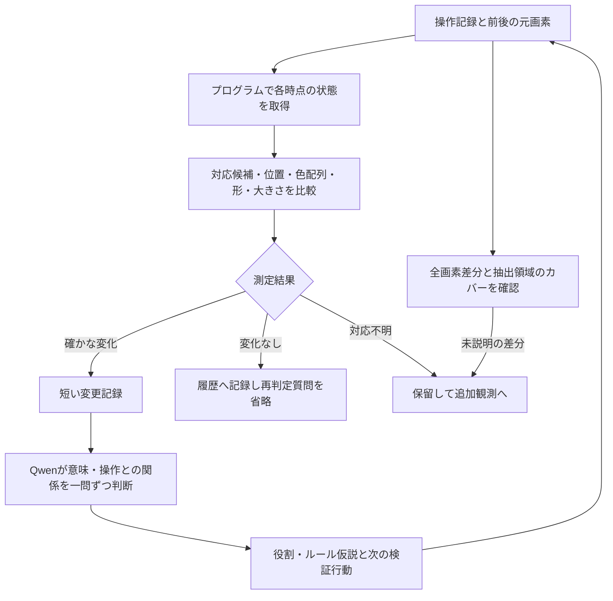
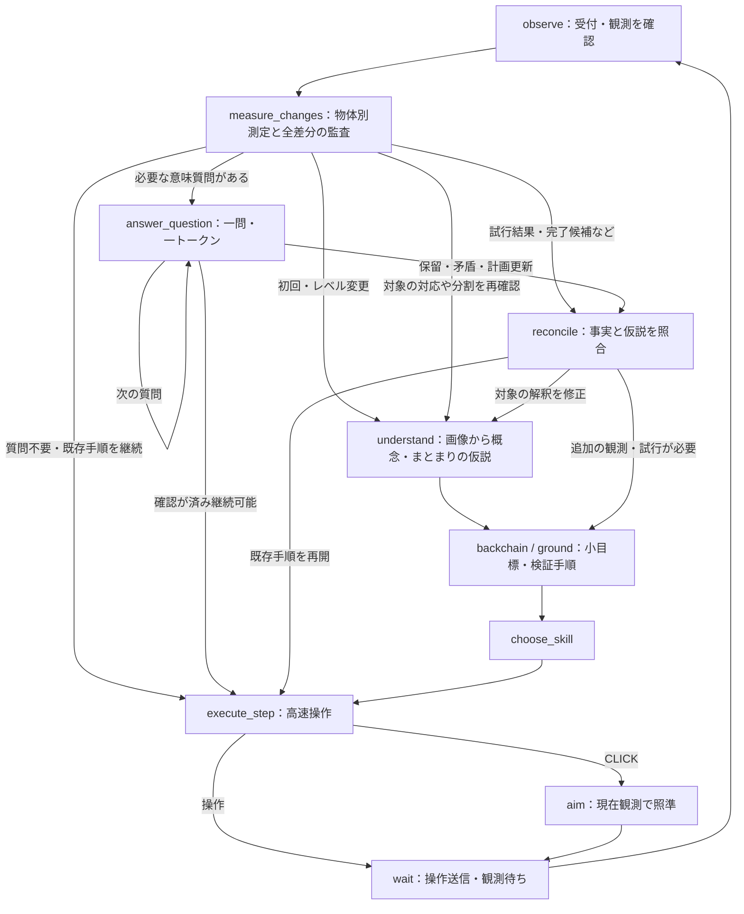

# 画面認識の採用方針・検証結果・参考文献

> 調査履歴：SAM統合後の資料整理前に保存した採用経緯・旧ベンチマークです。現行仕様は[統合資料](../../visual-recognition-adopted-ja.md)を参照してください。

更新：2026-09-28。画面認識に関する2026-09-27〜28の調査をまとめた、採用方針の参照先。

**元画素から測定できる変化はプログラムで判定し、Qwenへの質問は変化した対象の意味・操作との関係へ絞る。** 短い質問を一つずつ提示し、選択で答えられる判断は1トークンで処理する。共通概念、個体、観測時点の状態、役割仮説は区別して保持する。

この方針を採用する。プログラム測定・自動出題・1トークン回答・質問省略は比較用コードで検証済み。2026-09-28に観測測定と意味質問の状態をランタイムへ組み込んだ。**測定記録の読取り精度と、意味・因果推論やゲーム攻略の精度は別に評価する。** 初期統合時の結果は第7節に記録する。

**同日の追加採用：[初回SAM＋画素追跡をランタイムへ統合](../../hybrid-perception-runtime-20260928-ja.md)。** 現在の既定値は`COGNITION_PROPOSALS=sam_initial`。初回・リセット・レベル境界で領域候補を補完し、通常は画素処理で更新する。候補の全件索引、観測内IDと追跡ID、対象参照の継続・保留を既存の移動測定・1トークン質問へ接続した。従来の色領域測定は`program`で比較可能。以下は従来の測定方式の設計・評価履歴であり、SAM統合後の具体的な動作と制約は上記資料を参照する。

## 1. 採用する構成



| 要素 | 採用する扱い | 根拠・実装状況 |
|---|---|---|
| 微小変化の取得 | 元の64×64色ID配列を比較する。拡大画像から座標を読ませない | 限定した図形のプログラム比較で移動5/5対象を検出 |
| 概念と個体 | 同じ3×3パネルという概念を共有し、4個体の内部配列を個別に保持する | 共通クラスと個体別状態の保持を実装・確認 |
| 個体対応 | 見た目・形・位置などの対応候補を保存し、曖昧なら保留する | 同形物体の複数対応を検出する試作あり |
| 質問の入口 | 測定上の変化がある候補と保留候補を残し、変化なしへの再質問を省く | 87候補へのモデル質問を261問から43問へ削減 |
| Qwenへの入力 | 操作・観測IDに紐づく短い変更記録と、その問いに必要な関係だけを渡す | 短い測定記録の読取りに効果。最適な意味質問の構成は未確定 |
| Qwenの回答 | 小さい選択肢集合では1トークン＋許可文字制約。「判断不能」も用意する | 文法制約付き174要求すべてで1トークン回答を確認 |
| 事実と仮説 | 測定記録とモデルの解釈を別に保存する。解釈だけで測定済みの変化を消さない | 詳細回答が測定上の変化を否定した事例を踏まえた採用要件 |

上表は採用判断時の根拠。後続の比較用ランタイムでは測定記録と意味回答を分けたが、モデルが照合時に事実へ従うことまでは保証できていない。統合後の結果を第7節に示す。

### 対応候補とレトロUI付き画像の役割

今回の試作でいう「対応候補」は、プログラムが各フレームから抽出した形・色配列・位置などを照合した候補である。QwenがレトロUI付き画像を先に認識した結果を必須入力としてはいない。これは既存の抽出規則で扱える図形についての結果であり、未知の物体のまとまりや役割までプログラムだけで理解できる、という結論ではない。

「複数の図形を一つの装置とみなす」「このパネルは見本らしい」といった意味の解釈には、全体画像をQwenに見せる経路も残す。レトロUIはその際の文脈補助の候補である。過去の比較ではゲーム盤面として説明する兆候はあったが、移動対象の同定改善は確認できていないため、必須の前処理にも、不要と確定した処理にも位置づけない。

画像認識でまとまり・役割の仮説を作り、その領域の詳細をプログラムで測る連携は、候補IDへの参照契約まで追加した。Qwenの任意のまとまりを画素領域へ変換する一般的な連携は未完成である。曖昧な個体対応は、UI付き画像を見せれば解決すると仮定せず、追加の時系列観測や操作検証でも確かめる。

### 記録する情報

共通概念には「3×3パネル」「二色の矩形」などの形のまとまりを記録する。個体には参照する観測、実際の支持領域、局所配列、他個体との一致関係を持たせる。「プレイヤー」「見本」「ゴール」は更新可能な役割仮説にする。フレーム内IDや同じ呼び名だけで、前後の物理的同一性を確定しない。

正確な座標はプログラム内部の測定・照合に使う。Qwenの通常の回答には座標の再出力を求めず、「どの対象が変化したか」「この観測がどの仮説を支持するか」を問う。操作方向と物体の移動方向が一致するとは仮定せず、逆方向の連動や位置に依存する移動も記録に残す。

例えば、次は今後の意味質問用の記録形式の例であり、測定済みの成功プロンプトではない。

```text
試行 T12：操作 A。観測 O20 → O21。
測定事実：二色の矩形は移動した。白い十字は不変。
対応：矩形の前後対応は候補が一つ。未説明の差分はない。
既存仮説：矩形は操作対象かもしれない。
質問：この1回の観測だけで、矩形が操作Aによって動いたと確定できるか？
A. 確定できる
B. 操作直後の変化は確認できるが、因果関係はまだ確定できない
X. 提示情報から判断できない
```

「操作直後に変化した」という観測と「操作が原因」という推論は別にする。必要に応じてWAIT、同じ開始状態からの別操作、反復観測で仮説を検証する。未変化対象も比較や関係理解に必要なら記録を参照するため、質問を省くことは履歴を捨てることではない。

### 見落としを黙って処理しない条件

抽出候補で覆えない変更画素、前後の対応が複数ある候補、出現・消失・分裂・合体の可能性は、保留として残す。「物体候補が0件」を「変化なし」に置き換えない。試作では20×20の抽出対象外領域の出現に対し、質問0件でも400画素の未説明差分を検出した。

画像や部分拡大は、抽出や役割の確認が必要な場合に参照する。測定値だけで完結する比較には画像を毎回送らない。未説明差分が0でも、物体の区切り方や意味が正しい保証にはならない。

## 2. 採用を支える検証結果

通常の比較はローカルQwen3-VL-4B-Instruct、Q4_K_M本体・Q8_0 projector、llama.cppを使用した。以下は実ログの一部と小規模な合成問題による診断であり、ARC-AGI全体の成功率ではない。実験間では質問・入力形式が異なるため、正答率を合算しない。

### A. プログラムによる詳細取得と比較

限定した小図形とパネルの比較で、プログラムは移動対象を5/5検出した。同じ試験の前後画像を直接Qwenで比較する条件は0/5。プログラムは主対象の変化を9/9例で捉え、余計な変化・対応・関係の誤りまで確認した整合判定は8/9例だった。4つの3×3パネルを共通クラスの別個体として保持し、1セル変更やパネル同士の配列一致を比較できた。

抽出器は小さな連結成分、矩形のまとまり、3×3配列などの規則を持つ。未知ゲームに通用する物体検出・概念獲得の完成ではない。バーの短縮を別候補と解釈する問題もあり、測定の正確さと物体の分割・対応の正しさは分けて扱う。

出典：[状態取得の比較HTML](../../../outputs/instance-state-20260928-final/gallery.html)、[集計JSON](../../../outputs/instance-state-20260928-final/summary.json)。

### B. 短い測定記録と単純な質問

同じ29問について、画像のみ、短い前後の測定値、計算済みの変更記録を比較した。

| 入力 | 色 | 移動対象 | パネル内部の変化 | 操作と変化の対応 | 合計 |
|---|---:|---:|---:|---:|---:|
| 画像のみ | 4/4 | 4/16 | 1/5 | 1/4 | 10/29 |
| 短い前後の測定値 | 4/4 | 16/16 | 4/5 | 3/4 | 27/29 |
| 計算済みの変更記録 | 4/4 | 16/16 | 5/5 | 2/4 | 27/29 |

移動問題には1・4画素、逆方向の同時移動、無変化、WAITを含めた。画像のみの4/16は全問「どちらも動いていない」と答えた結果。測定記録の16/16は、画像から自力で移動を認識した成績ではなく、記録を正しく読めた成績である。操作との対応は過去の観測の読取りで、因果推論の成功率ではない。

出典：[単純質問の比較HTML](../../../outputs/simple-action-20260928/gallery.html)、[内容と形式を分離した集計](../../../outputs/simple-action-20260928/summary-reviewed.json)。

### C. 1トークン回答による高速化

上の29問のテキスト条件で、入力を固定して出力設定だけを変え、各3回測定した。

| 入力 | 通常の出力上限16：中央値 | 上限1＋許可文字制約：中央値 | 正答した問題 |
|---|---:|---:|---:|
| 前後の測定値 | 157.3ms | 99.5ms | 両設定とも27/29 |
| 計算済みの変更記録 | 141.1ms | 87.9ms | 両設定とも27/29 |

文字制約を付けた174要求すべてが、許可された1文字・生成1トークンになった。回答選択は出力設定間・反復間で変わらなかった。1トークン化は出力の短縮であり、入力読取りや前処理の時間は残る。「高速モード」はここでは短い選択回答を意味し、別の思考モデルへの切替ではない。

現在のローカルサーバーで確認した指定例：

```json
{"max_tokens": 1, "grammar": "root ::= \"A\" | \"B\" | \"X\""}
```

選択肢の文字が実モデルで1トークンになるかを確認する。上限に達して`finish_reason=length`でも、許可された1文字が完結していれば有効回答として扱う。別のサーバーで同じ`grammar`引数が使えるとは限らない。文法制約は回答形式を保証するもので、正しさの保証ではない。

出典：[出力設定の比較HTML](../../../outputs/one-token-20260928/gallery.html)、[集計JSON](../../../outputs/one-token-20260928/summary.json)、[トークン確認](../../../outputs/one-token-20260928/token-audit.json)。

### D. プログラム判定による質問省略

41画像対から得た87候補を各方式2回処理した。内訳は変化あり36、変化なし44、対応未確定7候補。全方式1トークン回答で、Qwenには測定状態のテキストを渡した。

| 方式 | 1巡回の質問数 | 時間合計の中央値 | 変化の組み合わせ正解 | 変化ありを検知 |
|---|---:|---:|---:|---:|
| 全3属性を個別に質問 | 261 | 38.63秒 | 61/87 | 28/36 |
| 変化なしを含め直接1問で分類 | 87 | 14.73秒 | 62/87 | 25/36 |
| **プログラムで入口判定→Qwenで詳細分類** | **43** | **7.24秒** | **62/87** | **25/36** |

プログラムによる省略は、直接分類と全候補の最終回答が同じで、質問数を50.6%、時間を50.8%削減した。全3属性巡回との比較では質問数83.5%、時間81.2%減。ただし後者に対して変化検知の精度まで同等とは言わない。

プログラム入口は測定上の変化36候補をすべて残したが、後段Qwenはうち11候補を「変化なし」と回答した。したがって採用構成では、測定済みの事実を再判定させず、意味の解釈と別に保持する。この修正後の意味推論の精度を、表の62/87や7.24秒が示しているわけではない。

候補数N、測定上の変化C、保留Uなら、入口判定後の対象数はC+U。各対象に1問なら今回は36+7=43問になる。意味について複数問を出す場合や追加観測が必要な場合、その分は増える。時間はリクエスト時間の合計で、抽出・起動等を含む実運用全体の時間ではない。

出典：[質問省略の比較HTML](../../../outputs/hierarchical-20260928/gallery.html)、[集計JSON](../../../outputs/hierarchical-20260928/summary.json)、[再現性・分岐の検査](../../../outputs/hierarchical-20260928/verification.json)。

## 3. 今回の標準経路に採用しない方法（参考）

| 調べた方向 | 残しておく知見 |
|---|---|
| レトロUI、幾何図形という事前説明、操作ボタンの発光 | ゲームらしい場面説明には兆候があったが、移動対象の認識改善は確認できなかった |
| 白色混合、前後重ね合わせ、境界線、クロスフェード、動画入力 | 境界線付き重ね合わせは一部の対象で改善したが、微小移動全般には不安定で加工を実変化と読む例もあった。人間向け閲覧の補助としては利用可能 |
| 事前の物体説明、命名、中間説明、相対位置の記述 | 説明の整合に役立つ場合はあるが、粗い文章を引き継ぐ問題が残った。名前は参照用とし、測定事実に代用しない |
| Qwenの「変化したか？」で詳細確認を省く | 入口で変化36候補中6候補を見落としたため、採用構成の入口はプログラムに置く |
| XAIによる注意・特徴差の診断 | 特徴差の存在と、移動の正しい判断は別だった。注意の可視化だけでは失敗原因を確定できない |
| 測定済み変更・関係をまとめて渡すルール推論 | 既存の小規模試験では安定しなかった。短い観測質問の成功を攻略推論の成功と読み替えない |
| FCOSなどの追加物体検出モデル | 今回の元画素が取得できる2D環境では優先しない。これらのモデルとの精度・速度比較は未実施 |

## 4. 参考文献と今回の位置づけ

以下は設計や評価の参考文献であり、上記の数値の出典は本プロジェクトの実測記録である。各研究が今回のQwen・64×64ゲームで同じ効果を保証するわけではない。

| 文献・公式資料 | 参考にする点 | 今回への適用範囲 |
|---|---|---|
| [Qwen3-VL Technical Report（2025）](https://arxiv.org/abs/2511.21631) | 画像・動画・テキストを扱うモデル構成と評価 | モデルの前提を確認する資料。一般ベンチマークの成績を、量子化4Bの微小変化認識へ直接換算しない |
| [llama.cpp GBNF文法の公式資料](https://github.com/ggml-org/llama.cpp/blob/master/grammars/README.md) | 出力文字列を文法で制限する方法 | 採用する選択肢制約の実装資料。1トークンになることと速度はローカルで別途確認した |
| [Voyager（Wang et al., 2023）](https://arxiv.org/abs/2305.16291) | 環境フィードバックによる反復修正とスキル蓄積 | 仮説を操作結果で検証する設計の参考。今回の画面認識改善を直接実証した研究ではない |
| [Unsupervised Object Learning via Common Fate（Tangemann et al., 2023）](https://proceedings.mlr.press/v213/tangemann23a.html) | 動きを手掛かりにした物体表現の学習 | 物体単位で状態を持つ発想の背景。訓練を伴う別方式であり、同じ方向に動くものだけをまとめる規則として採用しない |
| [Attention is not Explanation（Jain & Wallace, 2019）](https://aclanthology.org/N19-1357/) | 注意重みと出力への寄与を区別する必要性 | XAI結果を過大解釈せず、入力への介入や実際の正答で判断する根拠。Qwen固有の原因分析ではない |

## 5. 実装参照と次の確認

| 比較用の実装 | 内容 |
|---|---|
| [instance_state.py](../../../scripts/instance_state.py) | 各時点の候補取得、状態・対応・変更の比較 |
| [observation_questions.py](../../../scripts/observation_questions.py) | 元画素と操作からの自動出題、未説明差分の監査 |
| [hierarchical_questions.py](../../../scripts/hierarchical_questions.py) | 測定上の変化判定、質問形式、保留を含む分岐 |
| [benchmark_one_token.py](../../../scripts/benchmark_one_token.py) | 同じ問題での1トークン出力設定の比較 |
| [benchmark_hierarchical.py](../../../scripts/benchmark_hierarchical.py) | 実際の回答に従って呼び出しを省略する比較 |

比較用統合を第7節の条件で測定した。引き続き、未使用の場面で、変更の取りこぼし・誤った個体対応・操作記録の混同・意味判断・総時間を別々に測る。意味判断や攻略の改善を確認してから、その範囲を実績として追加する。

これまでの個別資料は調査履歴として保持している。古い資料中の「次の候補」「推奨」は当時の判断であり、現在の採用方針は本書を参照する。再現が必要な場合は各結果HTMLから入力・生回答・検査記録を確認できる。

## 6. エージェントのステートマシンへの組込み設計

2026-09-28追記。既存の状態と観測処理を確認した上での設計と、比較用実装の対応を示す。観測内の測定、候補参照、`answer_question`、保留を伴う結果照合は`measured`経路に実装した。未知のまとまりを確実に対応づける方法や、意味質問を網羅的に生成する方法は引き続き検証対象である。

### 現行処理との対応

現行の[machine.py](../../../agent/cognition/machine.py)には`observe`、4つの熟考状態、`choose_skill`、`execute_step`、`aim`、`read_memory`、`wait`、`stop`に加えて`answer_question`を登録した。[execution.py](../../../agent/cognition/execution.py)の`_receive()`で操作受付・観測の対応を確認し、元画素の変更数と変更領域を計算する。新経路では[perception.py](../../../agent/cognition/perception.py)が物体候補別の変化・対応・未説明差分を追加で記録する。モデルへ渡す変更画素の抜粋を、全差分の監査に流用しない。

[workflow.py](../../../agent/cognition/workflow.py)の`_on_observation()`が観測後の行先を選ぶ。ここに物体別の測定と質問の必要性の判定を接続した。毎操作で4つの熟考状態をすべて通す構成にはしない。

| 状態・内部処理 | 担当 | 入力と成果物 | 遷移の方針 |
|---|---|---|---|
| `observe`内の`measure_changes`〔新規の内部処理〕 | プログラム | 元画素、観測ID、受付済み操作、候補状態 → 変更記録、対応候補、未説明差分 | 初回は`understand`。継続時は下記の優先順位で振り分ける |
| `understand`〔既存を拡張〕 | Qwen＋プログラム検査 | 現在画像、候補領域、特定の疑問 → 概念・まとまり・役割の仮説と候補への参照 | 対応を検査して`backchain`/`ground`。不足情報を画像の再説明だけで確定しない |
| `answer_question`〔新規〕 | Qwen、1トークン | 一つの意味質問、短い測定記録、少数の選択肢 → 仮説への支持・反証・保留 | キュー内の次の質問、既存手順の継続、または`reconcile`。曖昧な回答を「変化なし」に置き換えない |
| `reconcile`〔既存を拡張〕 | Qwen | 測定事実、質問回答、今回の手順・期待 → 仮説・目標状態・次の疑問 | 対象理解は`understand`、計画修正は`backchain`/`ground`、継続は`execute_step` |
| `backchain` / `ground` | Qwen | 概念・関係・根拠付き仮説 → 小目標または一操作の検証手順 | 既存の計画・探索経路を利用 |
| `choose_skill` / `execute_step` / `aim` | Qwenの高速選択＋ホスト検査 | 今回の手順と観測に対応する情報 → 合法操作 | `wait`で操作結果を待ち、次の`observe`へ |

`measure_changes`はモデル呼出しを伴わない観測内の処理段階とする。`answer_question`は選択回答の状態であり、変更候補ごとに長文説明を生成する状態ではない。既存の`read_memory`、終了・期限処理は利用する。



図は認識に関係する主要経路を示す。`wait`はドライバーの受付・結果待ちであり、ゲーム内のWAIT操作とは別である。追加観測のために時間を進める場合は、その環境で可能な取得方法または合法操作を`ground`で具体化する。

### 観測後の遷移の優先順位

1. **受付・境界・期限を確認する。** 受付不明、観測の取り違え、終了は既存の処理を優先する。初回は現在状態だけを取得し、前後差分を作らない。RESETやレベル変更をまたいで移動を判定しない。
2. **探索試行の結果・完了候補を照合する。** 一操作の試行は無変化でも`reconcile`へ返す。「何も動かなかった」は結果であり、探索の未実施でも目標達成でもない。
3. **測定の欠落や対応の不確かさを扱う。** 未説明差分、対象の消失、曖昧な対応を保留として記録する。現在の操作対象が特定できない場合は理解・具体化へ戻す。ほかの候補の不明点も消さずに保持するが、すべての不明点を解くまで一律にゲームを停止する設計にはしない。
4. **必要な意味質問を処理する。** 既存の目標・操作対象・役割仮説について、今回の変化が判断を変える可能性がある場合に出題する。測定だけで決まる「動いたか」「何画素か」は再質問しない。
5. **質問が不要なら既存の高速実行へ戻す。** 変化なしを含めて観測記録は残す。遅延効果、無操作との比較、失敗の証拠など、無変化そのものが意味を持つ場合は照合対象になる。

### 状態間で渡すデータ

| 記録 | 最低限の情報 | 扱い |
|---|---|---|
| 測定記録 | エピソード、前後観測ID、操作・受付・起動ID、元画素差分、候補状態、対応根拠、未説明領域 | ホストが保存する測定値。モデルの回答で書き換えない |
| 対応仮説 | 前後の候補参照、候補の集合、採用した照合規則、未確定理由 | 数値の正確さと、物理的な同一性の仮説を区別する |
| 概念・役割仮説 | 概念名、個体・グループへの参照、役割、支持・反証する観測ID | Qwenが更新する解釈。幾何学的な抽出規則の出力と混同しない |
| 質問 | 問いのID、参照する測定・仮説、選択肢の意味、保留選択肢、回答後の行先 | 選択肢の一文字はその問いの中だけで解釈する |
| 回答 | 問いのID、観測ID、選択文字、形式の有効性、処理時間 | 別観測・別試行の回答を現状の判断へ転用しない |

`Target`には外観・役割・関係に加え、任意の`candidate_refs`を追加した。提示した現在の候補IDに存在するかを検査するが、その選択の意味的な正しさまでは保証しない。Qwenの「青い装置」という呼び名だけで画素領域を確定せず、対応できない場合は空の参照を許容する。クリック位置は引き続き最新観測の`aim`で決め、古い領域をそのままクリックしない。

### 実装前に定める初期動作と、比較で詰める点

| 論点 | 初期実装の扱い | その後の比較対象 |
|---|---|---|
| 未知のまとまりと画素領域の対応 | プログラム候補に参照を付け、Qwenのまとまり・役割を仮説として結ぶ。結べない対象は保留 | 分割・合体・背景との接触を含む未知画面で、候補生成が足りるか |
| 画像・レトロUIの使用 | 初回理解や対象の再解釈では画像を利用可能にする。測定だけの質問には不要。レトロUIは任意の表示条件 | 同じ入力条件で、役割理解・候補対応への効果とコストを比較 |
| 意味質問・選択肢の作成 | 既存の手順・仮説から短い問いを作り、各問に保留を用意する。自由な新規ルールの発見は熟考へ残す | 誘導的な選択肢、必要な問いの欠落、操作記録の混同を評価 |
| 保留と再試行 | 保留・無効回答は照合へ返し、画像再確認か追加観測かを具体化する。同じ観測・同じ問いの自動再生成は繰り返さない | 質問数上限と熟考への切替条件。時間切れの未処理項目は未確認として保存 |
| 推論の更新 | 測定事実を固定して、支持・反証・未確認を別に追記する | 意味判断・局所ルール予測・実際の操作成功率 |

このうち、質問の保留処理や観測IDの契約は実装時に確定できる。未知の物体分割と意味推論の精度は、状態遷移を定めるだけでは解決しないため、保留経路を備えた実装で測る。任意の問いを自動生成すれば必要な推論を網羅できる、という前提は置かない。

### 実装の順序と確認項目

まず`observe`へ候補抽出・物体別比較・全差分の監査を接続し、既存の操作判断は維持したまま記録を比較する。次に候補参照と測定・仮説の契約を追加し、最後に`answer_question`と質問省略を有効化する。新状態・遷移は`machine.py`の定義と実際の分岐、リプレイ表示を同時に更新する。

回帰確認では、初回／RESET／レベル変更、同形物体の曖昧な対応、候補外の差分、無変化の試行結果、遅延効果、古い回答、形式不正、予算切れを扱う。操作受付と照合、完了候補、カーソルの観測ごとの再取得も維持する。実モデルでは質問数だけでなく、抽出から操作までの総時間、未確認の取りこぼし、誤った意味判断、ゲームの進展を測る。

## 7. ステートマシン統合後のベンチマーク（2026-09-28）

**同じ画面について変更対象を答える精度は改善した。一方、実ゲームでの操作・攻略の改善は確認できなかった。** 測定記録を読めることと、それを計画・照合へ正しく使えることを分けて評価する必要がある。

[比較HTML：固定問題・実ゲームの観測・モデル解釈](../../../outputs/measured-runtime-20260928/gallery.html)に一式をまとめた。[実装のステートマシン](../../../outputs/measured-runtime-20260928/workflow/index.html)も参照できる。

### 実装した範囲

元画素から候補を抽出し、対応・位置・見た目・大きさ・未説明差分を測定する。変更候補と今回の期待効果について、「支持／反する／無関係／不明」を1トークンで答える`answer_question`を追加した。物体の同一性や操作の因果性を、測定済みの事実として扱うものではない。

質問は1観測につき最大4件で、残りは保留件数として照合へ渡す。形式不正や不明も照合へ戻し、測定記録を消さない。候補抽出の組合せ計算を制限するため、小成分が64個を超える場合は抽出制限を記録し、差分監査で未説明領域を残す。初回理解・照準・測定に保留がある場面では画像を使う。レトロUIは今回追加していない。

この初版の意味質問は「今回の期待効果との関係」という固定テンプレートである。役割や未知のルールに関する全質問を自動生成する実装ではない。候補参照の存在検査は行うが、意味的に正しい対応かまでは検証しない。

### 固定した29問の比較

過去の29問をそのまま使用し、同じ質問・選択肢・system指示で、画像入力と今回の実装が生成した測定入力を比較した。各2反復、計116要求、temperature=0、1トークン＋文法制約、キャッシュ無効。測定入力は手書きの正解説明ではなく、ランタイムと共通の`perception.py`が生成した記録である。

| 入力 | 色 | 移動対象 | パネル内部変化 | 操作との対応 | 合計 | 応答時間中央値 |
|---|---:|---:|---:|---:|---:|---:|
| 画像のみ | 4/4 | 4/16 | 1/5 | 1/4 | 10/29 | 501.1ms |
| 実装したプログラム測定入力 | 4/4 | **16/16** | **4/5** | 1/4 | **25/29** | **253.7ms** |

反復間の回答差はなく、116回答すべてが許可された1文字・生成1トークンだった。実際に動いた12問は画像0/12、測定入力12/12。無変化4問は両方4/4。1画素・4画素・逆方向の同時移動を含む。

測定処理は33画像対の準備時測定で中央値6.49ms。応答時間は測定処理を含まない。過去の短い説明文による27/29とは表現が異なり、今回の自動生成記録は25/29だった。既知の小規模な合成問題の再利用であり、未見ゲームへの転移やQwen単独の画像認識改善を示さない。

### 公開ゲームの短時間比較

旧方式の削除前に、同一のソーススナップショットから当時の`legacy`と`measured`を切り替え、ls20・vc33・ft09を各1回実行した。各最大4操作、全体120秒、1判断60秒、プロセス上限145秒。モデル・ゲームの版・時間予算を揃え、ローカルの公式SDKゲートウェイでオフライン実行した。外部提出はしていない。この比較は保存済みの履歴であり、現在の実装にはモード切替はない。

| ゲーム | 従来：操作数／全体時間 | 新方式：操作数／全体時間 | 新方式の意味質問 | 到達レベル |
|---|---:|---:|---:|---:|
| ls20 | 4回／116.2秒 | 2回／120.5秒 | 1問（不明） | 両方式0 |
| vc33 | 1回／79.4秒 | 0回／60.5秒 | 0問 | 両方式0 |
| ft09 | 0回／60.5秒 | 0回／60.6秒 | 0問 | 両方式0 |

ls20は予算上限、vc33・ft09は1判断の時間上限で終了した。表の全体時間は初期化・終了処理も含むため、推論予算とわずかに異なる。停止理由の`budget_exhausted`は操作数上限でも用いられるため、従来ls20の116.2秒を120秒の時間切れとは解釈しない。SDKスコアは6実行とも0だった。

新方式のvc33・ft09は、初期理解・具体化・記憶参照の間で時間を使い、環境操作に至らなかった。ls20では新状態が実行されたが、固定問題での改善は操作数や攻略改善にはつながらなかった。各1回の短い実行であり、一般的な性能低下率や成功率は推定しない。方式ごとに操作と画面が分岐するため、実ゲーム結果を固定画面の正答率へ合算しない。

### ログから確認した残課題

新方式のls20では、step 0→1で変わったのは下部の2画素、step 1→2でもその隣の2画素だけだった。黄色い帯の端が暗い灰色へ変わり、プレイヤー候補の移動は測定されていない。最初はバーのまとまりが変わって対応保留、次は同じ領域の内部色変化として記録した。

意味質問は「不明」を返したが、後続の`reconcile`は「プレイヤーが下へ動いた」と説明し、その前提を手順へ引き継いだ。**測定台帳の保全はできても、モデルの結果説明と測定の整合はまだ保証できない。** この例は、事実の提示だけで誤った期待を訂正できるとは限らないことを示す。

次の改善対象は、照合結果がどの測定・候補を根拠にしたかを必須にする契約と、不変対象も含めて期待効果を検査できる情報の渡し方である。また、同じ観測で理解・具体化・記憶参照を繰り返す時間も別に評価する。今回は測定後のプロンプト調整や都合のよい再試行を行わず、結果をそのまま保存した。

### 再現・検査

現在の実装で同じ短時間条件を実行する例：

```bash
make benchmark EVAL_STEPS=4 EVAL_SECONDS=120 EVAL_HARD_SECONDS=145 COGNITION_DECISION_SECONDS=60
```

現在は測定方式に統一した。これは実装整理であり、未確認の攻略性能向上を意味しない。上記の比較時点のコードと条件は、各評価のソーススナップショットとmanifestに保存されている。今後の比較は改善前後のコードで行う。

回帰テストは154件をADKコンテナで、既存の描画テスト8件をフォントのあるホストで実行し、すべて成功した。初回の全件実行では新状態の登録・表示の不足を検出して修正した。描画テストはコンテナに既存テスト指定のフォントがないため実行環境を分けた。状態表示の変更後は関連9件を再確認した。

固定入力とコードのハッシュ、全116要求の一意性、6実ゲームのソース一致、測定記録の元画素からの再計算を検査した。HTMLは29問・13実観測と新状態の表示をブラウザで確認した。

- [固定問題の集計](../../../outputs/measured-runtime-20260928/summary.json)・[入力と条件](../../../outputs/measured-runtime-20260928/plan.json)
- [認識と実ゲームの集計](../../../outputs/measured-runtime-20260928/combined-summary.json)・[実ゲームの比較条件](../../../outputs/measured-runtime-20260928/live-plan.json)
- [統合した検査記録](../../../outputs/measured-runtime-20260928/combined-verification.json)・[ブラウザ検査](../../../outputs/measured-runtime-20260928/browser-verification.json)
