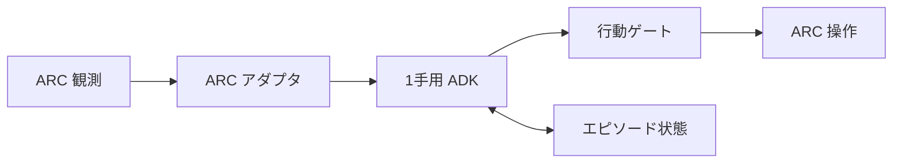
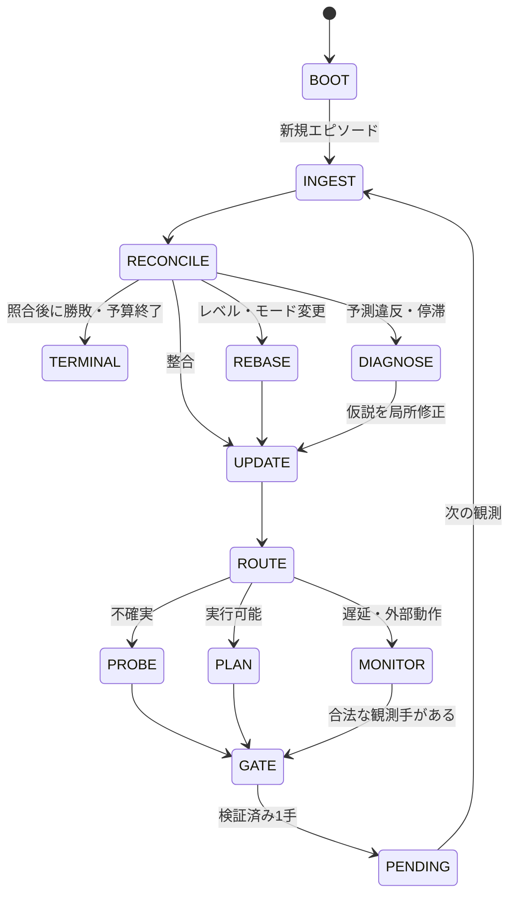

# Human VCGT に基づく ARC-AGI-3 エージェントの状態機械設計

設計案: 2026-09-24。対象は `magic-sword/acr-agi-3-adk-agent` の Python 実装。これは実装済み機能や攻略実績の報告ではない。

## 1. 根拠と目的

[環境別分析根拠](https://github.com/magic-sword/acr-agi-3-adk-agent/blob/main/docs/human-vcgt-environment-evidence-ja.md)と[横断分析](https://github.com/magic-sword/acr-agi-3-adk-agent/blob/main/docs/human-vcgt-analysis-ja.md)が示す設計仮説は、目標・操作可能な対象・操作の作用を仮説として保持し、予測に反する結果から必要な部分だけを更新すること。全25環境の340記録を構造確認し、定性分析は各環境2記録の計50記録を対象にした。元映像・フレームとの逐次照合は未実施で、注釈はプレイヤーの内省記録でもない。以下の「人間の思考」は実測した認知過程ではなく、注釈から移した**検証対象の制御方針**である。

目標は未知ゲームへの汎化、クリア率、行動数、実時間を同じ行動・推論予算で測ること。`ls20` でのローカルモデルによる2手実行は接続確認であり、クリアや Kaggle オフライン動作の証明ではない。

## 2. 実行境界

ARC の `choose_action(frames, latest_frame)` は現在の観測に対して**1手**を返す同期境界。ADK のワークフローは、この1手の内部で観測・前回結果の照合・仮説更新・提案・検証を行う。操作後の画面は次回の `choose_action` に届く。したがって `VERIFY` は次の呼び出しで行い、ADK 内部で未実装のゲーム操作ツールを呼んで無限に進めない。

1. **ARC アダプタ**: 実フレーム、ゲーム状態、使用可能な整数アクション、レベル数、手数を取得。画像の座標系とクリック座標系を別に管理する。
2. **状態機械**: 下表の遷移条件を Python の決定的処理で管理。Qwen3-VL は観測の解釈、競合する仮説の提示、候補行動の提案に用いる。
3. **行動ゲート**: モデル出力の型、使用可能なアクション、`ACTION6` の整数座標と範囲・変換、現在のゲーム状態、行動予算を検査する。`RESET` はゲーム状態と実際のフレームワーク契約に照らして許可する。失敗した出力をそのままゲームに渡さない。
4. **エピソード状態**: 同一プレイ中に保持し、ゲーム・レベル・操作モードの変化時に適用範囲を更新する。長いログや画像を毎回モデルに送らず、要約と必要な局所画像を渡す。

## 3. 1手をまたぐ階層状態機械

上位状態は `BOOT` / `ACTIVE` / `TERMINAL`。`ACTIVE` の下に以下の処理状態を置く。`PENDING` はゲームの非同期処理を意味せず、**前回返した操作の結果が次の観測まで未照合**という内部状態を表す。

|状態|入力・実行|次の状態とガード|
|---|---|---|
|`INGEST`|フレーム、合法手、ゲーム・レベルIDと終了フラグを正規化。前回の `PENDING` を取得|`RECONCILE`。初手で `PENDING` がなければ照合を飛ばす|
|`RECONCILE`|前回の予測と実際の変化を比較。勝利した一手の結果も記録し、不可視領域を「変化なし」と誤判定しない|照合後、勝敗・予算終了なら `TERMINAL`。レベル/モード/編集対象の変化は `REBASE`。予測反例・反復無効手は `DIAGNOSE`。その他 `UPDATE`|
|`REBASE`|変わったスコープを分類。前レベルの知識を候補として残し、適用前に再検証|新場面の基礎観測を終えたら `UPDATE`|
|`UPDATE`|対象・関係・隠れた状態、目標、作用の仮説と根拠を更新|モデル上の不確実性と残予算により `ROUTE`|
|`ROUTE`|目標不明、作用不明、既知計画、実行中の遅延、失敗原因を判定|区別可能な仮説があれば `PROBE`、計画可能なら `PLAN`、遅延なら `MONITOR`、停滞なら `DIAGNOSE`|
|`PROBE`|低コストで仮説を区別する合法な1手を提案し、期待される変化を記す|`GATE`|
|`PLAN`|前提、部分目標、副作用、維持条件、撤退条件を考慮し短い1手を提案|`GATE`|
|`MONITOR`|遅延や他者の動きがある場面を解釈。環境が時間進行する契機を確認|合法かつ意味の確認された観測用行動があれば `GATE`、なければ次の安全な計画へ。動画の停止時間をゲーム内の待機命令とみなさない|
|`DIAGNOSE`|知覚誤り、前提不足、連動範囲、目標誤認、モード変更、真の法則変更を切り分ける|対象仮説のみ反証・保留し、`PROBE` または `PLAN`。同条件の無効操作は繰り返さない|
|`GATE`|行動・座標・予算・状態を検証し、前回との同一条件反復を確認|合法なら `PENDING` を保存して1手返す。候補が不正なら再提案または安全な代替手へ。無条件 `RESET` にしない|
|`PENDING`|行動、予測、証拠スコープ、観測時点を保存|次の ARC 観測で `INGEST` へ|
|`TERMINAL`|勝敗、終了理由、使用手数・時間を記録|ARC 契約に沿って終了・再開|

優先順位は `入力正規化 → 前回結果の照合 → terminal → 場面切替 → 反例/停滞 → 探索か実行か`。環境そのものの変化と、従来の仮説が誤りだったことを別に記録する。画面が変化しない理由も、操作無効・遅延・見えない作用・安定した正しい状態を区別する。暫定しきい値（何手で停滞と判断するか、何回の探査を許すか）は設定可能にして評価で決める。

`GATE` で候補が採用できない場合は、同じ呼び出し内で有限回だけ再提案する。合法な代替手が決められないときは明示的に失敗として呼び出し元へ伝える。現行 ARC アダプタに「任意の時点で終了する」操作があるとは仮定しない。

## 4. 記憶とモデル出力の契約

永続する最小状態は JSON 化できる `EpisodeState` とする。

|フィールド|意味・更新規則|
|---|---|
|`scope`|`game_id / run_id / level_epoch / phase_or_mode / step`。観測していないモードは `unknown`|
|`belief.objects, relations, explored_regions`|見た対象・関係・既知/未知領域。各事実は `observed / inferred / unknown` と最終確認手数を持つ|
|`goal_hypotheses[]`|達成条件、根拠、反例、未充足条件。部分配置と ARC の `WIN` を別に扱う|
|`effect_hypotheses[]`|入力、対象、前提条件、作用範囲、遅延、副作用、適用スコープ、反証。作用と現在の目標に対する有用性を別項目にする|
|`plan`|短い部分目標、必要条件、維持/上書き可否、資源、時間条件、失敗時の撤退条件|
|`pending`|直前の操作と座標、直前の観測要約、予測、判定可能になる条件/期限。次フレームで一度だけ照合|
|`history`|直近の操作結果と、重複実験防止用の小さな索引。画像全履歴は保存しない|
|`budgets`|残りの ARC 手数、モデル呼び出し、実時間の上限。利用できる環境の上限に合わせて設定|

各仮説に `source`（実フレームかモデル推定か）、`confidence`（暫定）、`scope`、`supports`、`contradictions`、`testable_prediction` を持たせる。数値信頼度の大小だけで確定せず、反例と適用範囲を優先する。モデルには画像・最近の差分・関連仮説・合法手を渡し、候補1手、座標（必要時）、狙う仮説、予測、撤退条件を短い構造化 JSON で返させる。現行 `max_output_tokens=96` は拡張出力に足りると仮定せず、応答長と推論時間を測って調整する。

## 5. 必要な能力と、その「スキル」化

ここでいうスキルはまず**呼び出し可能な機能単位**。ゲーム固有の解法や色とボタンの固定対応は含めない。優先度 `P0` は最小の学習ループ、`P1` は複雑な相互作用、`P2` は抽象化と長期再利用。記載した例は注釈の設計仮説であり、機械的な正解ラベルではない。

|優先|機能（仮のモジュール名）|入力→出力|根拠例|
|---|---|---|---|
|P0|`perceive_and_track`|前後フレーム・行動→差分、対象、不可視領域と確度|`s5i5` の不可視宝石、`ls20` の探索地図、`m0r0` の複数対象|
|P0|`hypothesis_and_probe`|競合する目標/作用仮説→区別に役立つ合法な試行と予測|`tn36` の記号、`bp35` の遠隔連動、`r11l` の入力対象と目標対象|
|P0|`goal_and_change_diagnosis`|進捗・反例・場面情報→未充足条件、変更分類、仮説の局所改訂|`ls20` の出口、`tr87` の編集対象変更、`re86` の属性と対応先|
|P0|`validate_and_trace`|候補手・座標・合法手・予測→安全な1手、`pending` と追跡記録|全環境。特にクリック座標とモデルの幻覚への境界|
|P1|`relational_world_model`|作用結果→対象間の関係、作用範囲、条件、副作用|`cn04` の接続、`ar25` の変換基準、`lp85` の端点連動、`sc25` の発動条件|
|P1|`subgoal_planner`|目標・作用仮説・資源→前提、部分目標、維持条件、修復手順|`sk48` の操作単位、`ka59` の通路、`dc22` の経路作成、`lf52` の残存駒、`cd82` の上書き|
|P1|`temporal_and_external_model`|時間系列・他者の作用→遅延、タイミング、実行フェーズ|`vc33` の水位、`tu93` の巡回、`wa30` の NPC、`sp80` の配置と実行、`g50t` の履歴再生|
|P1|`joint_outcome_evaluator`|候補手→複数対象の改善と悪化、同時成立条件|`m0r0`、`bp35`、`lp85`、`vc33`|
|P1|`effect_value_reassessment`|安定した作用と新目標→有益性の再評価|`su15` の同じ退化作用の利用変更|
|P2|`pattern_and_program_abstraction`|局所例・反復→条件付きの再利用手順と中断条件|`ft09` の局所規則、`sb26` のサブルーチン、`tn36` の短い命令列|

ADK の [Skills for Agents](https://adk.dev/skills/) は `SKILL.md` と `SkillToolset` で説明・資源・ツールを段階的に読み込む**実験的機能**。現行 `LocalVisionLlm.generate_content_async` は `tools_dict`/`config.tools` が存在すると例外を出すため、現状のまま `SkillToolset` を `LlmAgent` に付けても機能しない。最初は上記の能力を Python の関数/ワークフローノードと短い指示として実装する。`SKILL.md` 化はローカルモデルのツール呼び出し・ADK 側の互換性を通し、遅延と成功率を比較してから選択する。スキルの数だけ LLM を増やす設計にはしない。

## 6. ADK 2.0 系への配置と既存実装との差分

公式の [ADK 2.0 概要](https://adk.dev/2.0/)、[Graph workflows](https://adk.dev/graphs/)、[Dynamic workflows](https://adk.dev/graphs/dynamic/)、[Workflow data handling](https://adk.dev/graphs/data-handling/)に沿って、1手の処理を `Workflow` の決定的ノードと1個の画像対応 `LlmAgent` で構成する。分岐ノードの `Event(route=...)` で `PROBE` / `PLAN` / `DIAGNOSE` を選べる。局所的な複雑な分岐が必要になれば `@node(rerun_on_resume=True)` と `ctx.run_node(...)` の動的ワークフローを検討する。まずは単純な1手グラフを優先し、ゲーム全体を一つの長時間実行ワークフローに閉じ込めない。

現行の `agent/adk_policy.py` は毎手 `InMemorySessionService()` と `single_step` セッションを作り、`OfflinePolicy(BaseAgent)` が `_run_async_impl` を上書きする。[ADK 2.0 移行案内](https://adk.dev/2.0/)は旧来の実行オーバーライドがワークフローエンジンで使われない場合を明記しているため、このクラスをそのまま「2.0 対応」と扱わず、関数ノードまたは公式推奨のコールバックへ移す。`agent/my_agent.py` の最近6手は結果・座標を含まず、前後画像に基づく更新もまだない。`agent/local_vlm.py` のツール非対応も上記のとおり。

持続化は一つの正規経路に絞る。推奨案は `MyAgent` がエピソード状態を保持し、毎手の ADK 呼び出しへ直列化して渡し、ワークフローの検証済み更新を受け取る方法。もし ADK セッションを同一ゲーム中再利用する構成へ変更するなら、セッションの生存期間と ARC 側の再生成境界を確認し、ADK の `Context.state`/`Event(state=...)` を使う。セッションオブジェクトへイベントを直接追記しない。状態はゲームを越えて無条件に共有しない。

移行前にローカルと Kaggle イメージ双方の `google-adk` 実バージョン、Python/依存 wheel、`Runner`/`Workflow`/ローカル `BaseLlm` の互換性を検査し、検証済み 2.x 版を固定してオフライン同梱する。現行 `requirements.local.txt` は ADK を固定せず、Kaggle GPU イメージにある前提なので、2.0 対応済みとはまだいえない。Notebook は `agent/*.py` から再生成する。

## 7. 検証計画と採用条件

1. **基盤の回帰**: 現行の合法手・座標テストを維持し、ADK 2.x で baseline とローカル VLM の各1手を確認。状態の次手持越しと、レベル/ゲーム切替時のスコープをテストする。
2. **フレームで検証した小事例**: `ls20` の出口未達成、`s5i5` の不可視対象、`vc33` の遅延、`tr87` の編集対象、`su15` の同一作用の再評価、`g50t` の同期を元フレーム・操作系列へ対応付ける。注釈だけを正解ラベルにしない。
3. **機能ごとの比較**: 現行方式 → 記憶追加 → 仮説/予測照合追加 → 条件付き計画追加を同じモデル・手数・時間上限で比較。成功率、レベル到達、行動数、推論実時間、合法手率、同条件の無効手反復、予測違反からの復帰手数を記録。
4. **汎化**: ゲーム単位で除外した評価に加え、似た機構群もまとめて除外。使える場合のみ色・配置・記号の変更を加える。既知環境の手順の暗記と、未知環境での作用学習を分ける。
5. **Kaggle**: オフライン wheel・モデル・実行バイナリをそろえた Save & Run で、通信、手数、時間、メモリを別途確認。ローカル結果を Kaggle 本番成功と呼ばない。

最初の実装単位は `前後観測 + pending結果照合 + 仮説スコープ + 合法手ゲート`。この単位で予測違反を正しく記録できてから、計画や時間モデルを段階的に足す。
