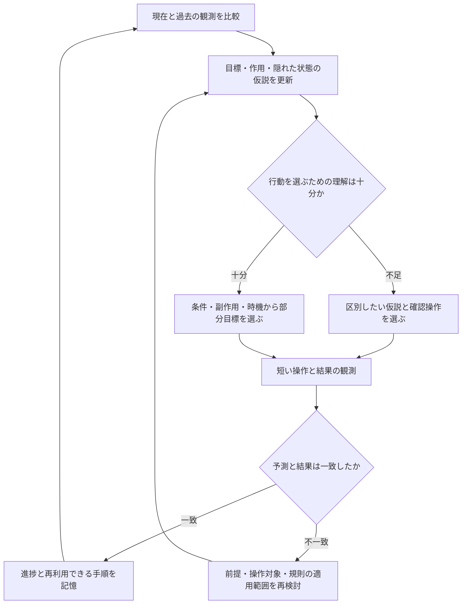

# Human VCGT: 全25環境を横断した思考パターン分析

更新日: 2026-09-24

**模倣すべき核は、変化する状況に合わせて「何が目標か・何に働きかけられるか・何が起こるか」という理解を更新し、その理解に基づいて探索と計画を切り替える能力である。** 部分目標の管理に加え、目標や操作対象の捉え方そのものを変更する能力が必要になる。

これは注釈から導いた設計仮説であり、人間の内的思考の実測結果や、実装効果の実証ではない。

## 対象、方法、根拠の強さ

- 出典: [Human VCGT](https://www.kaggle.com/datasets/magicsword001/acr-agi-3-human-vcgt)、[作成者による注釈生成方法](https://www.kaggle.com/competitions/arc-prize-2026-arc-agi-3/discussion/715611)。説明は本人の発話ではなく、動画とゲームルールに基づくLLM注釈。
- `results.csv` 全6,848,597,285 bytesを順次取得し、画像配列等の大きい列を除いて説明・メタデータを抽出した。前回の部分範囲・環境IDの形式に依存した切り出しは使用していない。
- **全件の構造確認: 25環境、340記録、1,649説明要素、説明本文9,400,827文字。** 注釈JSONの解析失敗0、環境とGUIDの組の重複0。
- **定性分析: 各環境2記録、計50記録を選択。** 見出し・導入・終端などの抜粋を確認し、関係する本文区間を詳読した。選択記録に含まれる説明は計273要素だが、全要素の全文を逐文評価したわけではない。代表例は複数段階の行動が記述された記録を中心に便宜的に選び、比較例の選び方は別紙に記載した。
- 残り23環境もすべて分析対象に含めた。「全環境」はこのCSVの収録範囲を指し、競技の未公開環境まで網羅した意味ではない。
- 動画・元フレームと逐次照合していないため、具体的行動も注釈上の記述として扱う。パターンの出現頻度、統計的有意差、成功への因果効果は測っていない。

参照資料:

- [25環境別の具体例・時刻・記録ID](human-vcgt-environment-evidence-ja.md)
- [全340記録の一覧と定性分析対象](vcgt-record-inventory.csv)
- [機械集計結果・取得条件](vcgt-analysis-metadata.json)
- [前回の2環境・6記録の分析](human-vcgt-initial-analysis-ja.md)

## 収録範囲と分析のカバレッジ

下表の `won=1` はデータ内のフラグの件数であり、人間一般の成功率ではない。収集・記録終了条件が未統制で、注釈の末尾と一致しない例もある。説明要素数はレベル数ではない。定性分析は全環境で2記録ずつ。

|環境|記録数|won=1|説明要素数|定性分析記録数|
|---|---:|---:|---:|---:|
|sk48|14|7|81|2|
|tn36|14|6|60|2|
|m0r0|11|7|53|2|
|bp35|14|2|85|2|
|cn04|12|6|47|2|
|dc22|11|4|50|2|
|tu93|13|9|95|2|
|lp85|54|15|218|2|
|ka59|10|3|37|2|
|wa30|14|5|85|2|
|vc33|10|6|54|2|
|lf52|11|4|79|2|
|r11l|10|10|60|2|
|sc25|15|10|75|2|
|sp80|12|2|34|2|
|ar25|10|5|65|2|
|sb26|12|5|67|2|
|cd82|11|8|53|2|
|re86|11|5|64|2|
|s5i5|11|4|54|2|
|ls20|13|6|58|2|
|ft09|10|4|34|2|
|su15|13|3|50|2|
|tr87|12|6|59|2|
|g50t|12|2|32|2|
|合計|340|144|1,649|50|

`lp85` は54記録、他環境は10〜15記録で、単純に文章をまとめると環境の偏りと文章量の差が結論へ混入する。今回は環境単位で比較した。異なる環境名でも似た連動機構があるため、25環境を25個の独立した証拠とは数えない。

## 前回の結論から何を広げるか

前回は、ブロック操作と地形変更から「部分目標を作り、完成部分を守り、失敗時に修復する」を中心に据えた。追加環境には、その枠組みだけでは扱えない次の違いがある。

|必要な拡張|根拠になる環境|設計への含意|
|---|---|---|
|目標対象そのものの再解釈|r11l、ls20|近づいた対象・場所が本当の達成条件かを検証する|
|答えの編集から規則の編集への切替|tr87|何が変数で何が制約かを再認識する|
|見えない対象・地図の保持|s5i5、ls20|現在画像だけで状態を決めない|
|同時作用・同期・遅れ|m0r0、g50t、vc33|独立した静的な部分目標列だけでは足りない|
|同じ作用の用途変更|su15|過去に有害だった作用を新目標の手段にできる|
|関係の抽出と手順の再利用|ft09、sb26、tn36|色・座標・入力列を超えて規則や構成を扱う|

「変化」は区別する必要がある。配置が変わる場合、未見の仕掛けが追加される場合、編集対象・モードが変わる場合、単に自分の仮説が誤っていた場合は、必要な修正が違う。今回の注釈だけで、同一状態・同一操作の遷移法則が時間とともに任意に変わることまで実証したわけではない。

## 環境を越えて転用する10の思考パターン

以下の「共通」は複数の具体例に共通する解釈を意味し、全環境・全プレイヤーに観察されたという意味ではない。

### 1. 目標を仮説として置き、未達成の理由で修正する

`r11l` では足を枠に置いてもクリアせず、胴体の位置へ着目する説明がある。`ls20` では出口に行くだけでは足りず、残った条件を探す。`m0r0` では一部の配置が終わったように見えても別の条件を探し続ける。

**転用する問い:** 「何が、どんな関係・状態になれば成功するのか。その仮説を支持・否定する結果は何か」。最初に目立つ物体や色を、そのまま確定したゴールにしない。

### 2. 不確実な点を絞り、結果を比較できる操作で調べる

`tn36` では同じ記号の反復実行で作用を調べ、`ar25`・`bp35` では入力対象と連動先を比較する。`vc33` ではバルブと水位変化の対応を探る。

**転用する問い:** 「この操作によって、どの仮説を区別できるか」。注釈内の探索がすべて統制された実験であるわけではない。実装では、試す前の予測と試した後の変化を残すことで、同じ試行の無駄な反復を減らすという提案になる。

### 3. 見た目から、作用・関係を表す状態へ抽象化する

`cn04` は接点、`ft09` は局所的な色の関係、`tr87` は記号間の対応、`r11l` は足と胴体の位置関係を扱う。色や形が同じでも、それが入力対象、結果、ヒント、障害物のどれかは異なる。

**転用する問い:** 「この環境の将来を予測するために、どの関係を保持すべきか」。汎用性は一つの固定表現に全ゲームを押し込むことではなく、予測に必要な変数を追加・変更できることにある。

### 4. 行動の前提条件と副作用から、部分目標を組み立てる

`sk48` の一時退避、`ka59` の通路確保、`lf52` の足場と残存駒の移送、`dc22` の経路構築には、後の操作を可能にする中間状態がある。`cd82` の上塗りや連動系の操作では、前の成果が後の操作で変わり得る。

**転用する問い:** 「次に必要な操作を可能にするには何を先に満たすか。何を失ってはいけないか」。維持条件は絶対ではなく、全体解のために一時的に崩してよい場合も計画する。

### 5. 複数の結果を同時に評価し、局所改善を過大評価しない

`m0r0`・`bp35`・`ar25` は一手が複数物体へ影響する。`lp85` は一つの端点の操作が他の目標への配置にも関係する。`vc33` は複数の浮きの条件を満たす必要がある。

**転用する問い:** 「この操作で良くなるものと悪くなるものは何か」。対象を独立に解けるか、同時に解く必要があるかを先に調べる。部分目標への単純な分割が常に有効とは限らない。

### 6. 観測できない状態を記憶し、不確実さも残す

`s5i5` では開始時に見える宝石の位置をその後も追う。`ls20` の後半では限られた視野を移動して地図を把握する。最新画像にない対象も、そのまま消えたとは限らない。

**転用する問い:** 「最後に何を確認し、それ以降の操作でどう変わったはずか」。直接観測、推定、未確認を分け、見えない状態を無根拠に確定しない。

### 7. 時間、実行段階、自分以外の動きを計画に入れる

`g50t` は記録された動きと現在の動きの同期、`tu93` は敵の向き・移動時機、`wa30` はNPCの運搬、`vc33` は水の変化、`sp80` は配置後に始まる流れを扱う。

**転用する問い:** 「今の変化は自分の直前の操作、過去の操作、外部の動きのどれによるか。いつ条件が成立するか」。静止して観察すること、明示的な待機、動画上の操作間隔は別物であり、環境が何を契機に進むかも確認する。

### 8. 結果の予測が外れたら、計画の粒度や問題の捉え方を変える

`sk48` は一括運搬から個別運搬へ切り替える。`tr87` は回答欄ではなく対応表が編集対象になる。`cn04` は回転だけでなく変形する部品を扱う。`re86` は位置だけでなく色・形と対応先を再検討する。

**転用する問い:** 「操作が失敗したのか、前提条件が不足したのか、そもそも違う対象・規則を想定していたのか」。失敗のたびに全知識を捨てず、反例が生じた仮説とその適用範囲を見直す。

### 9. 操作の作用と、それが有益かどうかを分ける

最も特徴的なのは `su15`。代表例の要素4–5ではUFOによる退化を避けるが、要素6の9:57–10:34では、必要な黄色の星を得るため橙の星を退化させると説明される。

**転用する問い:** 「この作用は今の目的に対して何を実現できるか」。これは作用法則の変化ではなく、目的に応じた用途変更。「敵は避ける」「物体は減らす」「完成部分は動かさない」といった固定方針より、作用と条件を保持する方が転用しやすいという示唆になる。

### 10. 再利用できる部分をまとめ、短い実行と結果確認を繰り返す

`sb26` では反復列をサブルーチンとして利用する。`tn36` は保存地点で長い経路を分割する。`sp80` は配置・実行・結果確認を分ける。`wa30` の再試行には作業順の変更がある。

**転用する問い:** 「どの部分は再利用でき、どの部分は現在の環境に合わせて組み直す必要があるか」。再利用する手順には開始条件、期待結果、中断条件を持たせる。既知のボタン列を無条件で再生することとは異なる。

## 変化する環境に適した思考の循環

この循環は今回の記述を整理した設計案であり、認知過程の実証モデルではない。目標が未確定なら目標仮説を、連動が未確定なら作用範囲を、同期が必要なら時間条件を重点的に更新する。

持続させる情報は、ゲーム固有の名詞より次の関係を中心にする。

|情報|内容と更新契機|
|---|---|
|目標仮説|達成すべき関係、未充足条件、支持・反証。未クリア時に見直す|
|作用仮説|入力、対象、成立条件、予想変化、副作用、適用する場面|
|状態の記憶|観測済みの地図・対象、最後の確認時点、推定と不確実さ|
|進行中の計画|部分目標、依存関係、同時成立条件、維持条件、撤退条件|
|試行記録|試した仮説、予測、結果、再試行する理由。失敗は条件付きで残す|
|再利用する手順|何を実現するか、開始条件、対象の置換方法、結果確認と中断条件|

長期目標は保持しつつ、未知・危険・強い連動がある場面では確認間隔を短くする。既知で安定した部分はまとめて実行できるか検討する。こうした配分の効果は今後の実験で検証する必要がある。

## 注釈をそのまま思考の正解にしないための確認

1. **同じレベル表示の異なる場面が一つの説明にまとまる。** 例: `m0r0` 比較例の要素1には0:00と7:35以降、`g50t` 比較例の要素1には0:00と21:52以降が同居する。説明要素を時系列の一区間や単一レベルとみなさない。
2. **見えない区間を後の結果から補っている。** `sc25` 代表例の要素2は、そのレベルの画面が提示フレームに見えないと明記する。ここから具体的な入力列や知識獲得過程を学習させない。
3. **勝利フラグと説明末尾の見え方が一致しない。** `wa30` 代表例は `won=1` だが要素9の末尾は未クリアで終わると記述する。映像の抽出範囲・注釈の見落とし・メタデータの意味のどれが原因か未確定であり、自動でラベルを書き換えない。
4. **目標やルールに後知恵が混ざる。** 注釈生成時にルールが与えられ、後の遷移から序盤の目的を説明する箇所もある。プレイヤーがその時点で知っていたとは限らない。
5. **説明形式の反復を、人間の思考の反復と取り違えない。** 「目標→理由→作業」は生成時の指定形式でもある。同じ言い回しの頻度から認知パターンの頻度を数えない。
6. **待機、認識、意図は観測と分ける。** 長い停止に熟考、迷い、操作外の事情など複数の説明があり得る。「気づいた」「狙った」という記述は推定として保存する。
7. **成功記録にも失敗、未勝利記録にも有用な学習がある。** `won` を各行動の最適性ラベルに使わない。未勝利を能力不足とみなさず、記録の長さや終了条件も確認する。

学習用には、`その時点までの観測 / 不確実な仮説 / 部分目標 / 予想効果 / 行動 / 実際の結果 / 更新内容 / 根拠区間` に分けることを提案する。未来の結果を入力に漏らさず、元の行動インデックスへ対応付け、検証できない意図は信頼度を下げる。説明文の流暢さより、行動と結果が対応することを重視する。

## 現在のエージェントに取り込む優先順

ここでは分析資料のみ更新し、エージェントは変更していない。ADKの具体的APIや学習方式の選定は別の実装・検証課題である。

1. **観測と行動結果を持ち越す。** 現状は `agent/adk_policy.py` で毎手セッションを作り、`agent/my_agent.py` では最新画像と直近6行動を主に渡す。仮説・地図・操作対象・クリック座標・期待と結果の差を持続させる基盤が先になる。
2. **仮説に適用範囲と反証を持たせる。** 別ゲーム、レベル、対象、操作モードに知識を無条件で拡張しない。予測が外れたとき、その範囲を再検証する。
3. **部分目標に連動・時間・中断条件を加える。** 独立に処理できる目標、同時に満たす目標、実行開始後の結果を待つ目標を区別する。
4. **検証した注釈区間から学習する。** まず25環境から上記の代表的な変化・修復区間を元フレームへ対応付ける。その後、状態理解、作用予測、目標選択、修復を分けて評価する。最初から説明全文の模倣に効果を期待しない。

これらは機能の区別であり、それぞれを別のLLMや複数エージェントに分ける必要性を示すものではない。

## 汎用性をどう評価するか

以下は今後の評価案であり、今回実施した実験ではない。

|比較・条件|確かめること|
|---|---|
|ゲームを丸ごと除外した評価|同じゲームの手順やフレームの暗記に依存していないか|
|似た機構を持つ環境群もまとめて除外|連動系などの近い課題からの転用だけで良く見えていないか|
|色・記号・配置を変えた同型課題|物体の外見ではなく作用と関係を使っているか。環境で実装可能な場合に実施|
|視野制限・遅延・操作対象変更を含む条件|記憶・予測・再認識が必要な場面で適応できるか|
|現在方式／記憶追加／仮説更新追加／条件付き計画追加|どの機能が実際に寄与するか|

同一の行動・推論予算でクリア率と行動数を測る。それに加え、予測が外れてから修正するまでの行動数、同じ条件下での無効操作の反復数、修復成功率、誤った規則の持ち越しを計測する。指標用の正解ラベルは元環境・元フレームで検証し、LLM注釈だけに依存させない。

今回支持されたのは、汎用エージェントへ必要そうな機能の候補と、それを検証するための具体例である。人間の思考を再現できたこと、未知環境で性能が上がることは、まだ確認していない。
