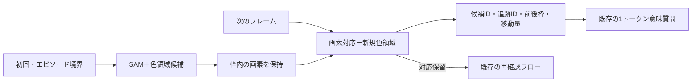

# 初回SAM＋画素更新のランタイム統合

> 現行の実装・設定・再検証の詳細資料。採用理由・成功した知見・文献・主要ログの入口は[統合資料](visual-recognition-adopted-ja.md)、次の課題は[引継ぎ](visual-recognition-handoff-ja.md)にまとめる。

2026-09-28。比較用試作を現行の`CognitiveRuntime`へ統合した。**初期候補のまとまりをSAMで補い、通常の移動は画素処理で測り、既存の1トークン意味質問へ渡す。** 初回だけSAMを使う方式の候補回収と移動測定を維持できた。ゲーム攻略の改善や全意思決定の高速化は、今回の検証対象とは別。

## 採用した動作

| 場面 | 処理 |
|---|---|
| 初回、RESET、レベル切替 | 色領域＋SAM ViT-B標準設定の上位128候補。重複する整数枠は統合 |
| 通常の新フレーム | 前の枠内の画素を上下左右8画素以内で探索。一意の完全一致だけ追跡IDを維持。新しい色領域も追加 |
| 全画素が前回と同じ | 候補・対応を保持し、色領域の再抽出も省略 |
| 色変化、複数一致、消失など | 対応を保留。古いIDを新しい領域に自動で付け直さず、再確認へ渡す |
| 観測が欠落、寸法変更、前後の観測が不連続 | 追跡状態を破棄して初期化。境界をまたぐ移動を作らない |
| SAM資材なし、CUDAなし、推論失敗 | 理由を測定ログとモデル文脈へ記録し、色領域＋画素追跡を継続。そのエピソード中に毎手再試行しない |
| 初期化時の残り予算が6秒未満 | SAMを省略し、`skipped_budget`を記録 |

SAMの重みはプロセス内で共有・遅延ロードし、GPU上に保持する。CPU前処理はPyTorch 4スレッド。入力は色格子を6倍に最近傍拡大した盤面だけで、カテゴリ・正解ラベル・行動の予測は渡さない。候補枠は画像端も含む整数画素へ外側丸めする。SAM 2の動画追跡ではない。

**毎手SAMと、自動的な「必要時SAM」の再実行は採用していない。** 色変化や途中で現れた多色物体の全体枠を、自動でSAMに取り直させる機構も未実装。今回選んだ初回方式の限界として残している。

## 移動認識・意味質問との接続



- `id`は観測内の候補参照。次の観測では失効する。`track_id`は一意の画素対応が継続した範囲で保持する。リセット時は別の追跡世代になる。
- `changes`へ、前後の候補、`delta_xy`、画素完全一致の対応根拠を渡す。測定上の移動と、操作が原因だったという解釈を分ける。
- 理解段階で受理した`candidate_refs`を追跡IDに結び付け、後続の`target_correspondence`に現在の参照・欠落したID・保留状態を記録する。対象の役割や物理的同一性を確定する情報ではない。
- 移動した候補の変更記録を既存の`questions()`へ接続し、最大4問を1トークンで回答する。対応不明・保留・質問の残りは既存の`reconcile`へ渡す。
- 元画面との一致、同形物体、色変化、無変化、リセット、二重観測、候補参照の失効を統合テストで確認した。

従来のモデル文脈は候補先頭24件までだった。SAMでは重要な候補がそれより後ろにあるため、**全候補のコンパクトな`candidate_index`**を提示する方式へ変更した。列は候補ID・包含端点の枠・色ID・生成元・追跡ID。全候補の画素配列を一括で渡さず、詳細は測定ログと変更質問に保持する。検証時も、全候補IDが索引に存在することを照合した。上位128というSAM自体の保持上限は残る。

## 実際のランタイムでの確認

前回と同じ合成6系列66フレームと、実ログ3系列23フレームを使用した。正解注釈は測定後の採点にだけ使用する。

1. 保存済みSAM出力を実際の`CognitiveRuntime._receive()`へ渡す検証で、89フレームすべての候補枠が前回の初回SAM方式と一致した。
2. 保存出力を使わず、新しいSAM実装をGPUで実行して同じ89フレームを再生した。各系列のSAM呼出しは1回、合計9回。
3. 変更記録の前後画素・移動量・ID継続を照合し、候補回収は別実装の採点器で確認した。
4. 評価用に複製した実コードからローカルSDKのls20を2操作実行し、資材パス・SAM・行動後の観測を確認した。初回SAMは1回（測定6.855秒、ロード込み）、後続2観測の測定は各約8.2msでSAMの再実行なし。これはモデルなしの接続確認で、攻略性能の測定ではない。

| 指標 | 合成 | 実ログ・部分注釈 |
|---|---:|---:|
| 対象×フレームの候補回収 | 242/264（91.7%） | 133/133（100%） |
| 正しく対応した並進移動 | 104/127 | 6/6 |
| SAM呼出し | 6回 | 3回 |
| 初回を除く観測処理の平均 | 6.63ms | 6.70ms |
| 初回を含む観測処理合計 | 27.260秒 | 11.858秒 |

実GPUはNVIDIA RTX A2000 12GB。プロセスの最初の初期化は**7.146秒**で、モデル読み込みや初回の推論準備を含む。以後の系列初期化は約**3.78〜4.15秒**。実ログ3系列の時間には、先行する合成系列で済んだ重みの初回ロード費用は含まれない。

上記は**観測フックの実測**で、観測・候補の記録とスナップショットを含み、Qwen・ゲーム操作・意味質問は含まない。1回ずつの再生であり、本番全体の応答時間や安定したp95を表すものではない。前回は部品時間の加算、今回はランタイム観測フックの直接測定なので、絶対値の差をそのまま最適化効果としない。ft09の無変化フレームで色領域の再抽出を省略できることは、テストでも確認した。

実Qwenへの接続確認では、実SAM候補の移動記録から次の3問を作った。

| 確認 | 応答 | 時間 |
|---|---|---:|
| 期待した変位と実測が一致 | `1`：支持 | 540ms |
| 期待した変位が逆方向 | `2`：反する | 394ms |
| 対象・到達条件が不明 | `8`：不明 | 393ms |

すべて実際のローカルQwen・既存`choose()`・1出力トークンで確認した。**これは接続用の3問であり、対象選択や意味判断の一般的な正答率ではない。** 完全な認知フローの呼出し・対象参照・保留への遷移は、SAMとQwenの応答を制御した結合テストでも確認している。

## 残るボトルネック

候補の保持・移動の測定・意味質問への接続は確認できたが、以下は解決していない。

- 色変化・変形・遮蔽・同形の複数物体では、画素の完全一致による追跡が切れる。合成の移動23件は検出できていない。
- SAMの枠は物理的な一物体とは限らず、背景や部品、複数対象を含む。候補回収100%でも、全対象の追跡IDが継続する意味ではない。
- 変更があった64遷移すべてで対応保留が残った。**SAM再実行は省けたが、Qwenの再確認を減らす課題は残る。** 全体候補が追えている場合の部品の曖昧さや、背景枠の変化をどう扱うかは次の改善対象。
- 意味質問は最大4問で、それ以外は保留件数として保持する。全候補を毎手Qwenで個別分類する構成ではない。
- ゲーム攻略への効果、未知ゲームでの回収率、モデルが候補索引を使う対象選択精度は未評価。

## GPUへの同時保持とロード回数

2026-09-28に追加確認。**Qwen3-VL-4B Q4_K_M（projector Q8_0、コンテキスト16,384、1スロット）とSAM ViT-B float32を同じRTX A2000 12GBへ保持し、両方の画像推論を交互に3回ずつ実行できた。** モデルを入れ替えてメモリを空ける処理はしていない。

| 測定 | 結果 |
|---|---:|
| Qwen常駐時のGPU全体使用量 | 5,735MiB（約5.60GiB） |
| SAM追加後・推論中のGPU全体使用量の観測最大 | 8,972MiB（約8.76GiB） |
| 同期間の空きメモリの観測最小 | 2,964MiB（約2.89GiB） |
| SAMのPyTorch割当ピーク／予約ピーク | 約2.71GiB／3.03GiB |
| 3つの認識エンジンに対するSAMロード回数 | **1回**：GPU上の重みアドレスも同一 |
| SAM初回／2回目／3回目の観測処理 | 6.305秒／3.766秒／4.093秒 |
| 初回中の`_load()`処理 | 2.351秒：初回import・モデル構築・重み読込み・GPU転送を含む |

Qwenは測定前後でコンテナの起動時刻・PID・起動引数が一致し、途中の画像要求も成功した。SAMの重みロードは最初だけで、約4秒の再検出時間とは区別する。GPU全体使用量は約100ms間隔のサンプリングであり、瞬間的なピークを完全に捕捉するものではない。PyTorchの割当値はSAMプロセス内の値で、QwenやCUDA全体の使用量とは異なる。

現行の起動構成ではQwenサーバーは独立プロセスで常駐し、SAMは同一プロセス内の共有プロバイダーで常駐する。ローカルにある公式`Swarm`は各ゲームを同じプロセスのスレッドで起動するため、同じ設定ならゲームごとにSAMの重みを複製しない。SAMの推論はプロバイダーのロックで直列化する。RESET・レベル切替は再検出だけで、重みを再ロードしない。一方、比較用`benchmark_local.py`はゲームごとに新規ワーカープロセスを起動するため、SAMの初回費用が各ゲームに発生する。この測定用構成と本番のスレッド構成は区別する。

**Kaggle上での同時保持は未実測。** 現在のNotebook生成設定はT4で、[公式スターター](https://github.com/arcprize/ARC-AGI-3-Kaggle-Starter#choosing-an-accelerator)にもT4×2の構成が記載されている。[NVIDIAの仕様](https://www.nvidia.com/en-us/data-center/tesla-t4/)ではT4は1枚16GB。今回の1枚12GBでの結果から、同じモデル・設定を16GBのGPUへ保持するメモリ容量は足りる見込み。ただし推論速度、CUDA／バイナリ互換性、複数ゲームの同時負荷、最大コンテキストでの余裕まで検証したものではない。2枚のメモリを自動で一つに合算する前提でもない。

2026-09-29にSAM専用Datasetの生成・接続設定と起動検証を追加した。ローカルで提出資材を生成済み。DatasetのアップロードとKaggle実機での確認は未実施。[提出手順と検証](#kaggle提出準備)を参照。

記録：[同時保持の実測結果](../outputs/model-residency-20260928/measured/summary.json)、[GPU使用量の時系列](../outputs/model-residency-20260928/measured/gpu-samples.jsonl)、[測定スクリプト](../scripts/check_model_residency.py)。SAM／Qwenの計算は交互で、同時カーネル実行の負荷試験ではない。

## 実行設定とオフライン資材

既定は`COGNITION_PROPOSALS=sam_initial`。`program`で従来の色領域測定へ戻せる。SAMが利用できない場合の画素追跡継続と、従来の`program`モードは別の処理である。

現環境では以前の測定で配置した次の資材を再利用する。

```text
outputs/sam-deps/sam_vit_b_01ec64.pth
outputs/sam-deps/segment-anything/segment_anything/
```

別環境では`COGNITION_SAM_CHECKPOINT`と`COGNITION_SAM_SOURCE`を、コンテナ内から参照できる絶対パスに設定する。`COGNITION_SAM_SOURCE`は`segment_anything`ディレクトリの親。`COGNITION_SAM_DEVICE`の既定は`cuda`。PyTorch・torchvision・NumPy・Pillow・ARCの描画パレットも使用する。実行中のダウンロードやpipインストールは行わない。

Composeへ設定を追加した。既存のコンテナは自動再作成していない。GPUなしで動いている既存のJupyterプロセスではSAMが`unavailable`になり得るため、新規GPUコンテナの`make eval-model`／`make benchmark`を使うか、必要に応じて`make lab`でCompose設定を適用する。`objects_measured.measurement.sam.status`が`ready`、2フレーム目以降の`called_this_frame`が`false`になっていることを確認できる。

評価用にソースを複製する`benchmark_local.py`では、SAM資材の絶対パスと設定をワーカーへ明示的に渡し、重み・外部SAMコードのハッシュをマニフェストへ記録する。ソース複製先を基準に資材を探して見失うことを防ぐ。

Kaggle Notebookは`agent/`コードを同梱し、SAM重み・外部ライブラリは専用のオフラインDatasetへ分離する。起動時に検証してパスを自動設定するため、ローカルの`outputs/sam-deps/`配置には依存しない。

## Kaggle提出準備

2026-09-29に追加。`make submission-ready`でNotebookと約375MBのSAM Datasetをローカル生成し、全コードセルの構文・生成物の鮮度・SAM資材のSHA-256を確認する。固定情報は[config/sam-bundle.json](../config/sam-bundle.json)。公式SAMコードとApache 2.0ライセンスを含み、重みは従来のViT-Bと同一。ソースは`sam-source.json`として格納し、Kaggleのアーカイブ展開やディレクトリ省略に依存させない。

- Qwenは`.cache/kaggle-qwen-bundle/`へ重み・projector・CUDA版`llama-server`・共有ライブラリ・ライセンス・ハッシュをまとめる。固定コミットをCUDA architecture 75（T4）向けにビルドし、ビルド元CPU固有の命令への依存を避ける。新規環境では`make model-download`と`make model-runtime`で元資材を準備する。
- 初回アップロード：`make auth` → `make qwen-upload` → `make sam-upload` → 両Datasetの処理完了後に`make push`。Datasetは非公開で作成する。アップロード自体は今回実行していない。
- エージェントだけの変更：`make push`。資材を変えた場合は先に`make sam-upload-version`または`make qwen-upload-version`。Notebookのプッシュ前には、接続先Datasetの必要ファイルと両マニフェストの一致を読み取り検査する。
- Save & Run：SAMの全ハッシュを照合し、常駐Qwenと同時にGPUへロードして画像推論を確認する。成功時に限り従来の提出用仮ファイルを生成する。失敗時は停止する。
- 本番再実行：ゲーム実行ワーカー内で同じ起動確認を行い、そのまま公式Swarmを実行する。SAMのロード済み共有プロバイダーを再利用し、Notebook親プロセスにはSAMをロードしない。初回・RESET・レベル切替での検出方針は従来どおり。
- 記録：Kaggleでは`/kaggle/working/submission-preflight.json`、ローカルでは[GPU起動確認結果](../outputs/kaggle-ready/submission-preflight.json)。起動確認には小さな合成画像を使い、SAM候補生成とQwenの画像付き1トークン応答を確認する。

ローカルのKaggleベースGPUコンテナで、生成済みDatasetからSAMを復元し、Qwenとの画像推論に成功。RTX A2000 12GBでSAM初回約6.36秒、両モデルの確認全体約6.54秒、SAMの予約メモリ3,106MiB。資材欠落・破損・古いマニフェスト・Notebookの接続設定不足・GPU確認失敗時の停止を含め、[217件のテストが成功](../outputs/kaggle-ready-tests.log)。これは提出準備と接続の検証で、Kaggleの実機時間や攻略成績ではない。

さらに、アップロード用のQwen資材（約3.19GB）とSAM資材（約375MB）を`/kaggle/input/datasets/…`へ読み取り専用マウントし、**生成Notebookの全7コードセルを`--network none`のGPUコンテナで実行した。** 新しくビルドしたQwenサーバーの起動・画像推論、SAMとの同時保持、Save & Run用`submission.parquet`の生成、サーバー終了まで成功した。Qwenの起動＋初回画像確認は約35.84秒、SAM＋Qwenの追加起動確認は約6.69秒。これらは起動時の費用で、毎手・毎ゲームの重みロードではない。

この検証は競技ディレクトリの存在をローカルで再現し、ARC依存ライブラリには開発イメージ内のものを使用した。実競技の配布物やgatewayを使う本番再実行の検証ではない。[セル実行記録](../outputs/kaggle-ready/notebook/notebook-smoke.json)・[両モデル確認結果](../outputs/kaggle-ready/notebook/submission-preflight.json)・[Notebook実行ログ](../outputs/kaggle-ready/notebook-run.log)・[再実行スクリプト](../scripts/run_notebook_smoke.py)・[ビルドログ](../outputs/kaggle-model-runtime-build.log)。

**遠隔資材の確認：** 2026-09-29のQwen Dataset読取APIはHTTP 403だったが、認証確認と自分のDataset一覧取得には成功し、設定先のQwen Datasetは一覧に存在しなかった。そのためQwen側も初回作成用の資材・コマンドを整備した。アップロード後の接続確認とKaggle実機のバイナリ／CUDA互換性、実行時間、並行ゲーム負荷は未確認。準備コマンドは[README](../README.md#offline-notebook)にまとめた。

## 9月30日マイルストーン賞の公開準備

2026-09-29確認。[Kaggle公式Overview](https://www.kaggle.com/competitions/arc-prize-2026-arc-agi-3/overview)は、マイルストーン期限までにNotebookをオープンソースライセンスで公開することを明記している。第2回は**2026-09-30 23:59 UTC＝2026-10-01 08:59 JST**。期限時点の順位による賞であり、公開しただけで受賞対象の順位が得られるわけではない。提出・実行・公開確認には余裕を持たせる。

[主催者の2026年共通規則](https://arcprize.org/competitions/2026)は、提出者自身が作ったコード・手法についてCC0やMIT-0などを例示し、第三者コード・手法は公開共有を許すオープンソースライセンスであることを求めている。自作部分のライセンスと、Qwen・SAM・ADK等の第三者ライセンスを区別する。KaggleのRulesタブ全文は今回の取得方法では読めなかったため、これは公式Overviewと主催者共通規則に基づく準備案で、全条項の適合確認ではない。

現状と必要な変更：

| 対象 | 現状 | 公開前に行うこと |
| --- | --- | --- |
| リポジトリの自作部分 | ルートの`LICENSE`なし | CC0またはMIT-0等を選び、全文を`LICENSE`に追加。READMEで適用範囲と第三者資材の除外を明示 |
| 生成Notebook | 冒頭は生成元説明のみ | `scripts/build_notebook.py`でライセンス・第三者帰属表示を生成Notebookへ含める。GitHub上のLICENSEだけに依存しない |
| Kaggleでの公開範囲 | `notebooks/kernel-metadata.json`は`is_private: true` | 公開する段階で`false`に変更し、Kaggle側の公開状態と選択ライセンスを確認。公開範囲の指定だけではライセンス設定の代わりにならない |
| Qwen・SAMの資材 | 作成コマンドはPrivateが既定 | 他の参加者が再実行できるよう、配布条件を保持して資材を公開するか、同じ資材を再構築する公開手順を用意する |
| 提出版の対応 | `make push`はNotebookのアップロード | 公開版と大会への提出版を対応させ、Kaggle上で提出成功・スコア・公開状態・ライセンスを確認する |

Kaggleでは公開NotebookとPrivate Datasetを組み合わせること自体は可能だが、他の利用者はそのPrivate Datasetにアクセスできない。[Kaggle公式Dataset説明](https://www.kaggle.com/docs/datasets)。したがって、資材の公開は再現性のための推奨であり、「全DatasetをPublicにする」という一律の大会条項を確認したものではない。前節のPrivate作成手順は開発用で、賞への応募準備ではこの公開経路も整える。

確認した規定はKaggle Notebookの公開を明記しており、GitHubリポジトリの公開だけで代用できるとは扱わない。GitHubの公開も再現性のために推奨するが、リポジトリ全体の公開が独立した必須条件だと断定する根拠は今回確認していない。

この追記ではライセンス付与・公開設定の変更・アップロードは実行していない。[MIT-0の公式ライセンス識別情報](https://spdx.org/licenses/MIT-0.html)を含め、ライセンス選択後に自作部分へ適用する。

## 保存資料と再検証

- 実装：[初回SAM](../agent/cognition/sam_proposals.py)、[画素追跡](../agent/cognition/proposal_tracking.py)、[測定スキーマへの接続](../agent/cognition/hybrid_perception.py)、[既存の意味質問](../agent/cognition/perception.py)
- [再生検証スクリプト](history/runtime/retired-implementation-ja.md)、[結合テスト](../tests/test_hybrid_perception.py)
- [保存SAMによる一致検証](../outputs/hybrid-runtime-20260928/recorded/summary.json)、[実GPUによる再生結果](../outputs/hybrid-runtime-20260928/live/summary.json)、[全測定ログ](../outputs/hybrid-runtime-20260928/live/measurements.jsonl)
- [実Qwenの要求・応答](../outputs/hybrid-runtime-20260928/qwen-smoke.json)、[全206テストのログ](../outputs/hybrid-runtime-20260928/tests-final.log)
- [実SDK・複製コードによる2操作確認](../outputs/hybrid-runtime-20260928/gateway-smoke/report.md)、[設定・資材ハッシュ](../outputs/hybrid-runtime-20260928/gateway-smoke/manifest.json)

全テストは206件成功。既存の描画テストで指定されるDejaVuSansが開発イメージにないため、テスト用コンテナへホストのフォントディレクトリを読み取り専用で渡して実行した。色変化を形状一致で結び付ける既存テストは従来`program`モードの検証として残し、新方式で再確認へ戻すテストを追加した。

再生は既存の出力先を上書きしない。新しいパスで実行する。

```bash
python scripts/verify_hybrid_runtime.py --sam recorded --out outputs/hybrid-check-recorded
python scripts/verify_hybrid_runtime.py --sam live --out outputs/hybrid-check-live
python scripts/verify_hybrid_runtime.py \
  --qwen-input outputs/hybrid-check-live/measurements.jsonl \
  --out outputs/hybrid-check-qwen.json
```
