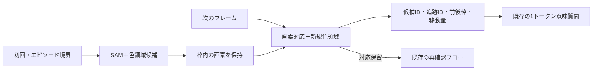

# 初回SAM＋画素更新のランタイム統合

> 現行の実装・設定・再検証の詳細資料。採用理由・成功した知見・文献・主要ログの入口は[統合資料](visual-recognition-adopted-ja.md)、次の課題は[引継ぎ](visual-recognition-handoff-ja.md)にまとめる。

2026-09-28。比較用試作を現行の`CognitiveRuntime`へ統合した。**初期候補のまとまりをSAMで補い、通常の移動は画素処理で測り、既存の1トークン意味質問へ渡す。** 初回だけSAMを使う方式の候補回収と移動測定を維持できた。ゲーム攻略の改善や全意思決定の高速化は、今回の検証対象とは別。

## 採用した動作

| 場面 | 処理 |
|---|---|
| 初回、RESET、レベル切替 | 色領域＋SAM ViT-B標準設定の上位128候補。重複する整数枠は統合 |
| 通常の新フレーム | 前の枠内の画素を上下左右8画素以内で探索。一意の完全一致だけ追跡IDを維持。新しい色領域も追加 |
| 全画素が前回と同じ | 候補・対応を保持し、色領域の再抽出も省略 |
| 色変化、複数一致、消失など | 対応を保留。古いIDを新しい領域に自動で付け直さず、再確認へ渡す |
| 観測が欠落、寸法変更、前後の観測が不連続 | 追跡状態を破棄して初期化。境界をまたぐ移動を作らない |
| SAM資材なし、CUDAなし、推論失敗 | 理由を測定ログとモデル文脈へ記録し、色領域＋画素追跡を継続。そのエピソード中に毎手再試行しない |
| 初期化時の残り予算が6秒未満 | SAMを省略し、`skipped_budget`を記録 |

SAMの重みはプロセス内で共有・遅延ロードし、GPU上に保持する。CPU前処理はPyTorch 4スレッド。入力は色格子を6倍に最近傍拡大した盤面だけで、カテゴリ・正解ラベル・行動の予測は渡さない。候補枠は画像端も含む整数画素へ外側丸めする。SAM 2の動画追跡ではない。

**毎手SAMと、自動的な「必要時SAM」の再実行は採用していない。** 色変化や途中で現れた多色物体の全体枠を、自動でSAMに取り直させる機構も未実装。今回選んだ初回方式の限界として残している。

## 移動認識・意味質問との接続



- `id`は観測内の候補参照。次の観測では失効する。`track_id`は一意の画素対応が継続した範囲で保持する。リセット時は別の追跡世代になる。
- `changes`へ、前後の候補、`delta_xy`、画素完全一致の対応根拠を渡す。測定上の移動と、操作が原因だったという解釈を分ける。
- 理解段階で受理した`candidate_refs`を追跡IDに結び付け、後続の`target_correspondence`に現在の参照・欠落したID・保留状態を記録する。対象の役割や物理的同一性を確定する情報ではない。
- 移動した候補の変更記録を既存の`questions()`へ接続し、最大4問を1トークンで回答する。対応不明・保留・質問の残りは既存の`reconcile`へ渡す。
- 元画面との一致、同形物体、色変化、無変化、リセット、二重観測、候補参照の失効を統合テストで確認した。

従来のモデル文脈は候補先頭24件までだった。SAMでは重要な候補がそれより後ろにあるため、**全候補のコンパクトな`candidate_index`**を提示する方式へ変更した。列は候補ID・包含端点の枠・色ID・生成元・追跡ID。全候補の画素配列を一括で渡さず、詳細は測定ログと変更質問に保持する。検証時も、全候補IDが索引に存在することを照合した。上位128というSAM自体の保持上限は残る。

## 実際のランタイムでの確認

前回と同じ合成6系列66フレームと、実ログ3系列23フレームを使用した。正解注釈は測定後の採点にだけ使用する。

1. 保存済みSAM出力を実際の`CognitiveRuntime._receive()`へ渡す検証で、89フレームすべての候補枠が前回の初回SAM方式と一致した。
2. 保存出力を使わず、新しいSAM実装をGPUで実行して同じ89フレームを再生した。各系列のSAM呼出しは1回、合計9回。
3. 変更記録の前後画素・移動量・ID継続を照合し、候補回収は別実装の採点器で確認した。
4. 評価用に複製した実コードからローカルSDKのls20を2操作実行し、資材パス・SAM・行動後の観測を確認した。初回SAMは1回（測定6.855秒、ロード込み）、後続2観測の測定は各約8.2msでSAMの再実行なし。これはモデルなしの接続確認で、攻略性能の測定ではない。

| 指標 | 合成 | 実ログ・部分注釈 |
|---|---:|---:|
| 対象×フレームの候補回収 | 242/264（91.7%） | 133/133（100%） |
| 正しく対応した並進移動 | 104/127 | 6/6 |
| SAM呼出し | 6回 | 3回 |
| 初回を除く観測処理の平均 | 6.63ms | 6.70ms |
| 初回を含む観測処理合計 | 27.260秒 | 11.858秒 |

実GPUはNVIDIA RTX A2000 12GB。プロセスの最初の初期化は**7.146秒**で、モデル読み込みや初回の推論準備を含む。以後の系列初期化は約**3.78〜4.15秒**。実ログ3系列の時間には、先行する合成系列で済んだ重みの初回ロード費用は含まれない。

上記は**観測フックの実測**で、観測・候補の記録とスナップショットを含み、Qwen・ゲーム操作・意味質問は含まない。1回ずつの再生であり、本番全体の応答時間や安定したp95を表すものではない。前回は部品時間の加算、今回はランタイム観測フックの直接測定なので、絶対値の差をそのまま最適化効果としない。ft09の無変化フレームで色領域の再抽出を省略できることは、テストでも確認した。

実Qwenへの接続確認では、実SAM候補の移動記録から次の3問を作った。

| 確認 | 応答 | 時間 |
|---|---|---:|
| 期待した変位と実測が一致 | `1`：支持 | 540ms |
| 期待した変位が逆方向 | `2`：反する | 394ms |
| 対象・到達条件が不明 | `8`：不明 | 393ms |

すべて実際のローカルQwen・既存`choose()`・1出力トークンで確認した。**これは接続用の3問であり、対象選択や意味判断の一般的な正答率ではない。** 完全な認知フローの呼出し・対象参照・保留への遷移は、SAMとQwenの応答を制御した結合テストでも確認している。

## 残るボトルネック

候補の保持・移動の測定・意味質問への接続は確認できたが、以下は解決していない。

- 色変化・変形・遮蔽・同形の複数物体では、画素の完全一致による追跡が切れる。合成の移動23件は検出できていない。
- SAMの枠は物理的な一物体とは限らず、背景や部品、複数対象を含む。候補回収100%でも、全対象の追跡IDが継続する意味ではない。
- 変更があった64遷移すべてで対応保留が残った。**SAM再実行は省けたが、Qwenの再確認を減らす課題は残る。** 全体候補が追えている場合の部品の曖昧さや、背景枠の変化をどう扱うかは次の改善対象。
- 意味質問は最大4問で、それ以外は保留件数として保持する。全候補を毎手Qwenで個別分類する構成ではない。
- ゲーム攻略への効果、未知ゲームでの回収率、モデルが候補索引を使う対象選択精度は未評価。

## 実行設定とオフライン資材

既定は`COGNITION_PROPOSALS=sam_initial`。`program`で従来の色領域測定へ戻せる。SAMが利用できない場合の画素追跡継続と、従来の`program`モードは別の処理である。

現環境では以前の測定で配置した次の資材を再利用する。

```text
outputs/sam-deps/sam_vit_b_01ec64.pth
outputs/sam-deps/segment-anything/segment_anything/
```

別環境では`COGNITION_SAM_CHECKPOINT`と`COGNITION_SAM_SOURCE`を、コンテナ内から参照できる絶対パスに設定する。`COGNITION_SAM_SOURCE`は`segment_anything`ディレクトリの親。`COGNITION_SAM_DEVICE`の既定は`cuda`。PyTorch・torchvision・NumPy・Pillow・ARCの描画パレットも使用する。実行中のダウンロードやpipインストールは行わない。

Composeへ設定を追加した。既存のコンテナは自動再作成していない。GPUなしで動いている既存のJupyterプロセスではSAMが`unavailable`になり得るため、新規GPUコンテナの`make eval-model`／`make benchmark`を使うか、必要に応じて`make lab`でCompose設定を適用する。`objects_measured.measurement.sam.status`が`ready`、2フレーム目以降の`called_this_frame`が`false`になっていることを確認できる。

評価用にソースを複製する`benchmark_local.py`では、SAM資材の絶対パスと設定をワーカーへ明示的に渡し、重み・外部SAMコードのハッシュをマニフェストへ記録する。ソース複製先を基準に資材を探して見失うことを防ぐ。

Kaggle Notebookのパッケージャーは新しい`agent/`コードを含むが、**SAM重み・外部SAMライブラリは自動同梱しない**。Kaggleで利用する際はオフライン資材をデータセット等に配置して上記パスを指定する必要がある。今回、アップロード・提出は行っていない。

## 保存資料と再検証

- 実装：[初回SAM](../agent/cognition/sam_proposals.py)、[画素追跡](../agent/cognition/proposal_tracking.py)、[測定スキーマへの接続](../agent/cognition/hybrid_perception.py)、[既存の意味質問](../agent/cognition/perception.py)
- [再生検証スクリプト](../scripts/verify_hybrid_runtime.py)、[結合テスト](../tests/test_hybrid_perception.py)
- [保存SAMによる一致検証](../outputs/hybrid-runtime-20260928/recorded/summary.json)、[実GPUによる再生結果](../outputs/hybrid-runtime-20260928/live/summary.json)、[全測定ログ](../outputs/hybrid-runtime-20260928/live/measurements.jsonl)
- [実Qwenの要求・応答](../outputs/hybrid-runtime-20260928/qwen-smoke.json)、[全206テストのログ](../outputs/hybrid-runtime-20260928/tests-final.log)
- [実SDK・複製コードによる2操作確認](../outputs/hybrid-runtime-20260928/gateway-smoke/report.md)、[設定・資材ハッシュ](../outputs/hybrid-runtime-20260928/gateway-smoke/manifest.json)

全テストは206件成功。既存の描画テストで指定されるDejaVuSansが開発イメージにないため、テスト用コンテナへホストのフォントディレクトリを読み取り専用で渡して実行した。色変化を形状一致で結び付ける既存テストは従来`program`モードの検証として残し、新方式で再確認へ戻すテストを追加した。

再生は既存の出力先を上書きしない。新しいパスで実行する。

```bash
python scripts/verify_hybrid_runtime.py --sam recorded --out outputs/hybrid-check-recorded
python scripts/verify_hybrid_runtime.py --sam live --out outputs/hybrid-check-live
python scripts/verify_hybrid_runtime.py \
  --qwen-input outputs/hybrid-check-live/measurements.jsonl \
  --out outputs/hybrid-check-qwen.json
```
