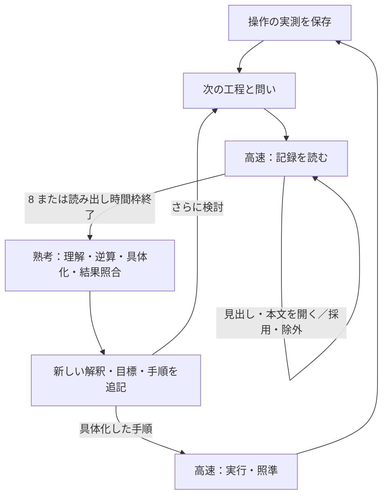

# 問いに合わせた記憶の読み出し

2026-09-27。実測と解釈を追記で保存し、次の熟考に必要な記録を1トークンの選択で集める。
旧来の単一因果メモの上書き、概念カタログの自動投入、直近の手順の一括投入を削除した。
永続記憶はschema_version 12。旧形式の変換は行わない。

## 実行の流れ

熟考の各工程の直前にread_memoryを挟む。初回など、必須入力以外に保存記録がなければ
読み出しモデルを呼ばない。追加記録が必要かどうかも高速側が判断し、8で即終了できる。
出力形式の修正呼び出しでは同じ選択済み記録を使い、読み出しをやり直さない。

理解・逆算・結果照合が作った問いを次の工程へ引き継ぐ。groundから戻る場合は
next_questionを優先し、省略されれば提出された計画のquestion、次いでreasonを引き継ぐ。
計画と復帰指定が同時に出ても復帰先を尊重し、その計画は実行しない。
問いの具体性や仮説の正しさをホストが判定して操作を拒否する仕組みは追加していない。

## 何を保存するか

|記録|作成元|内容|
|---|---|---|
|outcome|ホスト|操作、受付、観測ID、画面差分、対応する実行情報|
|scene / hypothesis|understand|対象群・関係の解釈と因果仮説|
|review|reconcile|実測に対する解釈、支持・反証・未確認、次の問い|
|goals|backchain|目標の前提関係、選んだ小目標、その理由|
|question|understand / ground|未解決の問い|
|procedure|ground|意味による対象指定、操作、継続・完了・再考条件|

各記録には作成工程、観測ID、エピソード番号、参照できた記録IDを付ける。
IDは記録の追跡用であり、ゲーム内物体の固定IDや座標への対応付けではない。
ホストは測定値を保存し、モデルにはそれを書き換えるAPIを渡さない。新しい解釈は別記録になる。
たとえば「クリックして無変化」という実測と「この対象は非操作物かもしれない」という照合を残したまま、
understandが以前の仮説を再提出しても、先の実測・照合は消えない。

参照リンクは「その記録を入力として利用できた」という来歴であり、主張を証明したという意味ではない。
outcomeに付随するexpected_effectなども、元の計画の予測として区別する必要がある。
レベル／RESET境界では進行状態を解除し、過去の記録は別エピソードの資料として保持する。

## 1トークンの読み出し

ホストは保存済み記録を「操作と結果」「対象・関係・目標・仮説」「問い」「手順」に分類し、
見出しとページを組み立てる。4件以下なら最初から記録の一覧を提示する。
モデルは自由文を生成せず、提示された数字だけを返す。

|数字|動作|
|---|---|
|1〜4|分類または記録を開く|
|5|前の一覧へ戻る|
|6|次のページへ進む。末尾では先頭へ戻る|
|7|開いている記録を採用／除外。一覧では採用済み記録を開く|
|8|採用した記録を次の熟考へ渡す|

存在する動作だけを選択肢に出す。本文を開いてから採用でき、複数件を集めて除外し直せる。
採用済み記録は通常の候補一覧から外し、専用の一覧で再閲覧・除外する。
見出しを見ただけの記録は次の熟考には渡さない。読み出しでは画像を送らず、問い・直近結果・
直近照合と文章の記録を使う。熟考とゲーム実行では従来どおり現在画像を使う。

既存手順のreuse候補も採用済み記録から作る。実行キャッシュから消えた手順を選んだ場合は
保存時の内容を復元する。同名手順を複数採用した場合は最後に採用した版を候補にする。
古い手順の有効性は熟考で再評価する。

## 入力と時間の枠

次の問い、直近の操作結果、直近の結果照合、現在の目標は必須入力。
逆算・具体化には今回のunderstandも渡す。照合には実行中の手順と今回の試行を渡す。
読み出しで選ばれなかったために直近の失敗が消えることはない。

追加記録の採用は最大4件、記録JSONの合計9000文字以内。これは保存件数の上限ではない。
読み出し1工程は最大4秒、かつその時点の判断残時間の1/5を使える。
max_tokens=1と数字の文法は既存の高速選択と共通。
読み出しが時間切れ・不正応答になっても採用済み記録は残り、熟考へ進む。
ゲーム全体または一観測の判断期限が尽きた場合は従来の期限処理に従う。

高速側は資料の選択を担当し、因果関係を新しく要約するのは熟考側。
一つのトークンで自由文を生成したり、誤った仮説を自動的に訂正したりするものではない。
入力の事前処理にも時間がかかるため、1トークンなら常に高速だとは仮定しない。

## 記録と検証

model.jsonlのwork=read_memoryに、提示した問い・見出し・本文・選択・実行時間を記録する。
artifacts.jsonlにはmemory_written（全文）、memory_navigation（閲覧経路）、
memory_prepared（採用した本文と呼び出し数・時間）を保存する。
リプレイの「計画・スキルを読む」で次の問い、読み出し状態、採用した記録を確認できる。
ベンチマークには読み出し工程数・時間・採用延べ件数・時間枠終了回数を追加した。

回帰テストでは過去の実測・照合の保存、階層とページ移動、採用・除外、入力サイズ、
期限切れ・不正応答時の部分結果、古い手順の復元、実ADKを通じた試行後の読み出しを確認する。
選択された記録が有益か、同じ計画への固執が減るかは、実モデルのログで別途評価する。

## 実モデルでの短時間確認

[20260926T171046930269Z](../outputs/evaluations/20260926T171046930269Z/report.md)は
各3操作まで・全体60秒・一観測45秒の確認。この全体評価は採用済み一覧を分離する修正前のもの。
最終コードでは回帰テスト74件、提出Notebookの生成、状態図の生成が成功した。

|ゲーム|実行操作数|読み出し1呼び出しの中央値|読み出し合計|採用延べ件数|
|---|---:|---:|---:|---:|
|ls20|1|0.324秒|13.985秒|4|
|vc33|0|0.230秒|10.471秒|5|
|ft09|0|0.214秒|11.632秒|3|

階層を開き、本文を読んで採用し、次の熟考へ渡す経路は実モデルでも動作した。
ls20では操作後の結果照合と、その次の読み出しも実行された。
一方、13回の読み出し工程すべてが8による終了を選ばず、時間枠で終了した。
同じ記録の再閲覧があり、読み出しだけでゲームごとに約10〜14秒を費やした。
熟考での曖昧な問いや同じ計画への復帰も残り、到達レベルは全て0。
停止理由はls20が全体期限、vc33とft09が一観測の判断期限だった。

この結果は、1トークンで複数回読み出せることの確認であり、攻略能力や総所要時間の改善を示さない。
残る評価課題は、採用した資料で問いに答えられると判断して読み出しを終了できるか、
その資料から新しい仮説・具体的な試行へ進めるかである。

このログを受けて採用済み記録を通常一覧から外し、記録の採用と除外を同じ一覧で反復しにくくした。
その後、3ゲームの最初の読み出しに相当する問いと記録を使って読み出し部分を実モデルで再確認した。
結果はそれぞれ16・18・21呼び出し、終了時の採用件数は2・4・0件で、全て4秒の時間枠終了だった。
通常一覧からの分離だけでは、採用済み一覧への再訪や終了判断の問題は解消していない。
この部分検証の入力・応答はoutputs/memory-reader-checkに保存した。
最終修正後の全体ゲーム評価は行っておらず、上表をその成績として扱わない。
