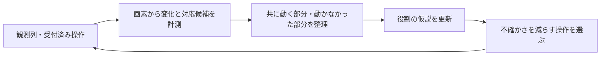

# 動きと能動的知覚を使う画面認識：文献と改善案

> 調査履歴：この資料は個別実験時点の記録です。現在の採用方針・主要な検証結果・参考文献は[統合資料](visual-recognition-adopted-ja.md)を参照してください。本文中の提案は、そのまま現行方針を表すものではありません。

2026-09-27。文献調査と設計案。
後続の[対応候補 × 過去の役割説明の比較](motion-perception-comparison-20260927-ja.md)で、
前処理と2×2比較を実施した。連続観測・能動的知覚・学習を伴う改善は未評価。
[直前の4条件比較](visual-recognition-comparison-20260927-ja.md)を受けた検討。

## 結論

次に優先するのは、**画素の変化から部品の対応・まとまりを取り出し、その後に役割を推定する構成**。
人間の視覚研究は、動きが注意を引くことに加え、物体の境界や同一性を捉える手掛かりになることを示す。
ただし、人間・動物での効果が、画像を並べるだけでQwenに生じるとはいえない。
視覚の処理原理を、測定可能な前処理と比較課題へ落とす。

## 文献で確認したこと

### 1. 共通して動く部分から、物体のまとまりを捉える

Kellman & Spelke (1983), *Perception of Partly Occluded Objects in Infancy*。
4か月児の注視を用いた実験で、中央を隠された棒の両端が一緒に動く条件では、
背後で連続した物体として捉えていることを示す反応が得られた。
静止した色・形の整合性だけでは同じ結果が得られなかった。
背景や遮蔽物に対する相対的な動きも重要だった。
「共通運動」は物体をまとめる手掛かりであり、常に同一物体を保証する規則ではない。
[著者研究室の原論文](https://kellmanlab.psych.ucla.edu/files/kellman_spelke_1983.pdf)

今回への設計仮説：色が違っても、近接し、位置関係を保って同じだけ移動する部分は、
一つの複合部品の候補として扱う。ls20の橙・青を別々に意味づける前に、共に移動したかを確かめる。

### 2. 動きの組合せから、静止した点だけでは曖昧な形を捉える

Johansson (1973), *Visual perception of biological motion and a model for its analysis*。
身体の主要な関節を表す10〜12点の動きから、人の歩行などが知覚されることを報告した。
動きに形状・構造を伝える情報があることの例。ただし生物運動を対象とする研究であり、
任意の抽象パズルの役割認識が向上するという実証ではない。
[出版社掲載の原論文要旨](https://link.springer.com/article/10.3758/BF03212378)

今回への設計仮説：各画像を別々に説明させるだけでなく、時点をまたぐ位置関係と変化の順序を入力の中心にする。

### 3. 周囲と異なる動きを検出する

Ölveczky, Baccus & Meister (2003), *Segregation of object and background motion in the retina*。
網膜神経節細胞の一部が、中心領域と周囲が異なる軌跡で動く場合に反応し、
画像全体の共通運動では抑制されることを示した。
これは局所的な動きを背景全体の動きから区別する神経回路上の証拠であり、物体の意味理解そのものではない。
[Natureの原論文要旨](https://www.nature.com/articles/nature01652)

今回への設計仮説：変化を一つの件数に潰さず、局所的な移動・色変化・端の伸縮・広域変化に分けて提示する。
画面スクロールがあれば背景の移動との相対関係も検討する。
予算表示は攻略上重要なので、周辺や小さい変化という理由で消さない。

### 4. 時間をまたいで同じ対象の状態を保持する

Kahneman, Treisman & Gibbs (1992), *The reviewing of object files: Object-specific integration of information*。
位置や動く枠の連続性で同じ対象に結びついた文字の命名が促進される実験から、
対象の連続する状態を統合する一時的表象「object file」を提案した。
実験は一般的なゲームの物体追跡精度を測ったものではない。
[出版社の原論文要旨](https://www.sciencedirect.com/science/article/pii/001002859290007O)

今回への設計仮説：以前の「Player」という名称ではなく、実際の形・色・位置関係の対応を保持し、役割は更新できるようにする。
固定のクリック座標や恒久的な物体IDへ戻す必要はない。観測間の対応候補に参照観測と不確かさを付ける。

### 5. 見分けるために観測方法や行動を選ぶ

Bajcsy (1988), *Active Perception*。
知覚を受動的な画像分析に限定せず、情報を得るために観測の取り方を制御する枠組みを提示した。
人間の行動実験ではなく、機械知覚・ロボティクスの理論と実装例である。
[原論文PDF](https://people.eecs.berkeley.edu/~yang/courses/cs294-6/papers/Bajcsy.active%20Perception.pdf)

今回への設計仮説：操作対象の候補が分かれたら、どの候補が反応するかを区別できる合法操作を選ぶ。
画面の切り出しは既存情報の再提示、ゲーム操作は新しい証拠の取得として区別する。
1回のUPで動いたことから「UP後に位置が変わった候補」は言えても、常に制御できるプレイヤーだとは確定しない。

## 機械学習との接続

心理学からの類推に加えて、動きを利用する物体学習の実装研究もある。

- Tangemann et al. (CLeaR 2023), [Unsupervised Object Learning via Common Fate](https://proceedings.mlr.press/v213/tangemann23a.html)：
  動きから得る領域を用いて、物体と背景の生成モデルを学習する。静止物体の分解は制約として挙げられている。
- Chen et al. (2022), [Unsupervised Segmentation in Real-World Images via Spelke Object Inference](https://arxiv.org/abs/2205.08515)：
  動きを学習信号にして静止画の領域分割を学ぶ。ロボットの腕と運ばれる物のような、
  別物体の相関した動きを分ける仕組みも扱う。

これらは追加の学習を伴う。今回の前処理案で同じ結果が得られるとは主張しない。
長期的には、確認できた時間的対応を教師信号にして初見の物体把握を改善する方向がある。

## 今回の失敗との関係

対象ログのls20は、初期観測・UP後の観測とも保存フレーム数が1。
入力は操作前後の静止画2枚で、操作中の連続した運動を見せた試験ではない。
`observation.py`も通常入力には最後のフレームを描画する。
したがって、前回の失敗は動きに基づく認識全般の否定にはならない。

ただし、単純にGIF化すれば改善するともいえない。
現在の要求は画像入力で、動画の時間処理を比較していない。2枚の間を補間しても実際の観測は増えない。
今回の2枚からは変位の候補を計算できるが、途中の経路・瞬間速度・遮蔽過程は分からない。

## 最初に試す具体案

最初はC/Gを汎用の軽い画像処理で補助し、Rを現在のVLMに任せる案を推す。
追加LLM工程を常設せず、同じ要求へ短い計測記録を渡す。

1. 色IDの前後差分と、形・色を保つ平行移動の対応候補を計算する。
   単色の連結領域だけを物体とせず、多色の近接部品の共通変位も候補にする。
   複数の候補が同程度に一致する場合は確定せず、曖昧さを記録する。
2. 共通変位、局所的な増減、色だけの変化を分ける。全体図を残した上で、
   変化領域と以前注目した不変領域を、前後で同じ範囲・縮尺にして並べる。
   各対象を別々に中央へ寄せる切り出しは、移動を見えなくするため使わない。
3. ホストの短い記録は、例えば「橙・青の近接領域：同じ変位候補」「白い十字の領域：差分0」までにする。
   Player、Exit、Healthといった役割は埋め込まない。形の一致は物体同一性の仮説であり、測定と区別する。
4. VLMは記録と原画像を用いて、以前の役割仮説の支持・反証・未確定を更新する。
   観測対応の記録を、同じモデルが自由文で上書きする構造にはしない。

ls20で狙うのは、橙青部品の上向き5画素の変位、白い十字の不変、下端帯の2画素の減少を分離すること。
この結果は対象ログの診断に使い、ゲーム固有の正解として処理へ埋め込まない。
動かなかった対象にも出口・参照図形などの役割があり得るため、注意を全て動く部分へ限定しない。

## 比較と採否

まず問いを「どの部分が、どう変化したか」に固定し、次の2×2を比較する。

|入力|以前の役割説明なし|以前の役割説明あり|
|---|---|---|
|前後画像＋現行の画素差分|A|B|
|同じ情報＋幾何学的な対応候補|C|D|

局所拡大は別の追加比較にして、対応情報の効果と混ぜない。
これで低水準の対応付け不足と、過去の誤った意味づけへの依存を分ける。
候補を計算したホスト自体も、移動・色変化・同色別物・複数物体の共通移動・分裂・遮蔽・広域移動を使って評価する。

主要指標は対象対応の正誤、変位、変化/不変の取り違え、役割の誤認訂正。
単なる名称数や詳しさでは判定しない。ホスト前処理を含む総時間・画像数・トークン数も揃えて記録する。
一部は操作名を伏せ、UPという語だけから移動を想像していないかを調べる。
同じフレームの前後比較では不変と答えるかも確認する。

その後、実際の連続した観測を2〜4時点取り、共通変位が持続するかを検証する。
観測順序しか分からない場合は速度を主張しない。架空の中間フレームは作らない。
使える実フレームが十分にあり、入力経路も確認できた段階で、動画対応モデルと静止画列の比較を検討する。
採用判断には未見ゲームと独立した画像照合を加える。
