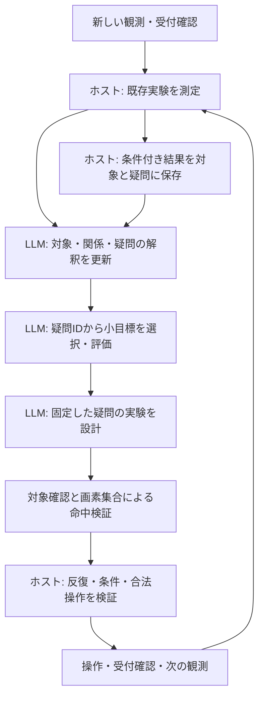

# 対象・関係・未解決の疑問を保持する世界記憶

設計・実装日: 2026-09-26。論文用の主張と再現実験を分けるための設計記録。

本変更の仮説は、**小目標の文章を毎回生成するだけでなく、画素に基づく対象候補と対象間の関係、未解決の疑問、条件付きの試行結果を保持すると、同じ問いへの固執を減らせる**というものである。成功率の改善を実証したという意味ではない。

前段の設計は [判断を限定したタスク](focused-task-refactor-design-ja.md)、人間プレイ注釈からの仮説は [Human VCGT分析](human-vcgt-analysis-ja.md) を参照。VCGTの説明は動画とルールに基づくLLM注釈で、人間の思考を直接測ったものではない。本変更もその分析を効果の実証として扱わない。

## 1. 変更に至った観測

対象: `outputs/evaluations/20260926T010513973678Z/vc33-5430563c`。
run ID: `07671a5931c8433f8e7199eb0ec06a28`。

この実行は実操作1回、モデル呼出し15回、到達レベル0で、`recovery_budget_exhausted`により停止した。

1. モデルは中央の黒い横長領域を調べる目標を作った。
2. `(24,32)`をクリックし、宣言した領域の画素変化が0だった。
3. ホストは測定条件を`unsupported`と判定した。LLMが非インタラクティブ性を実証したわけではない。
4. 目標評価は`replace`を返したが、目標選択は同じ目標文と完了条件を3回再提出した。
5. 同じ実験はホストが実行前に差し戻した。追加クリックによる無駄は防いだが、思考ループからの脱出はできなかった。

`*.requests.jsonl`の小目標選択入力には、旧目標、置換理由、操作、測定値、`unsupported`が含まれていた。「ノートを参照しなかったため負例が共有されなかった」という説明だけでは、この事例を説明できない。

さらに元フレームの色ID配列では、`x=24`で黒い画素は`y=28..31`にあり、`(24,32)`は灰色だった。前後で変化した画素は`(63,0)`の1セルだけだった。したがって「黒いバーはクリックしても反応しない」という普遍的な負例は、この記録から導けない。対象確認担当と実験設計担当が同じ誤座標を追認する問題もあった。

これらは単一実行の観測である。原因の寄与率、コンテキスト長による影響、モデル容量による限界は測定していない。

## 2. 採用した表現

### 観測と解釈を分離する

- **領域候補**: 色ID配列の4近傍・同色連結成分。ホストが画素集合、矩形、面積、色IDを計算する。背景やHUDも除外しない。
- **対象の仮説**: LLMが一つ以上の領域候補をまとめ、記述と複数の役割候補を付ける。操作対象や装飾であると確定しない。
- **関係の仮説**: 二つの対象の関係を記録する。接して見えることと、因果的につながることを区別する。
- **疑問**: 操作対象候補、操作種別、前提条件を表す対象、効果を観測する対象候補、調べる属性、問い、二つ以上の回答候補を持つ。盤面全体に関する問いは`scene`で表す。
- **条件付きの試行結果**: 操作、前提条件、事前期待、測定範囲、実測、受付確認に基づく判定、元の対象、証拠IDを保存する。

予測範囲の実測と画面全体の変化画素数・変化座標の標本を別に保持する。「クリックした対象自身は変わらなかった」と「画面のどこにも変化がなかった」を混同しない。座標標本は既存の観測結果が提供する上限付きの抜粋であり、完全な差分は元フレームから再計算できる。

例えば「青い領域をクリックした後、黄色い領域の位置が変わった」という結果では、操作対象と観測対象が異なる。対象ごとの`interactive: true/false`へ圧縮しない。

領域候補のIDは、同色で前後の画素集合のIoUが0.8以上、かつ対応先が双方で一意な場合に引き継ぐ。完全一致以外はoverlap_hypothesisとして記録し、物理的な同一性の証明とは扱わない。これにより1ピクセルの増減だけで同じ対象を未検証へ戻さない。対象のIDは区間と領域候補IDの集合から生成する。名前の変更ではIDは変わらない。対応が成立しない分割・統合・移動では新しいIDになる。LLMは`previous_ids`と`identity_reason`で旧対象との対応仮説を付けられる。対応を介して過去の試行結果を添付するが、同一物体であるという確定事実にはしない。

### 疑問と目標を結び付ける

疑問のIDは区間、対象ID、操作種別、前提条件の対象ID群、観測対象ID群、属性から生成する。文章の言い換えで同じ疑問を新規扱いにはしない。

`select_goal`は現在の未検証の疑問IDを選ぶ。直前に置き換えた疑問の再選択は受理しない。実験結果が得られた疑問は`tested`とするが、これは宣言した条件で試行済みという意味であり、物体の機能や一般法則が解明されたという意味ではない。

継続中の目標では、有限回の事前宣言済み再試行や、異なる有意味な実験を引き続き扱える。実験の反復防止は既存の操作・観測範囲・局所条件の比較で別途検証する。意味的な疑問の同一性を完全に決定できるとは主張しない。

### 記憶量の制限

初版の上限は領域候補64、対象6、関係6、新規提案する疑問4。領域候補が多い場合は走査順を均等にサンプリングし、省略数を入力・ログに明示する。最大領域だけを選ぶ方式にはしていないが、重要な小領域を取りこぼさない保証はない。

条件付き結果は作業記憶内で直近64件。全体入力には直近12件、目標別入力には対象・対応仮説に関連する直近4件を要約して添付する。対象の対応は最大4段まで辿る。履歴の原本はノートの各版・実験記録・元フレームに残す。

## 3. 実行経路と責務



図は探索経路の概略。意味的期待の判定、スキル利用、停止などを含む正確な全構造は`machine.py`とObservatoryを参照する。

新しい`interpret_world`は「現在の画素候補をどのような対象・関係・疑問として解釈するか」だけを扱う。小目標選択や実際の操作は返さない。通常の新規観測では実験の判定後に呼び、同じ観測内の差し戻しで毎回全体解釈を繰り返すことはしない。スキル継続中や終了条件成立時は既存のホスト経路を優先する。

クリックは対象IDに結び付ける。モデルが返した矩形に加え、指定対象の連結成分の実画素集合にクリック点が含まれることをホストが検証する。矩形内の穴や背景へのクリックを対象への命中と扱わない。これは幾何的一致であり、選ばれた対象の意味が正しいことを保証するものではない。

レベル変更・リセットでは、局所的な対象と知見を新しい区間へ無条件に移さない。旧区間の記録は保存する。全画素と全体状態は引き続き保持し、物体表現だけに置き換えない。

## 4. 実装と可視化

- `agent/cognition/world.py`: 領域候補、対象・関係・疑問、試行記憶と版の保存。
- `agent/cognition/tasks.py`: 世界解釈の契約、目標の疑問ID、実験の対象ID。
- `agent/cognition/focused.py`: タスク別情報の添付、参照の検証、結果の保存、画素への命中検証。
- `agent/cognition/completion.py`: 目標選択時に利用可能な疑問IDをツールSchemaへ反映。
- `agent/cognition/machine.py`: 実行と可視化で共有する世界解釈ステートと遷移。
- `scripts/notebook_view.py`: 対象・関係・疑問・条件付き結果を、その時点のノート版から表示。
- `scripts/eval_reporting.py`: 疑問の試行数、記憶の更新数、画素による命中検証数を集計。

`world-v*.json`と`*.notebook.jsonl`に記憶の版を残す。`*.requests.jsonl`で、各判断に実際に渡した内容を確認できる。表示時点より未来の知見を過去の判断へ重ねない。

## 5. 先行研究との関係

### EMPA / Theory-Based Reinforcement Learning

Tsividisほか, *Human-Level Reinforcement Learning through Theory-Based Modeling, Exploration, and Planning*, 2021 preprint, [arXiv:2107.12544](https://arxiv.org/abs/2107.12544)。参照箇所: Figure 1、Learning, exploration and planning。

物体・相互作用・目標の仮説を更新し、理論に基づく探索目標を生成する点を参考にした。ただしEMPAはLLMではなく、記号化された物体情報とVGDLによる表現を利用する。画素から対象を発見する本実装の精度を、この研究の結果から保証することはできない。

### WorldCoder

Tang, Key, Ellis, *WorldCoder, a Model-Based LLM Agent: Building World Models by Writing Code and Interacting with the Environment*, 2024, [arXiv:2402.12275v3](https://arxiv.org/html/2402.12275v3)。参照箇所: §2.1、§2.2、§5。

LLMが世界の変化をコードで記述し、観測との不一致で修正する。本実装では、観測事実と仮説を分けて更新する設計を参考にした。WorldCoderの状態は記号的・離散的で、決定論的環境を前提とする。今回の変更は実行可能な遷移シミュレータや探索プランナの実装ではなく、その前段の対象・疑問・条件付き結果の記憶である。

### 物体中心表現が常に有効とは限らないという実験

Yoon, Wu, Bae, Ahn, *An Investigation into Pre-Training Object-Centric Representations for Reinforcement Learning*, ICML 2023, [PMLR 202](https://proceedings.mlr.press/v202/yoon23c.html)。参照箇所: Figure 2、Introduction、実験節。

関係推論の課題では物体中心表現の利点がある一方、他の課題では通常の表現と同等または劣る結果を報告する。これはLLMのJSON記憶を直接評価した研究ではない。物体の分割品質だけでなく、行動選択と課題達成への効果を比較する必要があるという評価設計の根拠にした。

### OPINE-World

*OPINE-World: Programmatic World Modeling with Ontology-error-Prioritized Interactive Exploration for ARC-AGI-3*, 2026 preprint, [arXiv:2607.01531v2](https://arxiv.org/html/2607.01531v2)。参照箇所: §3、§4 Ablations、§6、Appendix N/P。

対象の種類や作用についての不確実さを探索へ使い、世界モデルを修正するという近い提案。ただし各ゲーム1実行、構成要素別のアブレーション未実施という限界が明記されている。画素入力・物体IDの扱いには本文と付録で追加確認が必要な記述があり、記載された成績を本設計の実証として採用しない。今回ベイズ的なontology errorやコード生成シミュレータを再現したわけでもない。

上記は2026-09-26に確認した一次資料。関連性の整理は本プロジェクトの設計上の解釈である。

## 6. 検証と今後の比較実験

### 実装の正しさを確認するテスト

- 背景・HUD・小領域を既知の意味で除外しない。
- 架空の領域ID、対象ID、疑問IDを受理しない。
- 矩形内でも実画素外のクリックを命中と扱わない。元ログのバー外クリックを再現した画素配置も含む。
- 対象の分割・統合で対応の仮説と過去の版が残る。
- HUDだけの変化や問いの言い換えで同じ対象・属性の疑問を未検証へ戻さない。
- 操作対象とは別の対象で測った効果を、元の対象と疑問に紐付けて記録する。
- 受付不明、区間変更、意味的に判定不能な結果を確定した負例にしない。
- ノート再生時に未来の知見を表示しない。

実行: `docker compose exec -T dev python -m unittest discover -s tests -v`。
これらの多くはモデル応答を固定した統合テストで、実LLMの認識能力を測るものではない。

### 2026-09-26の開発検証

全132テストを実行。Observatoryも実カーネルで実行し、ログ未選択でも最新の16ステート・38遷移を描画することを確認した。世界記憶の表示は各時点のノート版を利用する。

実モデルによる最終スモーク試行は評価ID `20260926T021330334749Z`、run ID `41e98ccb262a4c28a2f2242a099bf045`。Qwen3-VL-4B-Instruct Q4_K_M、モデル呼出し上限12、HTTP上限32、操作上限2、推論時間上限120秒、プロセス上限150秒で実施した。

```sh
make benchmark EVAL_GAMES=vc33 EVAL_STEPS=2 EVAL_LEVELS=1 EVAL_SECONDS=120 EVAL_HARD_SECONDS=150
```

|項目|結果|
|---|---|
|実行時間|52.42秒|
|モデル呼出し / HTTP要求|9 / 9|
|入力 / 出力トークン|22,139 / 2,484|
|操作 / 到達レベル|2 / 0|
|条件付き試行 / 画素命中検証|2 / 2|
|型検証エラー|0|
|停止条件|操作数上限|

1手目は黒い領域内の `(28,28)` をクリックし、宣言した領域の変化0を記録した。次に別の疑問を選び、2手目で青い領域の `(60,24)` をクリックした。青い領域自体の変化は0だったが、画面全体では266画素が変化した。これは対象間の効果を検討する材料であり、「青い対象に作用がなかった」という結論ではない。最後の観測後は操作上限で停止したため、その変化を次の解釈・行動に利用できるかは、この試行では確認していない。

この結果を受け、条件付き記憶へ画面全体の変化も明示的に保存する変更を加え、回帰テストで確認した。この記録追加は上記の実モデル試行より後であり、同一ソースでの再試行は行っていない。実行時のソースハッシュ、モデルハッシュ、実行条件、集計結果を [機械可読の検証記録](object-world-smoke-20260926.json) に保存した。元要求・フレーム・スナップショットは `outputs/evaluations/20260926T021330334749Z/` にある。

開発途中の不成功例も残している。以下は変更を挟んだ試行で、同一条件の比較実験ではない。

|評価ID|確認した問題と変更|
|---|---|
|20260926T015844809808Z|対象ID省略で操作に至らず。ツールSchemaの必須項目・選択肢を修正。|
|20260926T020308477888Z|1手で時間上限。世界解釈の対象数・出力上限を絞った。|
|20260926T020722922429Z|1画素変化でIDが変わり、同じピンクの領域へ2回クリック。対応が一意な同色領域のID継承を追加。|
|20260926T021125785055Z|意味判定で受付証拠IDの省略を繰り返して停止。固定済み実験の受付IDはホストが付与するよう変更。|

最終試行で別対象への移行を観測したが、単一ゲームの2手であり、固執の解消や攻略性能の改善を一般化できない。ステージクリアも未確認である。

### 論文に向けた評価計画（未実施の比較実験）

比較条件は、A: 変更前、B: 対象・疑問の記憶のみ、C: 画素集合による命中検証のみ、D: 両方とする。B/Cを実行する切替はまだ実装していないため、分離した実験版が必要。まず公開複数ゲーム・複数実行で比較し、開発に使ったvc33だけで一般化を主張しない。

同じモデル・量子化・推論設定・手数・時間・HTTP予算・レベル条件を記録する。新規タスクによる呼出し増加があるため、同一HTTP予算での比較に加え、同一総時間・トークン費用の比較も行う。ソーススナップショット、モデルハッシュ、元フレームと要求ログを保存する。

主要指標は到達レベルと実操作数。副指標は同じ実験の再提案、別の疑問への移行、条件付き試行数、モデル呼出し・トークン・時間、対象認識の訂正。`pixel_mask_matches`は画素上の整合性だけであり、意味的な対象認識正解率ではない。後者には独立した注釈が必要である。

色変更、移動、同色の別物体、物体の接触・分裂、遅延効果、操作対象と観測対象の分離、HUDだけの変化、物体化しにくい盤面ルールを含める。成功例だけでなく、誤った分割が探索を妨げた例も保存する。

### 残る限界

連結成分は物体ではない。部品の一部だけを対象化することはできるが、同色で接した複数物体の内部を現方式だけで分離できない。IoUによる対応はヒューリスティックで、接触や重なりによって誤対応し得る。閾値0.8の最適性は検証していない。`previous_ids`による対応もモデルの仮説である。疑問IDの同一性は限定した構造上の近似であり、異なる条件を過度にまとめたり、再分割で同じ試行を新規に見せたりする余地がある。既存の実験重複検証を残している理由でもある。

初期状態では通常4タスク（世界解釈→目標選択→実験設計→対象確認）が必要で、標準の4呼出し予算を使い切る。訂正や差し戻しを調べる評価には、許容範囲内で追加予算を設定し、その値を必ず報告する。
