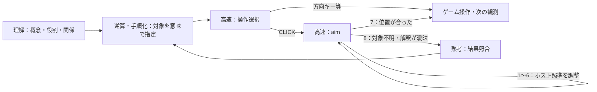

# 概念・役割による対象指定と高速な照準合わせ

2026-09-27。実装済み。全体の状態遷移は[熟考・高速実行](fast-slow-runtime-ja.md)を参照。

## 対象の意味と座標を分ける

理解時の `Target(id, appearance, x, y)` と、目標・計画の `target_ids` を削除した。
誤った座標を一度提出すると後続の判断が引き継ぐ構造をなくす。

`understand` は次の二層を提出する。

- `concepts`: 共通概念の名前と説明。最大4件。
- `targets`: 今注目しているインスタンスまたは対象群の `concept`, `appearance`,
  `role_hypothesis`, `relations`。最大6件。座標や個体IDは不要。

例えば「3×3のパネル」という共通概念の下に、「枠で強調されたパネル」と
「他の三つのパネル群」を置ける。同じ概念でも、操作対象候補と参照例候補のように
役割は異なってよい。役割は仮説であり、観測結果によって訂正する。
この例や特定ゲームの正解規則は実行プロンプトへ埋め込んでいない。

概念カタログは最大16件。理解時に過去の概念を参照し、今回必要な概念・対象だけを
具体化して後続へ渡す。盤面全体の物体一覧や全セルの列挙は要求しない。
これは小規模な自然言語カタログをモデルが参照する方式で、埋め込み検索基盤ではない。

目標・計画の `target_query` は、対象の見た目・役割・関係を自然言語で記述する。
手順のCLICKにも個別の `target_query` を持たせ、操作するインスタンスと部位を指定する。
座標付きの旧手順は受理しない。方向キー等は対象位置の指定を必要としない。
目標IDと手順の起動IDは、依存関係・実行履歴の対応付けのために残す。

## CLICKの実行経路

aimの選択肢は1トークンの数字。最初はlocateモードで、`1/2/3/4` から
左上/右上/左下/右下の対象領域を選ぶ。この時点では座標は未設定で、クリックは選択肢にない。
対象領域の中央へ照準を置いてadjustモードへ進む。adjustでは `1/2/3/4` が上/下/左/右、
`5/6` が移動幅を半分/倍にする。
`7` は現在のカーソル位置のクリック、`8` はreconcileへ戻る。
端で移動できない方向や最小幅からの縮小は選択肢に出さない。
同じ合法操作の反復を理由にした拒否・ゲーム停止は導入していない。

初期位置はモデルが選んだ領域から決め、未確認の状態として扱う。初期移動幅は盤面の長辺の1/8以下の
最大の2の累乗（最低1）。モデルが必要に応じて粗く移動し、1画素まで細かくできる。
別の確認呼出しを追加せず、7の選択をその時点の位置確認として記録する。
「中央が対象」という前提や、期限切れ時に中央をクリックする代替処理はない。

ホストは実座標を保持し、モデルは現在画像との位置関係を判断する。
ゲームだけの原画像と、黄色い照準を示す独立したホスト画像を渡す。
領域選択では元画像だけを使い、微調整ではホスト画像も渡す。
ホスト画像には全体図と照準周辺の拡大図があり、移動幅を小さくすると拡大範囲も狭くなる。
画像座標への変換はホストの描画原点・倍率を使う。

## 観測と実行の境界

カーソルの移動・拡大はゲームAPIを呼ばず、操作数や画面差分に含めない。
実画素と照準表示は独立しており、ホスト描画を操作の効果として学習させない。
照準は観測IDに結び付ける。次の観測では解除し、同じクエリでも再び合わせ直す。
したがってスキルに古いクリック位置を保存する必要はない。

現在のドライバは、照準調整中に新しいゲームフレームを取得しない。
観測間の位置変化への再照準は可能だが、壁時計に従って連続的に動く対象を追跡する実装ではない。
全工程は既存のゲーム期限・判断期限を共有し、照準中の期限切れでもゲーム操作を送信しない。
1トークンでも画像入力の処理費用は残る。

クリックの実行記録には `binding` としてクエリ、観測ID、最終座標、移動幅、調整回数、
確認状態を残す。操作の受付・結果は従来どおり起動IDに対応付ける。
照準の7は小目標の完了を意味しない。probeならクリック受付後の観測で結果照合へ戻る。

## 記録と評価

`cursor_started`, `cursor_located`, `cursor_adjusted`, `cursor_confirmed` を記録する。
評価レポートにはaimの呼出し時間、調整回数、確認回数、確認までの総時間の中央値を追加した。
確認回数は送信・受付済みのクリック数とは区別する。
ノートブックには実際にモデルへ渡した最後の照準画像を表示する。
別の観測へ進むと表示を解除し、未来の照準画像は表示しない。

回帰テストは、共有概念と異なる役割、旧座標形式の拒否、調整中の未送信、確認後の実座標、
8による復帰、観測ごとの再照準、期限、元画像の不変性、RGB・非正方形の座標変換、
保存されたモデル入力の再表示を検証する。モデルの視覚判断の正確さは別途実測する。

## 実モデルでの短い確認

[領域選択追加前の3ゲーム評価](../outputs/evaluations/20260926T161329944493Z/report.md)では、
クリック系のゲームが未調整の中央位置をそのまま確認した。このため最初の領域選択を実行経路へ追加した。

[領域選択を含むクリック系2ゲームの評価](../outputs/evaluations/20260926T161902574015Z/report.md)は、
各2操作、全体60秒、一観測45秒。Qwen3-VL-4B-Instructで確認した。

|ゲーム|操作数|実行時間|照準開始から確認まで|結果|
|---|---:|---:|---|---|
|vc33|2|27.0秒|2.13秒、1.04秒|初回は左上領域を選び、下へ2回調整して(15,31)をクリック。次回は領域を選び直して(15,47)。操作上限で終了|
|ft09|1|58.5秒|1.06秒|右上領域を選んで(47,15)をクリック。次の判断は熟考を反復し、判断期限で終了|

到達レベルは両方0。実モデルが領域選択とカーソル移動を利用したことは確認できたが、
正しい対象を選べること、共有概念や役割を適切に推定できること、攻略性能が改善することは未確認。
特にft09では概念を単なるpixelとして説明し、4パネルの役割分担を有用な仮説にできていない。
照準の成功判定もモデル判断であり、上記の時間は正しい位置に到達したことを保証する指標ではない。

評価時のソースは各ディレクトリのpackageに保存している。評価後のagent差分は状態図の表示名短縮のみ。

## 設計の参考と限界

[V*](https://vstar-seal.github.io/)の、必要な対象を指定して視覚探索を起動する構造を参考にした。
本実装はV*の探索モデルやヒートマップを再現したものではない。

[GUI-Cursor](https://arxiv.org/html/2509.21552v1)は仮想カーソルを描画して位置を修正する研究。
追加学習と文章による推論を使っており、本実装の未追加学習Qwenによる1トークン選択の
精度を裏付けるものではない。対象を正しく選ぶ能力と、指定対象に照準を合わせる能力を
分けて評価する必要がある。
