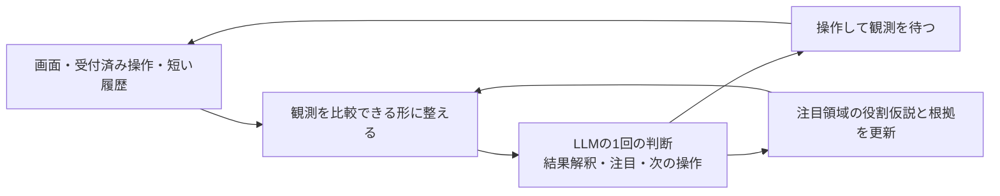

# 微小変化をタイムバーと解釈するための調査

調査日: 2026-09-26。対象ベンチマーク: `outputs/evaluations/20260926T113716122325Z`。

## 結論と今回の変更

本番の注意選択ループから、同条件反復による操作拒否を削除した。反復回数の事前宣言、
禁止台帳、反復を理由とした修正要求・停止を廃止した。実測差分と直近8試行は判断材料として残す。
同じ無反応操作の6回継続と、A→B→C→Aの再訪が各1要求で実行できる回帰テストを含め、
全123テスト通過。古い観測ID・非合法操作・座標・受付・時間の検証は継続する。
削除後の実モデル評価は未実施で、反復誤認が解決したという意味ではない。

次の改善候補は、**複数時点の観測から、変化が「対象の反応」「予算の消費」などの何を意味するかを
LLMが解釈できる入力と記憶にすること**。新しい反復禁止規則を追加する根拠は得られていない。
以下は設計候補であり、タイマー判定や新しいスキルは今回の本番コードに追加していない。

## 実行ログから確認できる問題

|ゲーム|実行と画素変化|モデルが提出した説明の傾向|
|---|---|---|
|ls20-9607627b|30回DOWN。各操作で下端y=61,62の2画素だけ変化|道が開いた、近くの対象に反応があったという説明を継続|
|vc33-5430563c|30回CLICK(36,24)。各操作で上端y=0の1〜2画素だけ変化|クリック対象の反応や進展として解釈を継続|
|ft09-0d8bbf25|3か所クリックして差分0。4回目に最初の座標を再提出|再訪が反復拒否となり、修正後も同座標で停止|

提出された `interpretation` / `notes` にはls20/vc33のバーを時間・残り予算とする仮説が見当たらない。
これは出力された説明についての確認であり、モデル内部の思考を観測したわけではない。
詳細は[提出された説明と短いメモの抽出](../outputs/evaluations/20260926T113716122325Z/attention-analysis.md)。

現行入力には前後画像と差分座標があり、既存指示にも端の変化を対象の反応と即断しない旨がある。
それでも誤認している。したがって「タイマーかもしれない」と一文足せば解決する、とはいえない。
またft09には説明した色とクリック位置の不一致もあり、反復拒否の削除は座標認識まで修正するものではない。

## VCGTの同じゲームにある根拠

出典は[Human VCGT](https://www.kaggle.com/datasets/magicsword001/acr-agi-3-human-vcgt)。
[既存の取得・分析記録](human-vcgt-analysis-ja.md)によると、説明は動画とゲームルールを使って生成された
LLM注釈であり、人間本人の発話ではない。作者の[生成方法の説明](https://www.kaggle.com/competitions/arc-prize-2026-arc-agi-3/discussion/715611)
は今回のWeb取得では本文を取得できなかったため、この来歴は既存の調査記録に基づく。

ローカル抽出 `.cache/vcgt-analysis/annotations.jsonl` のうち、ls20全13記録、vc33全10記録を
時間・バー・消耗に関する語で検索し、該当する説明と前後の文脈を確認した。ゲームIDは全件で
上記ベンチマークと同一。比較としてft09の10記録も検索した。
該当記録はls20が2件、vc33が3件、ft09は0件。これは検索語への一致数であり、
人間の認識率やバーの有無を意味しない。元動画との逐次照合は今回実施していない。

|記録|説明上の場面|設計に使える手掛かり|
|---|---|---|
|ls20、CSV行285、説明要素7、17:00〜17:45|下端のバーが減り、17:22に失敗。再試行では色状態の条件を調べ直す|バー消耗と攻略条件を別の情報として扱っている。ただし失敗原因の記述には不確かさがある|
|vc33、CSV行173、説明要素3、0:47〜3:08|水位と浮きの高さを調整。上端バーが消耗し2:52に失敗、再試行では手順を改善|水位変化は操作の効果、目印への整列は進展、バーは残り予算として区別できる|
|vc33、CSV行177、説明要素1、1:12〜1:51|異なるバルブで水位を調整し、同じ場所の再クリックも行う。1:47に時間切れと記述|同じ操作でも盤面に意味のある効果があれば再試行は自然。座標の重複だけでは良否を決められない|

再確認用GUID（上表順、いずれも末尾 `.recording`）:

- `cfe4acef-d6bc-499d-bede-0d397703362d.recording`：説明要素7の行57〜100。
- `1469cb95-ccf9-4a93-8356-f44443d20dce.recording`：説明要素3の行1〜63。
- `f1addbb7-4708-48e4-8d47-095d049ad5d4.recording`：説明要素1の行43〜60。

CSV行はヘッダー込みの論理レコード番号。説明要素は `analysis_responses` をJSON復号した配列の
1始まりの番号、行は各要素を改行で分割した1始まりの番号。映像時刻は各説明内の表記を使用した。
抽出ファイルSHA256は `4ebec70003fa1e13fa3cf8fe211f88a5aad5d4b29e29c3abf3473c5529107390`。
取得条件は[既存メタデータ](vcgt-analysis-metadata.json)。

**この説明から「人間が最初の数画素の変化でタイマーと推論した」とは結論できない。**
注釈の書き手はゲームルールや後の失敗も知り得る。一方、攻略の状態と予算を別々に表現する例としては使える。
vc33では同じバーを進捗バーともタイマーとも記述しており、名称だけの分類より機能の推定が重要になる。

## 参考になる先行研究と適用の限界

|一次資料|研究で扱った仕組み|今回への示唆と限界|
|---|---|---|
|Pathak et al., 2017, [Curiosity-driven Exploration by Self-supervised Prediction](https://arxiv.org/abs/1705.05363)|前後の観測から操作を予測する逆モデルで特徴を学習し、その特徴上で結果の予測誤差を用いる|全画素の変化をそのまま探索価値としない発想。タイマーの意味を認識するモデルではなく、Qwenへの文章指示だけで再現するものでもない|
|Lamb et al., 2022, [AC-State](https://arxiv.org/html/2207.08229v2)|複数ステップ離れた観測間の操作を予測し、情報を圧縮して制御に必要な状態を学ぶ|直前1回だけでなく履歴を使う根拠。時間的に相関する背景ノイズも検討するが、訓練と仮定を伴う研究で、数手でのタイマー認識を保証しない|
|Ten et al., 2021, [Humans monitor learning progress in curiosity-driven exploration](https://pmc.ncbi.nlm.nih.gov/articles/PMC8514490/)|自由に選ぶ学習課題において、習熟度に加えて学習の進み方を含むモデルが人間の課題選択によく適合した|変化の発生だけでなく理解・予測が改善したかを見る発想。ゲームのタイマー認識やLLMの切替能力を検証した研究ではない|

AC-State本文は、制御できるものだけでなく制御に影響するものも扱う。付録Eでは、
制御用の表現だけで全ての課題関連情報が保たれるわけではないことも議論する。
今回への適用では、終了条件に関わるタイマーを「制御できない背景」として消してはいけない。
操作ごとに減る予算は操作と因果関係を持ち得るので、「操作による変化か否か」という二分も不足する。
必要なのは**変化の原因・対象と、攻略上の役割を分けること**である。

## ステートマシンに落とす候補

以下は上記を踏まえた設計仮説。研究手法をそのまま実装したものではない。
通常の1操作1判断を保ち、実際に変化した領域やLLMが関心を持った領域に絞って履歴を見られるようにする。
全物体を列挙したり、端の画素を一律に無視したりする必要はない。

`B` は同じ応答から更新する短い記憶であり、追加の推論工程ではない。
役割が曖昧なら、後続の通常判断でその領域の時間変化を調べる。意味の判断が不確かなことは操作拒否にしない。

### 1. 見た目の仮説を、時間変化で確かめられる入力

細長い枠と塗りの長さはバーの候補になるが、形だけでは残り時間・体力・進捗を区別できない。
候補に注目したとき、既存の観測から開始時・途中・現在の小さな画像列や同領域の切り出しを示す。
各画像には観測IDとその間の実行操作を対応づける。全画面も残して他の対象へ注意を移せるようにする。
切り出しは位置確認の補助であり、クリック座標は元の画面座標を維持する。

ホストは領域内外の変化や観測の並びを計測する。どの領域が何を表すかはLLMの暫定解釈とする。
最初の注目先までLLM任せにすると、今回のようにバーを見ないままになる可能性がある。
そのため初期案では、実測差分の位置から対応領域の時間比較を通常入力に添える。
これは物体の全列挙やタイマー分類ではなく、すでに与えている変化の根拠を視覚化する処理である。
差分が広い場合に切り出しが巨大になる問題も含め、画像数・解像度の上限は速度評価で決める。
現行の直近8試行には差分の範囲はあるが、複数時点を一緒に見て塗りの増減を判断する提示はない。
ここを改善する案なら、モデルの呼出回数を増やさず検証できる。ただし画像増加による遅延は測定が必要。

### 2. 操作の効果と、攻略上の意味を別々に記憶する

例えば「下端の同じ列帯で色が順に置換される」は測定に近い情報、
「予算が減っている」は役割仮説、「この操作で目標に近づいた」は別の判断である。
短い記憶を更新する際、役割仮説に参照観測と未解決点を結び付ける。
これにより前の文章の言い換えだけで確信が増えるのを避ける設計を試せる。効果は未検証。

複数の異なる操作でも同様に減ることや、失敗・再開との対応は、予算表示という仮説の材料になる。
ただし、今回のls20/vc33は同じ操作を続けた軌跡なので、**これだけでは時間経過と操作回数の寄与を分離できない**。
ひとまず「消耗する予算かもしれない」で十分で、秒数のタイマーと断定する必要はない。
別操作を選ぶなら、バーの正体のためだけに手を消費せず、盤面についても情報が得られる操作が望ましい。

### 3. 必要なときだけ使うスキル候補「変化の役割を調べる」

常駐の禁止事項一覧を増やす代わりに、普段の注意判断が結果を説明できないときに利用する
小さな比較手続きにできる。入力は注目した領域、既存の観測列、対応する操作。
出力は役割の候補・根拠・まだ区別できない点と、それを確かめる次の操作。
「N回繰り返したから発動」「差分がN画素以下なら無効」といった硬い判定を意味判断の代用にしない。
同じ結果が予測できるようになったら、攻略に役立つか、まだ何を学べるかを次の通常判断へ返す。

最初から独立した評価LLMを毎手呼ぶ構成は、時間制約から優先度が低い。
比較手続きも同じ注意判断の入力・出力に収める案を先に評価する。
将来スキルとして分離する場合も、選択と呼出しの遅延を含めて採否を決める。

## 実装を選ぶ前の小さな評価

まず保存済みの同じ観測地点を使い、現行入力と「複数時点の視覚比較を加えた入力」を比較する。
この段階ではバーをタイマーと教える文や、VCGTの攻略ルールをモデルへ渡さない。
同じ地点で複数回試し、偶然の回答変動と区別する。閉じた再生評価では次の操作の実効果までは測れないため、
候補が絞れた後に短い実ゲーム評価を行う。

見る項目は、変化した領域の特定、予算仮説の有無と根拠、対象の反応との取り違え、
次の操作で確かめる内容、モデル要求数・入力トークン・判断時間とする。
「タイマー」という単語が出ることだけを合格にしない。
バーを表示する部分を隠した再生との比較も、誤認への寄与を調べる診断には使えるが、本番での固定マスク採用とは別問題。

比較対象に、微小な盤面変化が本当に重要な例、同じ操作で水位が変わる例、ft09の別対象調査、
VCGTで設計を考えるのに使っていないゲームを含める。
VCGTの後知恵をオンライン認識能力と取り違えず、認識改善と時間コストの双方で選ぶ。
