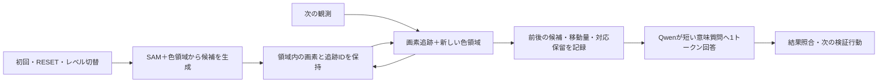

# 物体認識の採用構成・検証結果・参考資料

更新：2026-09-29。この資料を物体認識の入口・採用方針の正本とする。**初回はSAMで物体候補のまとまりを補い、通常はプログラムで画素の動きを測り、Qwenには意味・操作との関係を小さな質問で判断させる。** この構成は現行フレームワークへ統合済み。

同日追加：通常経路に、マスクと元の部品の保持、対象ID・部品／全体の仮説、対象別の履歴検索を統合した。[対象仮説と履歴の実装・検証](object-hypotheses-runtime-ja.md)を参照。以下の過去の回収率は当時の実装・枠基準による結果であり、新しいマスクIoU評価と混ぜない。

認識の目的は、静止画から全物体の完全な分割・クラス一覧を作ることではなく、**行動・因果推論に必要な候補と変化を落とさず、低コストで利用できること**とする。外観や役割が未確定の静止候補、複数の対応仮説を許容する。連動していても一つの物理物体・因果関係が確定したとはみなさない。

| 読みたいこと | 参照先 |
|---|---|
| 現在の判断、実装済みの構成、検証の要点 | このページ |
| 実装・設定・再実行・ログ項目 | [SAM＋画素追跡のランタイム仕様](hybrid-perception-runtime-20260928-ja.md) |
| 次に直す課題と作業の入口 | [短い引継ぎ](visual-recognition-handoff-ja.md) |
| 行動計画の3要素・コンパクトな逆算計画とその根拠 | [計画の統合資料](planning-adopted-ja.md) |
| 個別の測定条件、未採用案、文献調査、生ログ | [調査履歴の要点と索引](history/visual-recognition/README.md) |

## 現時点の判断と直近の検証

**前処理だけの正答率で方式を確定しない。** 全候補・全連動を解析できても、後段へ大量に提示すると計画や因果推論のノイズになる可能性がある。候補や根拠を保持することと、その場の推論へ全部渡すことを分ける。どの情報を集計・要約・提示するかは、後段で必要な対象を落とさず、仮説更新や検証行動に役立つかで決める。

| 状態 | 現在の位置付け |
|---|---|
| 実装済み | 初回SAM＋画素追跡、全候補索引、候補参照の継続／欠落、短い意味質問。以下のランタイム仕様に対応 |
| 検証済み・未採用 | 局所外観記述、画素差分の提示比較、プログラムによる連動候補の集計。限定条件の測定であり、本番の計画・因果推論へ未統合 |
| 未確認 | プログラム解析全体が同じ51問で39/51を超えるか、連動情報の量が後段に与える影響、計画・因果推論・ゲーム進展の改善 |
| 次の判断に必要 | 後段の問い・必要情報・保留の扱いを整理し、その条件下で前処理の内容と情報量を比較する。全連動の常時提示、追跡器の削除、画像の一律省略は未採用 |

直近の検証は以下に集約する。異なる分母・採点基準の結果を一つの精度として合算しない。

| 検証 | 主な結果 | ここから言えること・限界 |
|---|---|---|
| [概念生成と候補選択の分離](history/visual-recognition/concept-binding-split-20260929-ja.md) | 概念専用質問は合成7/8種類・実画面3/13種類。正しい指定からの候補選択は22/36対象 | 候補が存在しても、意味や個体の対応は別に失敗する。現在の`concepts`も物体クラス一覧を保証しない |
| [局所外観記述からの個体選択](history/visual-recognition/region-descriptions-comparison-20260929-ja.md) | 従来22/36、全体図あり10/36、なし6/36 | 全体／部品の自己判定による除外で取りこぼした。この条件は採用しない |
| [差分・追跡情報の提示](history/visual-recognition/delta-recognition-comparison-20260929-ja.md) | 観測事実51問：前後画像37/51、差分追加39/51、追跡追加37/51、差分テキストのみ17/51 | 情報の追加だけでは安定して改善しない。計画・因果推論の評価ではない |
| [プログラムによる連動集計](history/visual-recognition/delta-recognition-comparison-20260929-ja.md) | 色変化の連動4/4、同じ移動応答4/4 | 同じ初期状態の小規模合成診断。**8/8を39/51と直接比較できず、全体で上回るかは未確認** |
| [先行研究とQwenの学習からの提案](history/visual-recognition/concept-binding-research-20260929-ja.md) | 領域の指定、外観と位置の分離、対照例などを調査 | 文献上の成果と本プロジェクトの実測を区別する。追加学習・自律的クラス統合は未検証 |

後段を含む評価では、必要対象の考慮漏れ、曖昧さを早まって確定する誤り、測定と説明の矛盾、有用な検証行動、入力情報量・モデル呼出し数・総時間を確認する。まだこの基準で前処理の最適な方式・量を決めたわけではない。

## 1. 採用した構成

初期観測ではカテゴリを指定できないため、カテゴリーなしで候補を広く拾う。厳密な枠一致より、後段が必要な画素を調べられる領域を漏らさないことを優先する。

| 段階 | 採用した処理 |
|---|---|
| 初期候補 | SAM ViT-B標準設定の上位128候補＋既存の色領域。整数枠が一致するものは重複を統合 |
| 通常の更新 | 枠内の画素を上下左右8画素以内で探索。一意の完全一致だけ追跡IDを維持。新しい色領域も追加 |
| 無変化 | 候補と対応を保持し、色領域の再抽出も省略 |
| 曖昧な対応 | 色変化・消失・複数一致などを保留し、再確認へ渡す。毎手SAMを呼び直す構成にはしない |
| 候補の提示 | 先頭24件だけでなく、全候補のID・枠・色・生成元・追跡IDをコンパクトな索引で提示 |
| 移動認識との接続 | 観測内IDと追跡IDを分離。前後の枠・`delta_xy`・対象参照の継続／欠落を後段へ渡す |
| 意味判断 | 測定事実を保持し、期待効果を支持／反する／無関係／不明の1トークンで回答。最大4問、残りは保留 |

既定は`COGNITION_PROPOSALS=sam_initial`。SAM資材・GPUが利用できない場合は、その理由を記録して色領域＋画素追跡を続ける。`program`は従来の測定方式との比較用。資材配置や境界時の処理は[ランタイム仕様](hybrid-perception-runtime-20260928-ja.md)にまとめる。

## 2. うまくいった点と採用根拠

### SAMで、多色物体を一つの候補として拾いやすくなった

色の連結成分だけでは、多色の十字やL字が部品に分かれる。SAMはこうしたまとまりの候補を補えた。同じ静止23画像で、候補回収はQwen一括検出の**合成63/80・実画面3/17**に対して、SAM標準は**79/80・17/17**。実画面は部分注釈であり、全物体を見落とさない証明ではない。

標準SAMの時間中央値は合成4.394秒、実画面4.193秒。分割探索は合成を1対象だけ追加回収したが約10秒かかり、標準設定を採用した。[静止画像の測定条件・比較](sam-proposals-comparison-20260928-ja.md)

### 初回のまとまりを保持すれば、毎手SAMを実行せずに更新できた

合成6系列66フレーム・実ログ3系列23フレームの比較では、初回SAM＋画素更新が、プログラムのみより多くの対象を維持できた。

| 方式 | 合成の候補回収／264 | 実ログの候補回収／133 |
|---|---:|---:|
| プログラムのみ | 142 | 119 |
| **初回SAM＋画素更新** | **242** | **133** |
| 毎手SAM | 263 | 133 |

単位は**対象×フレームの延べ数**。実ログの差は、混色の長い棒と白灰色の模様を持つ四角の**異なる2対象**を、8・6フレーム保持できたこと。14種類の新しい物体を発見した意味ではない。毎手SAMは実ログで回収数が増えず、初回方式を採用した。[時系列4方式の比較](temporal-proposals-comparison-20260928-ja.md)

### 統合後も回収数を維持し、通常更新はミリ秒単位になった

実際の`CognitiveRuntime`の観測処理へ89フレームを渡し、新しい実装でSAMをGPU実行した結果。

| 指標 | 合成 | 実ログ・部分注釈 |
|---|---:|---:|
| 候補回収 | 242/264（91.7%） | 133/133（100%） |
| 正しい並進移動の対応 | 104/127 | 6/6 |
| SAM呼出し | 6回：各系列初回のみ | 3回：各系列初回のみ |
| 初回後の観測処理・平均 | 6.63ms | 6.70ms |

NVIDIA RTX A2000 12GBで測定。最初の初期化はロード込み7.146秒、重みをロード済みの以後の系列初期化は約3.78〜4.15秒。通常更新の時間にQwen・ゲーム操作は含まない。前段の比較は部品時間の加算、上表は観測フックの直接測定なので、時間を混ぜて速度改善率を計算しない。

全206テスト、実SDKで2操作の接続確認、候補枠・前後画素・移動量・IDの照合を実施した。[統合結果と実行条件](hybrid-perception-runtime-20260928-ja.md)

メモリも追加確認し、12GB GPU上でQwenとSAMを同時保持して交互に画像推論できた。GPU全体の使用量は観測最大約8.76GiB、SAMのロードは3系列で1回。約4秒の再検出は重みの再ロードとは別。SAM専用Dataset・Notebook生成・起動検証を整備済みで、アップロードとKaggle実機確認は未実施。[ロード回数・メモリ](hybrid-perception-runtime-20260928-ja.md#gpuへの同時保持とロード回数)・[提出手順と検証](hybrid-perception-runtime-20260928-ja.md#kaggle提出準備)

### 候補を拾った後に、提示段階で捨てないことが重要だった

静止画像の診断では、ft09の注釈対象の一つはSAM候補の**72位**だった。上位16件へ絞ると実画面は12/17、128件なら17/17。候補上限は生成後の選別なので、減らしてもSAM自体の推論時間は短くならなかった。

この結果を受け、128候補まで保持し、現行コードの「先頭24件だけモデルへ提示」という制約も全件索引へ変更した。SAMの品質スコアは、ゲーム上の重要性や対象参照の正しさを保証するものとして使わない。[候補順位と保持上限の診断](sam-proposals-comparison-20260928-ja.md)

### 測定情報を短いクイズに渡す方式は、認識と速度の両方に有効だった

SAM導入前の固定29問では、短い測定値を渡す条件は27/29、画像だけは10/29。移動対象の質問は測定値で16/16、画像だけで4/16だった。**測定値を読めた成績であり、Qwen単独で画素の動きを検出した成績ではない。**

同じテキスト入力の出力設定比較では、1トークン＋許可文字制約で27/29を維持し、174要求すべてが有効な1トークンになった。変更記録の条件で応答中央値は141.1msから87.9msへ短縮した。別の試作では、無変化をプログラムで省くことで87問を43問へ減らし、後段の回答を維持できた。ただし、後段Qwenが測定事実を誤って否定する例もあったため、現在は事実の再判定と意味判断を分けている。

最新のSAM統合後は、実Qwenへの接続確認3問が「支持・反する・不明」を各1トークンで返した。これは約0.39〜0.54秒の接続確認であり、過去の29問とは入力・目的が違う。対象選択や意味判断の一般的な正答率は未確認。[短い質問](history/visual-recognition/simple-action-comparison-20260928-ja.md)・[1トークン化](history/visual-recognition/one-token-comparison-20260928-ja.md)・[質問省略](history/visual-recognition/hierarchical-comparison-20260928-ja.md)

## 3. 主要な検証ログ

| 何を確認するか | 読みやすい結果 | 条件・生ログ・監査 |
|---|---|---|
| SAMによる初期候補の回収 | [枠の比較HTML](../outputs/sam-proposals-20260928/gallery.html)・[集計](../outputs/sam-proposals-20260928/summary.json) | [固定計画](../outputs/sam-proposals-20260928/plan.json)・[SAM全出力](../outputs/sam-proposals-20260928/sam-results.jsonl)・[独立監査](../outputs/sam-proposals-20260928/independent-audit.json) |
| 初回SAMと毎手SAMの差 | [時系列比較HTML](../outputs/temporal-proposals-20260928/gallery.html)・[集計](../outputs/temporal-proposals-20260928/summary.json) | [入力・注釈](../outputs/temporal-proposals-20260928/sequences.json)・[固定計画](../outputs/temporal-proposals-20260928/plan.json)・[独立監査](../outputs/temporal-proposals-20260928/independent-audit.json) |
| 現行ランタイムの回収・移動・時間 | [実GPUの集計](../outputs/hybrid-runtime-20260928/live/summary.json) | [全測定ログ](../outputs/hybrid-runtime-20260928/live/measurements.jsonl)・[コード・入力ハッシュ](../outputs/hybrid-runtime-20260928/live/manifest.json)・[保存出力との一致確認](../outputs/hybrid-runtime-20260928/recorded/summary.json) |
| 移動測定からQwenへの接続 | [3問の要求・応答](../outputs/hybrid-runtime-20260928/qwen-smoke.json) | [全206テスト](../outputs/hybrid-runtime-20260928/tests-final.log)・[結合テストの実装](../tests/test_hybrid_perception.py) |
| 評価用コードからゲームを動かす経路 | [2操作の確認レポート](../outputs/hybrid-runtime-20260928/gateway-smoke/report.md) | [設定・SAM資材ハッシュ](../outputs/hybrid-runtime-20260928/gateway-smoke/manifest.json) |
| 短い測定情報と1トークン回答 | [29問の比較HTML](../outputs/simple-action-20260928/gallery.html)・[採点](../outputs/simple-action-20260928/summary-reviewed.json) | [1トークン比較](../outputs/one-token-20260928/summary.json)・[トークン監査](../outputs/one-token-20260928/token-audit.json)・[質問省略の照合](../outputs/hierarchical-20260928/verification.json) |

候補回収の共通主基準は「枠に盤面1画素の余裕、対象画素90%以上、面積が正解外接枠の9倍以下、1対1対応」。IoU 0.5で採点した古い検出試験とは別指標。実画面は部分注釈であり、未注釈物体の見落としや適合率は評価していない。

`outputs/`の実験データはGit管理外。共有・環境移行では上表のディレクトリを別途保存する。今回の整理では生ログ・正解・採点・ソーススナップショットを変更していない。再実行は[検証スクリプト](../scripts/verify_hybrid_runtime.py)で新しい出力先を指定する。

## 4. 参考文献・公式情報

外部資料は方式・実装・評価条件を理解するための参照先。上記の精度と時間の根拠は本プロジェクトの測定ログである。

| 資料 | 今回参考にする点 |
|---|---|
| [SAM公式自動マスク生成コード：使用コミット固定](https://github.com/facebookresearch/segment-anything/blob/dca509fe793f601edb92606367a655c15ac00fdf/segment_anything/automatic_mask_generator.py) | 点を配置してマスク候補を作る実装、品質・安定性による選別。今回採用した検出器の直接の参照先 |
| [SAM取得元・重みの記録](../outputs/sam-proposals-20260928/external-provenance.json) | 使用コードのコミットとViT-B重みの取得URL。再現時は固定計画・統合マニフェストのハッシュも照合する |
| [llama.cpp公式GBNF資料](https://github.com/ggml-org/llama.cpp/blob/master/grammars/README.md) | 選択肢の出力文字を制約する方法。1トークン化・正答率・速度はローカルで別途検証した |
| [Qwen3-VL公式2D Groundingサンプル](https://github.com/QwenLM/Qwen3-VL/blob/main/cookbooks/2d_grounding.ipynb) | Qwenによる枠出力を比較する際の形式・座標規約。古い非標準の座標要求による失敗を一般能力と混同しないための資料 |
| [Unsupervised Object Learning via Common Fate（2023）](https://proceedings.mlr.press/v213/tangemann23a.html) | 動きを手掛かりに物体表現を得る研究。将来の部品統合の参考であり、この学習方式を現行実装へ導入したわけではない |

そのほかの論文・方式の調査は[履歴の索引](history/visual-recognition/README.md)に残した。上表の外部資料の参照先は2026-09-28に再確認。SAM以外の`main`／`master`参照は更新され得るため、実験時の条件は保存ログを優先する。

## 5. 採用しなかった方法から残す知見

| 方法 | 残しておく要点 |
|---|---|
| Qwenによる全物体の一括列挙・枠出力 | 多色形状をまとめる例はあるが、実画面の列挙漏れが残った。初期候補生成の主方式には採用しない |
| 反復検出・枠の提示・モザイク | 重複、終了判定、既存枠による未検出物の隠れが課題。今回の条件では時間に見合う安定した改善を得られなかった |
| 毎手SAM・単純な必要時SAM | 毎手は高コスト。単純な再確認条件は全変更遷移で発火し、呼出し削減につながらなかった |
| EdgeBoxes | 数十msで速いが、単独では実画面の回収でSAMに届かなかった。プログラムとの事後結合は有望でも、統合後の速度・追跡は未測定 |
| 候補ごとの一致確率・自己確信度 | 出力確率の取得には成功したが、高確率の誤一致が残った。複数一致・不明を確率だけで決めない |
| 事前説明・画像強調・動画・注意の可視化 | 個別の参考例はあるが、微小移動の安定認識の主経路には採用していない |

数値・例外・比較条件が必要なときだけ[履歴の短い要約と個別資料](history/visual-recognition/README.md)へ進む。これらは各条件での結果であり、方式自体の一般的な無効性を示すものではない。

## 6. 現在の限界と次の課題

**領域を拾えること、同じ物体を追えること、意味を正しく理解できること、ゲームを解けることは別の評価である。**

- 色変化・遮蔽・変形・同形物体では対応が切れる。合成の移動23/127件は拾えていない。途中で現れる多色物体をSAMで取り直す機構も未実装。
- 変更があった64遷移すべてで対応保留が残った。SAM再実行は省けたが、Qwenの再確認呼出しを減らす課題は残る。
- 候補IDの存在と追跡上の対応は検査するが、モデルによる役割付け・自由文・因果判断の正しさまでは保証しない。
- ゲーム攻略への改善、未知ゲームへの汎化は未確認。実ログ6/6の移動はls20の短い区間に限る。

次の検証は、全体候補を追えているときの部品・背景の保留の扱いと、測定根拠を結果照合・計画に維持できるかを分けて進める。[作業の引継ぎ](visual-recognition-handoff-ja.md)
