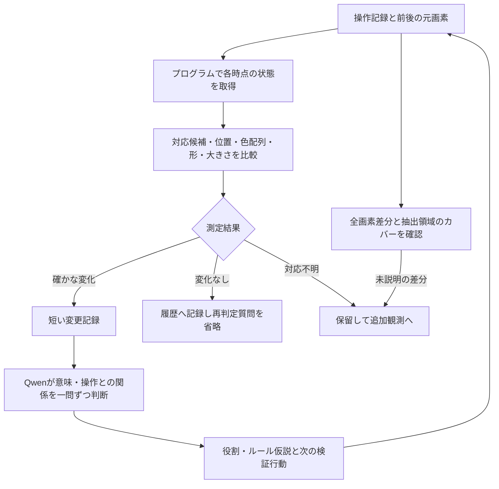

# 画面認識の採用方針・検証結果・参考文献

更新：2026-09-28。画面認識に関する2026-09-27〜28の調査をまとめた、採用方針の参照先。

**元画素から測定できる変化はプログラムで判定し、Qwenへの質問は変化した対象の意味・操作との関係へ絞る。** 短い質問を一つずつ提示し、選択で答えられる判断は1トークンで処理する。共通概念、個体、観測時点の状態、役割仮説は区別して保持する。

この方針を採用する。プログラム測定・自動出題・1トークン回答・質問省略は比較用コードで検証済み。**意味・因果関係の推論に絞った一連の処理の精度と速度、および実ゲームの攻略効果は未検証**である。本書は採用設計を定めるもので、本番エージェントへの統合完了を表すものではない。

## 1. 採用する構成



| 要素 | 採用する扱い | 根拠・実装状況 |
|---|---|---|
| 微小変化の取得 | 元の64×64色ID配列を比較する。拡大画像から座標を読ませない | 限定した図形のプログラム比較で移動5/5対象を検出 |
| 概念と個体 | 同じ3×3パネルという概念を共有し、4個体の内部配列を個別に保持する | 共通クラスと個体別状態の保持を実装・確認 |
| 個体対応 | 見た目・形・位置などの対応候補を保存し、曖昧なら保留する | 同形物体の複数対応を検出する試作あり |
| 質問の入口 | 測定上の変化がある候補と保留候補を残し、変化なしへの再質問を省く | 87候補へのモデル質問を261問から43問へ削減 |
| Qwenへの入力 | 操作・観測IDに紐づく短い変更記録と、その問いに必要な関係だけを渡す | 短い測定記録の読取りに効果。最適な意味質問の構成は未確定 |
| Qwenの回答 | 小さい選択肢集合では1トークン＋許可文字制約。「判断不能」も用意する | 文法制約付き174要求すべてで1トークン回答を確認 |
| 事実と仮説 | 測定記録とモデルの解釈を別に保存する。解釈だけで測定済みの変化を消さない | 詳細回答が測定上の変化を否定した事例を踏まえた採用要件 |

最後の分離や意味質問への限定は、今後の統合で満たす要件である。比較用スクリプトが一連の処理をすべて実装済み、という意味ではない。

### 対応候補とレトロUI付き画像の役割

今回の試作でいう「対応候補」は、プログラムが各フレームから抽出した形・色配列・位置などを照合した候補である。QwenがレトロUI付き画像を先に認識した結果を必須入力としてはいない。これは既存の抽出規則で扱える図形についての結果であり、未知の物体のまとまりや役割までプログラムだけで理解できる、という結論ではない。

「複数の図形を一つの装置とみなす」「このパネルは見本らしい」といった意味の解釈には、全体画像をQwenに見せる経路も残す。レトロUIはその際の文脈補助の候補である。過去の比較ではゲーム盤面として説明する兆候はあったが、移動対象の同定改善は確認できていないため、必須の前処理にも、不要と確定した処理にも位置づけない。

画像認識でまとまり・役割の仮説を作り、その領域の詳細をプログラムで測る連携は、今後の統合候補である。現在の自動抽出・対応試作がこの連携を実装済みではない。曖昧な個体対応は、UI付き画像を見せれば解決すると仮定せず、追加の時系列観測や操作検証でも確かめる。

### 記録する情報

共通概念には「3×3パネル」「二色の矩形」などの形のまとまりを記録する。個体には参照する観測、実際の支持領域、局所配列、他個体との一致関係を持たせる。「プレイヤー」「見本」「ゴール」は更新可能な役割仮説にする。フレーム内IDや同じ呼び名だけで、前後の物理的同一性を確定しない。

正確な座標はプログラム内部の測定・照合に使う。Qwenの通常の回答には座標の再出力を求めず、「どの対象が変化したか」「この観測がどの仮説を支持するか」を問う。操作方向と物体の移動方向が一致するとは仮定せず、逆方向の連動や位置に依存する移動も記録に残す。

例えば、次は今後の意味質問用の記録形式の例であり、測定済みの成功プロンプトではない。

```text
試行 T12：操作 A。観測 O20 → O21。
測定事実：二色の矩形は移動した。白い十字は不変。
対応：矩形の前後対応は候補が一つ。未説明の差分はない。
既存仮説：矩形は操作対象かもしれない。
質問：この1回の観測だけで、矩形が操作Aによって動いたと確定できるか？
A. 確定できる
B. 操作直後の変化は確認できるが、因果関係はまだ確定できない
X. 提示情報から判断できない
```

「操作直後に変化した」という観測と「操作が原因」という推論は別にする。必要に応じてWAIT、同じ開始状態からの別操作、反復観測で仮説を検証する。未変化対象も比較や関係理解に必要なら記録を参照するため、質問を省くことは履歴を捨てることではない。

### 見落としを黙って処理しない条件

抽出候補で覆えない変更画素、前後の対応が複数ある候補、出現・消失・分裂・合体の可能性は、保留として残す。「物体候補が0件」を「変化なし」に置き換えない。試作では20×20の抽出対象外領域の出現に対し、質問0件でも400画素の未説明差分を検出した。

画像や部分拡大は、抽出や役割の確認が必要な場合に参照する。測定値だけで完結する比較には画像を毎回送らない。未説明差分が0でも、物体の区切り方や意味が正しい保証にはならない。

## 2. 採用を支える検証結果

通常の比較はローカルQwen3-VL-4B-Instruct、Q4_K_M本体・Q8_0 projector、llama.cppを使用した。以下は実ログの一部と小規模な合成問題による診断であり、ARC-AGI全体の成功率ではない。実験間では質問・入力形式が異なるため、正答率を合算しない。

### A. プログラムによる詳細取得と比較

限定した小図形とパネルの比較で、プログラムは移動対象を5/5検出した。同じ試験の前後画像を直接Qwenで比較する条件は0/5。プログラムは主対象の変化を9/9例で捉え、余計な変化・対応・関係の誤りまで確認した整合判定は8/9例だった。4つの3×3パネルを共通クラスの別個体として保持し、1セル変更やパネル同士の配列一致を比較できた。

抽出器は小さな連結成分、矩形のまとまり、3×3配列などの規則を持つ。未知ゲームに通用する物体検出・概念獲得の完成ではない。バーの短縮を別候補と解釈する問題もあり、測定の正確さと物体の分割・対応の正しさは分けて扱う。

出典：[状態取得の比較HTML](../outputs/instance-state-20260928-final/gallery.html)、[集計JSON](../outputs/instance-state-20260928-final/summary.json)。

### B. 短い測定記録と単純な質問

同じ29問について、画像のみ、短い前後の測定値、計算済みの変更記録を比較した。

| 入力 | 色 | 移動対象 | パネル内部の変化 | 操作と変化の対応 | 合計 |
|---|---:|---:|---:|---:|---:|
| 画像のみ | 4/4 | 4/16 | 1/5 | 1/4 | 10/29 |
| 短い前後の測定値 | 4/4 | 16/16 | 4/5 | 3/4 | 27/29 |
| 計算済みの変更記録 | 4/4 | 16/16 | 5/5 | 2/4 | 27/29 |

移動問題には1・4画素、逆方向の同時移動、無変化、WAITを含めた。画像のみの4/16は全問「どちらも動いていない」と答えた結果。測定記録の16/16は、画像から自力で移動を認識した成績ではなく、記録を正しく読めた成績である。操作との対応は過去の観測の読取りで、因果推論の成功率ではない。

出典：[単純質問の比較HTML](../outputs/simple-action-20260928/gallery.html)、[内容と形式を分離した集計](../outputs/simple-action-20260928/summary-reviewed.json)。

### C. 1トークン回答による高速化

上の29問のテキスト条件で、入力を固定して出力設定だけを変え、各3回測定した。

| 入力 | 通常の出力上限16：中央値 | 上限1＋許可文字制約：中央値 | 正答した問題 |
|---|---:|---:|---:|
| 前後の測定値 | 157.3ms | 99.5ms | 両設定とも27/29 |
| 計算済みの変更記録 | 141.1ms | 87.9ms | 両設定とも27/29 |

文字制約を付けた174要求すべてが、許可された1文字・生成1トークンになった。回答選択は出力設定間・反復間で変わらなかった。1トークン化は出力の短縮であり、入力読取りや前処理の時間は残る。「高速モード」はここでは短い選択回答を意味し、別の思考モデルへの切替ではない。

現在のローカルサーバーで確認した指定例：

```json
{"max_tokens": 1, "grammar": "root ::= \"A\" | \"B\" | \"X\""}
```

選択肢の文字が実モデルで1トークンになるかを確認する。上限に達して`finish_reason=length`でも、許可された1文字が完結していれば有効回答として扱う。別のサーバーで同じ`grammar`引数が使えるとは限らない。文法制約は回答形式を保証するもので、正しさの保証ではない。

出典：[出力設定の比較HTML](../outputs/one-token-20260928/gallery.html)、[集計JSON](../outputs/one-token-20260928/summary.json)、[トークン確認](../outputs/one-token-20260928/token-audit.json)。

### D. プログラム判定による質問省略

41画像対から得た87候補を各方式2回処理した。内訳は変化あり36、変化なし44、対応未確定7候補。全方式1トークン回答で、Qwenには測定状態のテキストを渡した。

| 方式 | 1巡回の質問数 | 時間合計の中央値 | 変化の組み合わせ正解 | 変化ありを検知 |
|---|---:|---:|---:|---:|
| 全3属性を個別に質問 | 261 | 38.63秒 | 61/87 | 28/36 |
| 変化なしを含め直接1問で分類 | 87 | 14.73秒 | 62/87 | 25/36 |
| **プログラムで入口判定→Qwenで詳細分類** | **43** | **7.24秒** | **62/87** | **25/36** |

プログラムによる省略は、直接分類と全候補の最終回答が同じで、質問数を50.6%、時間を50.8%削減した。全3属性巡回との比較では質問数83.5%、時間81.2%減。ただし後者に対して変化検知の精度まで同等とは言わない。

プログラム入口は測定上の変化36候補をすべて残したが、後段Qwenはうち11候補を「変化なし」と回答した。したがって採用構成では、測定済みの事実を再判定させず、意味の解釈と別に保持する。この修正後の意味推論の精度を、表の62/87や7.24秒が示しているわけではない。

候補数N、測定上の変化C、保留Uなら、入口判定後の対象数はC+U。各対象に1問なら今回は36+7=43問になる。意味について複数問を出す場合や追加観測が必要な場合、その分は増える。時間はリクエスト時間の合計で、抽出・起動等を含む実運用全体の時間ではない。

出典：[質問省略の比較HTML](../outputs/hierarchical-20260928/gallery.html)、[集計JSON](../outputs/hierarchical-20260928/summary.json)、[再現性・分岐の検査](../outputs/hierarchical-20260928/verification.json)。

## 3. 今回の標準経路に採用しない方法（参考）

| 調べた方向 | 残しておく知見 |
|---|---|
| レトロUI、幾何図形という事前説明、操作ボタンの発光 | ゲームらしい場面説明には兆候があったが、移動対象の認識改善は確認できなかった |
| 白色混合、前後重ね合わせ、境界線、クロスフェード、動画入力 | 境界線付き重ね合わせは一部の対象で改善したが、微小移動全般には不安定で加工を実変化と読む例もあった。人間向け閲覧の補助としては利用可能 |
| 事前の物体説明、命名、中間説明、相対位置の記述 | 説明の整合に役立つ場合はあるが、粗い文章を引き継ぐ問題が残った。名前は参照用とし、測定事実に代用しない |
| Qwenの「変化したか？」で詳細確認を省く | 入口で変化36候補中6候補を見落としたため、採用構成の入口はプログラムに置く |
| XAIによる注意・特徴差の診断 | 特徴差の存在と、移動の正しい判断は別だった。注意の可視化だけでは失敗原因を確定できない |
| 測定済み変更・関係をまとめて渡すルール推論 | 既存の小規模試験では安定しなかった。短い観測質問の成功を攻略推論の成功と読み替えない |
| FCOSなどの追加物体検出モデル | 今回の元画素が取得できる2D環境では優先しない。これらのモデルとの精度・速度比較は未実施 |

## 4. 参考文献と今回の位置づけ

以下は設計や評価の参考文献であり、上記の数値の出典は本プロジェクトの実測記録である。各研究が今回のQwen・64×64ゲームで同じ効果を保証するわけではない。

| 文献・公式資料 | 参考にする点 | 今回への適用範囲 |
|---|---|---|
| [Qwen3-VL Technical Report（2025）](https://arxiv.org/abs/2511.21631) | 画像・動画・テキストを扱うモデル構成と評価 | モデルの前提を確認する資料。一般ベンチマークの成績を、量子化4Bの微小変化認識へ直接換算しない |
| [llama.cpp GBNF文法の公式資料](https://github.com/ggml-org/llama.cpp/blob/master/grammars/README.md) | 出力文字列を文法で制限する方法 | 採用する選択肢制約の実装資料。1トークンになることと速度はローカルで別途確認した |
| [Voyager（Wang et al., 2023）](https://arxiv.org/abs/2305.16291) | 環境フィードバックによる反復修正とスキル蓄積 | 仮説を操作結果で検証する設計の参考。今回の画面認識改善を直接実証した研究ではない |
| [Unsupervised Object Learning via Common Fate（Tangemann et al., 2023）](https://proceedings.mlr.press/v213/tangemann23a.html) | 動きを手掛かりにした物体表現の学習 | 物体単位で状態を持つ発想の背景。訓練を伴う別方式であり、同じ方向に動くものだけをまとめる規則として採用しない |
| [Attention is not Explanation（Jain & Wallace, 2019）](https://aclanthology.org/N19-1357/) | 注意重みと出力への寄与を区別する必要性 | XAI結果を過大解釈せず、入力への介入や実際の正答で判断する根拠。Qwen固有の原因分析ではない |

## 5. 実装参照と次の確認

| 比較用の実装 | 内容 |
|---|---|
| [instance_state.py](../scripts/instance_state.py) | 各時点の候補取得、状態・対応・変更の比較 |
| [observation_questions.py](../scripts/observation_questions.py) | 元画素と操作からの自動出題、未説明差分の監査 |
| [hierarchical_questions.py](../scripts/hierarchical_questions.py) | 測定上の変化判定、質問形式、保留を含む分岐 |
| [benchmark_one_token.py](../scripts/benchmark_one_token.py) | 同じ問題での1トークン出力設定の比較 |
| [benchmark_hierarchical.py](../scripts/benchmark_hierarchical.py) | 実際の回答に従って呼び出しを省略する比較 |

次の統合では、測定事実を保持したまま意味質問へ絞る処理を実装し、未使用の場面で、変更の取りこぼし・誤った個体対応・操作記録の混同・意味判断・総時間を別々に測る。意味判断や攻略の改善を確認してから、その範囲を実績として追加する。

これまでの個別資料は調査履歴として保持している。古い資料中の「次の候補」「推奨」は当時の判断であり、現在の採用方針は本書を参照する。再現が必要な場合は各結果HTMLから入力・生回答・検査記録を確認できる。
