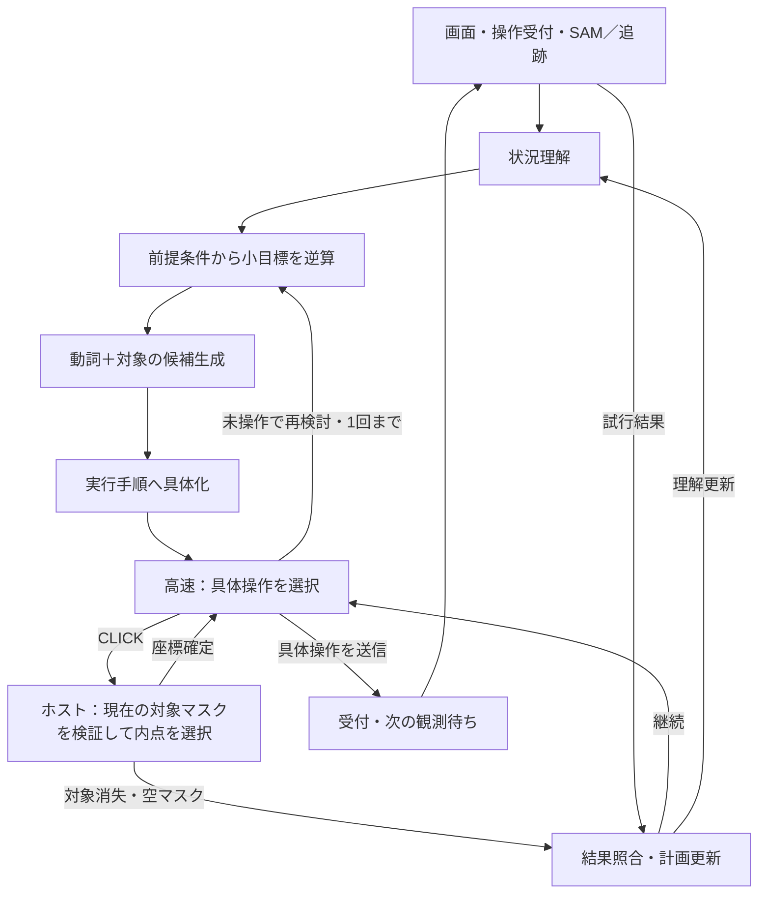

# マイルストーン採用構成：SAMマスクによるクリック

更新：2026-09-30。9月30日〜10月1日午前のマイルストーンでは、既存のSAM ViT-B・画素追跡・対象仮説を使い、選んだ現在マスク内からクリック点を決める。SAM 3は承認後の別実験に留め、完成条件にしない。

この文書を現行方針の入口とする。[比較実験の一覧と判断](click-selection-evidence-ja.md)、[整理前の引き継ぎ](history/milestone-20260930/handoff-before-consolidation-ja.md)から詳細を辿れる。

## 状態遷移と実装



上図は主要経路の要約。全遷移の正本は [machine.py](../agent/cognition/machine.py)。監視画面もこの定義から図を生成する。`bind_click` は追加のLLM判断ではなく、1回の決定内で完結するホスト処理。継続可能なLLM工程や記憶schemaは増やしていない。

通常ランタイムは `FocusedRuntime`、メモリschema 16。最終目標・小目標・抽象操作・複数ステップの手順を保持する。単一操作版 `SimpleRuntime` は比較・回帰確認用で、通常経路には使わない。

## クリックの契約

1. 計画・具体化で、候補の `object_refs` に含まれる対象を選ぶ。複数対象なら `target_object_id` を明示する。
2. 高速実行がCLICKを選んだら `click_requested` → `bind_click`。対象IDが**現在観測**に存在し、有効なマスク画素があることを検証する。
3. マスク画素の重心を求め、それに最も近い**マスク内の実画素**を決定する。外接矩形の中心ではない。同距離はy、xの順で決める。
4. `click_mask_bound` に観測ID・対象ID・候補参照・座標・方式を記録し、`click_bound` で実行へ戻る。新しいモデル呼び出しやカーソル調整は行わない。
5. `confirmed` はマスク内点の確定だけを意味する。`confirmation_scope=inside_current_mask`、`target_contact=unknown` を併記し、ゲーム上の有効クリックと混同しない。
6. 対象消失・空マスクではクリックを送信せず `click_binding_invalid` から照合へ戻る。方向操作はこの工程を通らない。

実装は [focused_workflow.py](../agent/cognition/focused_workflow.py)、点選択は [simple_workflow.py](../agent/cognition/simple_workflow.py)。対象はSAM単独の出力に限らず、画素成分やグループ化された仮説も含む。現在のSAMは自然言語による対象選択を行わない。

## 無操作ループと結果確認

- 手順の完了7は、その手順の操作受付と次の観測を得るまで選べない。
- 未操作の再検討は、結果照合を挟まず1回だけ検証へ再計画する。繰り返しは `planning_no_progress` で終了する。
- 同じ観測で各計画工程を実行する回数は最大2回。
- 操作受付、選択マスク内への座標決定、画素変化、ゲーム進展は別々に扱う。
- 履歴は対象の変化・無変化・不明と、別対象の実測変化に絞る。

[無操作ループの修正](no-action-loop-fix-ja.md)と[履歴の仕様](compact-history-validation-ja.md)を参照。

## 停止しない判断ループ（2026-09-30 追加）

2026-09-29の評価（`outputs/evaluations/20260929T155706368979Z`）は3ゲームで操作1・3・0。1手ごとに理解から具体化まで5工程（約40秒）をやり直して45秒の判断枠を使い切り、枠切れ・出力不正でゲーム全体を停止していた。これを次のように変えた。

- **停止しない**：判断時間切れ・出力不正（修復1回後）・計画停滞では `fallback` 状態へ移り、ホストが1手を送る。時間切れで実行中の手順があればその手順を続け、それ以外は最も試行回数の少ない操作（クリックは現在の対象マスクの内点）を選ぶ。否定された手順は破棄する。ゲームを終えるのは全体の期限（`COGNITION_SECONDS`）だけ。
- **期限後の正しい出力も採用**：同じ観測への有効な計画は時間切れでも受け入れ、代替手として実行する。
- **重複候補はホストで除去**：同じ動詞・対象の候補は `duplicate semantic candidates` として差し戻さずに間引く。
- **理解の再利用**：照合が `understand` 以外を選び、全対象が現在観測で追跡できていれば、状況理解を省いて候補生成・小目標へ直接戻る。代替手で中断した計画も次の観測で再開する。
- **移動の試行は最低3手**：クリックを含まない試行は `probe_action_limit` を3以上にし、1手ごとの照合を減らす。
- **実測の明示**：照合・高速実行に `measured_outcome`（変化セル数、対象の移動方向、無変化）を渡し、変化があるのに「効果なし」と書かないよう指示した。

## 推論の高速化（2026-09-30 追加）

工程・プロンプトは変えず、llama-server に n-gram 投機的デコーディング（`--spec-type ngram-simple`、照合4・予測16トークン）を追加した。出力はID・対象名・スキーマのキーを入力から写す部分が多く、下書きモデルなしで先読みが当たる。設定は Kaggle 用の [model_runtime.py](../agent/model_runtime.py) の `SPECULATIVE_ARGS` と `compose.yaml` で共通（一致をテストで確認）。

- 記録済みの15要求（5工程×3ゲーム）の再送：投機なし114.3秒 → 85.1秒（26%短縮）。生成速度はおよそ55 → 75〜88トークン/秒。入力処理（約24秒）は変わらない。
- 投機ありでは15件中6〜8件で言い回しが変わる（数値計算順序による揺れ。選択された対象・判断はほぼ同じ）。
- 効果のなかったもの：後付け説明欄（rationale・reason）の上限短縮（約1%）、FlashAttention明示・ubatch拡大（0%）。
- 導入後の評価（`outputs/evaluations/20260929T173558349666Z`）：ls20 18手・vc33 15手・ft09 16手、到達レベル0。計画由来の手が 11/18・13/15・13/16 に増えた（導入前 8/16・5/6・7/15）。前回の vc33 レベル1到達は再現せず、1回ずつの比較のため差は未確定。
- 既知の問題：ls20 の ground で入力が17.8kトークンとなり `--ctx-size 16384` を超えた（HTTP 400、代替手で継続）。

## 採用しないもの・既知の限界

マイルストーンではページ分割、輪郭付き比較、旧カーソル調整、SAM 3、Grounding DINOを本番に追加しない。既存マスクからの選択はオフラインで一定の命中を得たが、小部分・別対象の選択や曖昧な対象への誤クリックは残る。モデルが選んだ対象の意味が正しいことをプログラムの内点計算だけでは保証できない。

全候補の和集合比較は本番の対象選択と完全に同じではない。13/18という比較値を本番エージェントの精度や攻略率として扱わない。停止しない判断ループ導入後の評価（`outputs/evaluations/20260929T163552955972Z`、30手・600秒）は ls20 16手・vc33 6手でレベル1到達（SDKスコア3.571）・ft09 15手。各1回の実行で、ばらつきは未評価。計画工程の時間切れ（特に ground）は依然多く、代替手の多くは未試行操作の探索。

## 検証・提出物

関連する回帰試験、状態図生成、提出ノートブック生成で確認する。生成元は `agent/` と `scripts/build_notebook.py`。ユーザー編集済みの `notebooks/agent_observatory.ipynb` は上書きしない。

```bash
docker compose exec -T -e USER=prog -e LOGNAME=prog dev python -m unittest discover -s tests -v
docker compose exec -T -e USER=prog -e LOGNAME=prog dev python scripts/build_notebook.py
```

GPUはdevコンテナ再起動後にRTX A2000認識とCUDA計算を確認済み。SAM 3はHugging Face認証済みだがモデル承認待ちで、推論結果はまだない。

検証結果（2026-09-30）：全257テスト成功。ログは `outputs/milestone-tests-20260930.log`。提出用 `notebooks/submission.ipynb` を再生成し、実装定義から `outputs/milestone-state-machine-20260930.html` を生成。今回の変更は状態の可視化・記録と仕様整理であり、クリック選択の精度向上や新しい攻略成功を主張しない。
